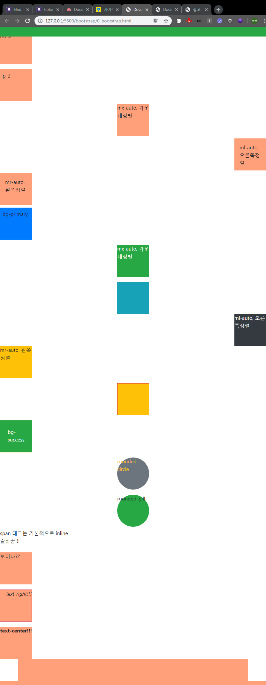
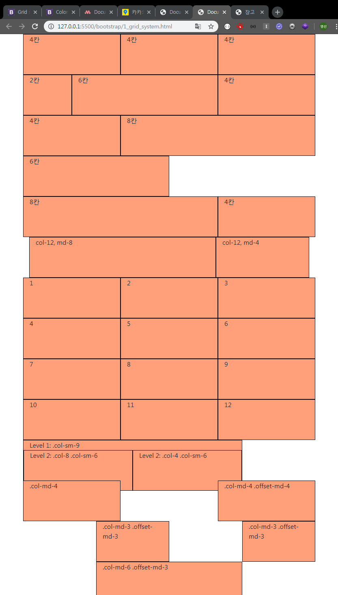

### 2019-11-04

# Bootstrap

bootstrap -  https://getbootstrap.com/ 

materialize - https://materializecss.com/ 

---

CDN

---

0_bootstrap.html -> Bootstrap CSS, JavaScript 연결해주기, `<style>`적용시키기

```html
<!-- 0_bootstrap.html -->

<!DOCTYPE html>
...

<!-- CSS -->
<link rel="stylesheet" href="https://stackpath.bootstrapcdn.com/bootstrap/4.3.1/css/bootstrap.min.css" integrity="sha384-ggOyR0iXCbMQv3Xipma34MD+dH/1fQ784/j6cY/iJTQUOhcWr7x9JvoRxT2MZw1T" crossorigin="anonymous">
    <style>
        body{
            height: 100000px;
        }
        div{
            width: 100px;
            height: 100px;
            background-color: lightsalmon;
        }
        .sticky{
            width: 100%;
            height: 30px;
        }
    </style>
</head>
<body>

<!-- JavaScript  -->
<script src="https://code.jquery.com/jquery-3.3.1.slim.min.js" integrity="sha384-q8i/X+965DzO0rT7abK41JStQIAqVgRVzpbzo5smXKp4YfRvH+8abtTE1Pi6jizo" crossorigin="anonymous"></script>
<script src="https://cdnjs.cloudflare.com/ajax/libs/popper.js/1.14.7/umd/popper.min.js" integrity="sha384-UO2eT0CpHqdSJQ6hJty5KVphtPhzWj9WO1clHTMGa3JDZwrnQq4sF86dIHNDz0W1" crossorigin="anonymous"></script>
<script src="https://stackpath.bootstrapcdn.com/bootstrap/4.3.1/js/bootstrap.min.js" integrity="sha384-JjSmVgyd0p3pXB1rRibZUAYoIIy6OrQ6VrjIEaFf/nJGzIxFDsf4x0xIM+B07jRM" crossorigin="anonymous"></script>
</body>
</html>
```


## 1. Spacing

```html
<!-- 0_bootstrap.html -->

...
<body>
    <!-- 1. Spacing-->
    <div class="mt-3">mt-3</div>
    <div class="p-2 mt-3">p-2</div>
    <div class="mt-2 mx-auto">mx-auto, 가운데정렬</div>
    <div class="mt-2  p-3 ml-auto">ml-auto, 오른쪽정렬</div>
    <div class="mt-2  p-3 mr-auto">mr-auto, 왼쪽정렬</div>
</body>
```


## 2. Color

```html
<!-- 0_bootstrap.html -->

...
<body>
    <!-- 2. Color -->
    <div class="mt-2 p-2 bg-primary">bg-primary</div>
    <div class="m-3 mx-auto bg-success text-light">mx-auto, 가운데정렬</div>
    <div class="mx-auto bg-info"></div>
    <div class="ml-auto bg-dark text-white">ml-auto, 오른쪽정렬</div>
    <div class="mr-auto bg-warning">mr-auto, 왼쪽정렬</div>
</body>
```

## 3. Border

```html
<!-- 0_bootstrap.html -->

...
<body>
    <!-- 3. Border -->
    <div class="my-3 bg-warning mx-auto border border-danger"></div>
    <div class="mt-2 p-4 bg-success text-white border-bottom border-warning">bg-success</div>
    <div class="m-3 mx-auto bg-secondary text-warning rounded-circle">rounded-circle</div>
    <div class="m-2 mx-auto bg-success rounded-pill">rounded-pill</div>
</body>
```

## 4. Display

```html
<!-- 0_bootstrap.html -->

...
<body>
    <!-- 4. Display -->
    <span class="d-block">span 태그는 기본적으로 inline</span>
    <span>줄바꿈!!!</span>
    
    <div class="mt-4 d-sm-none d-md-block">보이나??</div>
	<div class="mt-4 d-none d-xl-block">보이니이이이?</div>
</body>
```

## 5. Position

```html
<!-- 0_bootstrap.html -->

...
<body>
    <!-- 5. Position -->
    <div class="sticky fixed-top bg-success"></div>
    <div class="sticky fixed-bottom"></div> 
</body>
```

## 6. Text

```html
<!-- 0_bootstrap.html -->

...
<body>
    <div class="mt-3 border border-danger text-right font-italic">text-right!!!</div>
	<div class="mt-3 text-center font-weight-bold">text-center!!!</div>
</body>
```





## 7. Grid

 https://getbootstrap.com/docs/4.3/layout/grid/ 

```html
<!-- 1_grid_system.html -->

<!DOCTYPE html>
<html lang="en">
<head>
  <meta charset="UTF-8">
  <meta name="viewport" content="width=device-width, initial-scale=1.0">
  <meta http-equiv="X-UA-Compatible" content="ie=edge">
  <title>Document</title>
  <link rel="stylesheet" href="https://stackpath.bootstrapcdn.com/bootstrap/4.3.1/css/bootstrap.min.css" integrity="sha384-ggOyR0iXCbMQv3Xipma34MD+dH/1fQ784/j6cY/iJTQUOhcWr7x9JvoRxT2MZw1T" crossorigin="anonymous">
  <style>
    body{
      height: 1000000px;
    }
    .square{
      width: 100px;
      height: 100px;
      background-color: lightsalmon;
      border: 1px solid black;
    }
  </style>
</head>
<body>
  
    <div class="container">
        <div class="row">
            <div class="square col-4">4칸</div>
            <div class="square col-4">4칸</div>
            <div class="square col-4">4칸</div>
        </div>
        <div class="row">
            <div class="square col-2">2칸</div>
            <div class="square col-6">6칸</div>
            <div class="square col-4">4칸</div>
        </div>
        <div class="row">
            <div class="square col-4">4칸</div>
            <div class="square col-8">8칸</div>
        </div>
        <div class="row">
          <div class="square col-6">6칸</div>
          <div class="square col-8" >8칸</div>
          <div class="square col-4">4칸</div>
        </div>

        <div class="container">
          <div class="row">
            <div class="square col-12 col-md-8">col-12, md-8</div>
            <div class="square col-12 col-md-4">col-12, md-4</div>
          </div>
        </div>

    </div>

    <!-- [실습] 12개의 div 배분하기 -->
    <!-- 기본적으로 한줄에 1개, sm 2개, md 3개, lg 4개, xl 6개 -->
    <div class="container">
      <div class="row">
        <div class="square col-12 col-sm-6 col-md-4 col-lg-3 col-xl-2">1</div>
        <div class="square col-12 col-sm-6 col-md-4 col-lg-3 col-xl-2">2</div>
        <div class="square col-12 col-sm-6 col-md-4 col-lg-3 col-xl-2">3</div>
        <div class="square col-12 col-sm-6 col-md-4 col-lg-3 col-xl-2">4</div>
        <div class="square col-12 col-sm-6 col-md-4 col-lg-3 col-xl-2">5</div>
        <div class="square col-12 col-sm-6 col-md-4 col-lg-3 col-xl-2">6</div>
        <div class="square col-12 col-sm-6 col-md-4 col-lg-3 col-xl-2">7</div>
        <div class="square col-12 col-sm-6 col-md-4 col-lg-3 col-xl-2">8</div>
        <div class="square col-12 col-sm-6 col-md-4 col-lg-3 col-xl-2">9</div>
        <div class="square col-12 col-sm-6 col-md-4 col-lg-3 col-xl-2">10</div>
        <div class="square col-12 col-sm-6 col-md-4 col-lg-3 col-xl-2">11</div>
        <div class="square col-12 col-sm-6 col-md-4 col-lg-3 col-xl-2">12</div>
        </div>
    </div>
 <!-- 공식문서 확인해서 Nesting & Offset 사용해보기 -->
 <!-- Docs -> Layout -> Grid -->

    <!-- Nesting -->
    <div class="container ">
        <div class="row">
            <div class="square col-sm-9">
              Level 1: .col-sm-9
              <div class="row">
                <div class="square col-8 col-sm-6">
                  Level 2: .col-8 .col-sm-6
                </div>
                <div class="square col-4 col-sm-6">
                  Level 2: .col-4 .col-sm-6
                </div>
              </div>
            </div>
          </div>
    </div>

    <!-- Offset -->
    <div class="container">
        <div class="row">
          <div class="square col-md-4">.col-md-4</div>
          <div class="square col-md-4 offset-md-4">.col-md-4 .offset-md-4</div>
        </div>
        <div class="row">
          <div class="square col-md-3 offset-md-3">.col-md-3 .offset-md-3</div>
          <div class="square col-md-3 offset-md-3">.col-md-3 .offset-md-3</div>
        </div>
        <div class="row">
          <div class="square col-md-6 offset-md-3">.col-md-6 .offset-md-3</div>
        </div>
      </div>


    <script src="https://code.jquery.com/jquery-3.3.1.slim.min.js" integrity="sha384-q8i/X+965DzO0rT7abK41JStQIAqVgRVzpbzo5smXKp4YfRvH+8abtTE1Pi6jizo" crossorigin="anonymous"></script>
    <script src="https://cdnjs.cloudflare.com/ajax/libs/popper.js/1.14.7/umd/popper.min.js" integrity="sha384-UO2eT0CpHqdSJQ6hJty5KVphtPhzWj9WO1clHTMGa3JDZwrnQq4sF86dIHNDz0W1" crossorigin="anonymous"></script>
    <script src="https://stackpath.bootstrapcdn.com/bootstrap/4.3.1/js/bootstrap.min.js" integrity="sha384-JjSmVgyd0p3pXB1rRibZUAYoIIy6OrQ6VrjIEaFf/nJGzIxFDsf4x0xIM+B07jRM" crossorigin="anonymous"></script>
</body>
</html>
```





