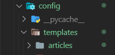
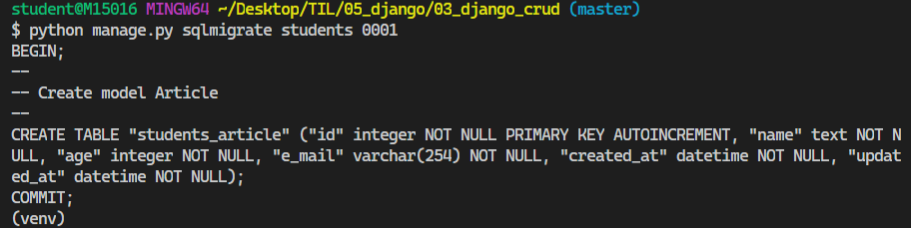
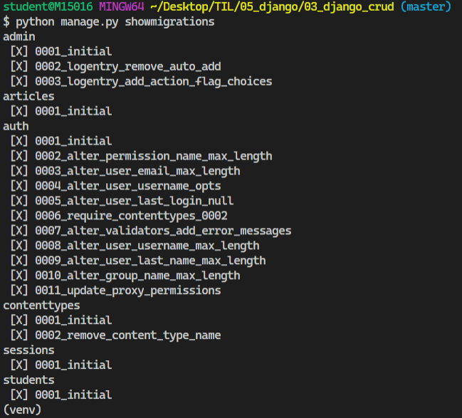
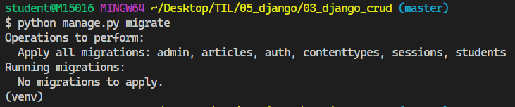
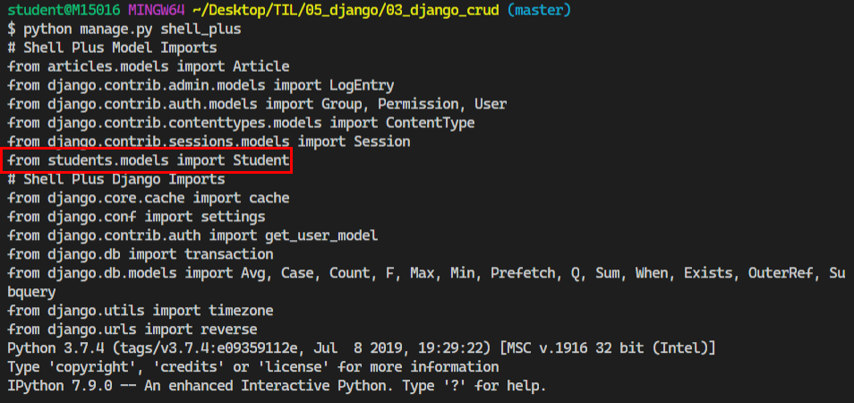
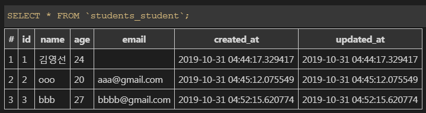

### 2019-10-30

# Django CRUD 구현

## 0. 사전작업

#### 0.1 프로젝트 생성

```bash
# 가상환경 진입
# 05_django
$ source ~/venv/Scripts/activate

$ cd 03_django_crud/

# 05_django/03_django_crud/
$ django-admin startproject config .
```
```python
# settings.py

INSTALLED_APPS = [
    'articles',
   	...
]

...

LANGUAGE_CODE = 'ko-kr'

TIME_ZONE = 'Asia/Seoul'
```

#### 0.2 애플리케이션 생성

```bash
# 애플리케이션 생성
$ python manage.py startapp articles
```

#### 0.3 URL 로직 분리(위임)

- 사용자가 articles/ 라는 경로로 접근할 경우, articles 애플리케이션의 'urls.py'에서 처리하도록 로직 수정

**03_django_crud > config > urls.py**

```python
# 03_django_crud/config/urls.py

from django.contrib import admin
from django.urls import path, include

urlpatterns = [
    path('articles/', include('articles.urls')),
    path('admin/', admin.site.urls),
]
```
**03_django_crud > articles > urls.py 파일 생성** 

```python
# urls.py 파일 생성
# 03_django_crud/articles/urls.py

from django.urls import path
from . import views

urlpatterns = [
   path('', views.index),
]
```
#### 0.4 템플릿 경로 커스터마이징 + `base.html` 만들기

- 장고는 Default로 애플리케이션 내부의 templates를 바라보도록 설정되어 있습니다.
- 앞으로 config 폴더 안에 있는 templates 폴더를 바라보도록 경로를 커스터마이징 해주세요.

**config > templates 파일 생성 > articles 폴더 생성** 

```python
# settings.py 
# TEMPLATES > 'DIRS' 경로설정 해줘야한다!!!

TEMPLATES = [
    {
        'BACKEND': 'django.template.backends.django.DjangoTemplates',
        'DIRS': [os.path.join(BASE_DIR, 'config', 'templates')], # 수정(경로설정)
        ...
    },
]
```



**views.py 코드 추가**

```python
# views.py

from django.shortcuts import render

def index(request):
    return render(request,'articles/index.html')
```

**articles 폴더에 index.html 파일 추가**

```html
<!-- index.html -->

<h2> INDEX 페이지 </h2>
```


**templates 폴더에 base.html 파일 추가**

Bootstrap 이용 - https://getbootstrap.com/docs/4.3/getting-started/introduction/ 

```html
<!-- base.html -->

<!DOCTYPE html>
<html lang="en">
<head>
  <meta charset="UTF-8">
  <meta name="viewport" content="width=device-width, initial-scale=1.0">
  <meta http-equiv="X-UA-Compatible" content="ie=edge">
  <title>장고 CRUD</title>

  <!-- Bootstrap CSS -->
  <link rel="stylesheet" href="https://stackpath.bootstrapcdn.com/bootstrap/4.3.1/css/bootstrap.min.css" integrity="sha384-ggOyR0iXCbMQv3Xipma34MD+dH/1fQ784/j6cY/iJTQUOhcWr7x9JvoRxT2MZw1T" crossorigin="anonymous">

</head>
<body>

  <div class = "container">
    
    
  </div>


  <!-- Bootstrap JS -->
  <script src="https://code.jquery.com/jquery-3.3.1.slim.min.js" integrity="sha384-q8i/X+965DzO0rT7abK41JStQIAqVgRVzpbzo5smXKp4YfRvH+8abtTE1Pi6jizo" crossorigin="anonymous"></script>
  <script src="https://cdnjs.cloudflare.com/ajax/libs/popper.js/1.14.7/umd/popper.min.js" integrity="sha384-UO2eT0CpHqdSJQ6hJty5KVphtPhzWj9WO1clHTMGa3JDZwrnQq4sF86dIHNDz0W1" crossorigin="anonymous"></script>
  <script src="https://stackpath.bootstrapcdn.com/bootstrap/4.3.1/js/bootstrap.min.js" integrity="sha384-JjSmVgyd0p3pXB1rRibZUAYoIIy6OrQ6VrjIEaFf/nJGzIxFDsf4x0xIM+B07jRM" crossorigin="anonymous"></script>

</body>
</html>
```

#### 0.5 데이터베이스 모델링

**models.py 코드 추가**

```python
# models.py

from django.db import models

# Create your models here.
class Article(models.Model):
    title = models.CharField(max_length=40)
    content = models.TextField()
    created_at = models.DateTimeField(auto_now_add=True)
    updated_at = models.DateTimeField(auto_now=True)

    # 객체 표시 형식 수정 
    def __str__(self):
        return f'[{self.pk}] {self.title}'
```

`makemigrations` **: 설계도 만들기** 

```bash
$ python manage.py makemigrations
```

```bash
# 파일 구조

03_django_crud/
    config/
    articles/
        migrations/
            0001_initial.py
```

`migrate` **: 실제 DB에 반영하기**

```bash
$ python manage.py migrate
```

**추가 정보**

- `showmigrations` : makemigrations를 통해 만든 설계도가 실제 DB에 반영된 상태인지 아닌지 확인

- `sqlmigrate` : 실제 DB에 반영하기 전 SQL 쿼리문으로 바뀐 모습 확인

  ```bash
  $ python manage.py sqlmigrate articles 0001
  ```


## 1. CREATE

- 기본적으로 두 개의 뷰 함수로 구성된다.
  1. 사용자에게 HTML Form을 던져줄 함수
  2. HTML Form에서 데이터를 전달받아서 실제 DB에 저장하는 함수
- **일단 GET 요청을 통해 구현해보자!**

```python
# 03_django_crud
# articles/views.py

from django.shortcuts import render
from .models import Article

# 사용자에게 게시글 작성 폼을 보여 주는 함수
def new(request):
    return render(request,'articles/new.html')

# 사용자로부터 데이터를 받아서 DB에 저장하는 함수
def create(request):
    title = request.GET.get('title')
    content = request.GET.get('content')

    article = Article(title=title, content=content)
    article.save()
    return render(request,'articles/index.html')
```

```html
<!-- articles/new.html -->

<!-- 상속 받는 코드 -->



<h1 class="text-center">NEW</h1>
<form action="/articles/create/" method="GET">
  TITLE: <input type="text" name="title"><br>
  CONTENT: <textarea name="content" cols="30" rows="10"></textarea><br>
  <input type="submit">
</form>
<hr>
<a href="/articles/">[BACK]</a>

```

```html
<!-- articles/create.html -->

<!-- 상속 받는 코드 -->



<h2> 글 작성이 완료되었습니다.! </h2>

```

- 데이터가 정상적으로 저장됐는지 확인하기 위해 admin 페이지로 들어가보기.

  - admin 계정 생성

  ```bash
  $ python manage.py createsuperuser
  ```
  
  - admin.py 코드 추가
  
  ``` python
  # admin.py
  
  from django.contrib import admin
  from .models import Article
  
  class ArticleAdmin(admin.ModelAdmin):
      list_display = ('pk', 'title', 'content', 'created_at', 'updated_at',)
  
  admin.site.register(Article, ArticleAdmin)
  ```
  
 - 메인 페이지에서 게시글 목록이 나오게 해보기 **(Read - Index 로직)** 

```python
# 03_django_crud
# articles/views.py

from django.shortcuts import render
from .models import Article

def index(request):
    articles = Article.objects.all()[::-1] # 정렬_내림차순
    context = {'articles':articles}
    return render(request,'articles/index.html', context)
```

```html
<!-- articles/index.html -->

<!-- 상속 받는 코드 -->



<h1 class="text-center">Articles</h1>
<a href="/articles/new/">[NEW]</a>
<hr>

  <p>글 번호: {{ article.pk }}</p>
  ...
  <p>수정 시각: {{ article.updated_at }}</p>
  <hr>


```

- 게시글 작성 요청 방식을 `GET`에서 `POST` 방식으로 바꾸기
  - 지금은 GET 요청으로 보내고 있어서 쿼리 스트링에 데이터가 노출되고 있다. 이는 우리 서버의 데이터 구조가 노출될 위험도 있고, URL 경로로만 게시글 작성이 가능하면 서버 폭파의 위험성이 증가한다.
  - POST 요청으로 바꾸어 HTTP body에 내용을 숨기고 작성자의 신원을 확인하는 절차를 거치도록 한다.

```python
# 03_django_crud
# articles/views.py

from django.shortcuts import render
from .models import Article

# 사용자에게 게시글 작성 폼을 보여 주는 함수
def new(request):
    return render(request,'articles/new.html')

# 사용자로부터 데이터를 받아서 DB에 저장하는 함수
def create(request):
    title = request.POST.get('title')
    content = request.POST.get('content')

    article = Article(title=title, content=content)
    article.save()
    return render(request,'articles/index.html')
```

```html
<!-- articles/new.html -->

<!-- 상속 받는 코드 -->



<h1 class="text-center">NEW</h1>
<form action="/articles/create/" method="POST">
<!-- POST 요청할 때 반드시 설정 -->
 
  TITLE: <input type="text" name="title"><br>
  CONTENT: <textarea name="content" cols="30" rows="10"></textarea><br>
  <input type="submit">
</form>
<hr>
<a href="/articles/">[BACK]</a>

```

- 지금은 게시글 작성을 완료한 뒤 "게시글 작성이 완료됐어요"라는 어색한 로직으로 구현되어 있다.
  - **데이터베이스에 게시글 작성이 완료되면 메인 페이지로 `redirect` 시켜버리자.**

  ```python
  # 03_django_crud
  # articles/views.py
  
  from django.shortcuts import render, redirect
  from .models import Article
  
  # 사용자로부터 데이터를 받아서 DB에 저장하는 함수
  def create(request):
      title = request.POST.get('title')
      content = request.POST.get('content')
  
      article = Article(title=title, content=content)
      article.save()
      # return render(request,'articles/index.html')
      return redirect('/articles/')
  ```

  

## 2. READ(Detail 페이지)

 게시글 목록이 출력되는 메인 페이지에서 글 내용, 수정 시각 등 모든 정보를 보여줄 필요는 없다. **메인 페이지에선 글 번호, 글 제목과 같은 기본적인 내용만 보여주고, 사용자가 클릭했을 때 게시글 상세정보 페이지로 이동**하도록 만들어보자. 

```python
# 03_django_crud
# articles/views.py


# 게시글 상세정보를 가져오는 함수

# Variable Routing 적용
# 사용자가 요청을 보낸 URL로부터 게시글 PK 값을 건네받는다.
def detail(request, article_pk):
    article = Article.objects.get(pk=article_pk)
    context = {'article':article} # 딕셔너리 형태로 넘겨주기
    return render(request, 'articles/detail.html', context)
```

```python
# 03_django_crud/articles/urls.py

# Variable Routing 적용
# 사용자가 게시글을 조회할 때 articles/1, articles/2 처럼 게시글들 중에 1번 게시글, 게시글들 중에 2번 게시글과 같은 모습으로 접근하는 것이 자연스럽다.

from django.urls import path
from . import views

urlpatterns = [
    path('<int:article_pk>/', views.detail),
    ...
]
```

```html
<!-- detail.html -->

<!-- 상속 받는 코드 -->



<h1 class="text-center">DETAIL</h1>
<p>글 번호 : {{ article.pk }}</p>
<p>글 제목 : {{ article.title }}</p>
<p>글 내용 : {{ article.content }}</p>
<p>생성 시각 : {{ article.created_at }}</p>
<p>수정 시각 : {{ article.updated_at }}</p>
<hr>
<a href="/articles/">[BACK]</a>

```

```html
<!-- articles/index.html -->

<!-- 상속 받는 코드 -->



  <h1 class="text-center">Articles</h1>
  <a href="/articles/new">[NEW]</a>
  <hr>
  
  <p> [{{article.pk }}] {{ article.title }}</p>
    <a href="/articles/{{article.pk }}">[DETAIL]</a>
  <hr>
  

```


## 3. UPDATE

```python

```


## 4. DELETE


```python
# 03_django_crud
# articles/views.py

# 삭제 페이지
def delete(request, article_pk):
    article = Article.objects.get(pk=article_pk)
    article.delete()
    return redirect('/articles/')
```

```html
<!-- detail.html -->

<!-- 상속 받는 코드 -->

...

<a href="/articles/{{ article.pk }}/delete/">[DELETE]</a>

```

```python
# 03_django_crud/articles/urls.py

from django.urls import path
from . import views

urlpatterns = [
    ...
	path('<int:article_pk>/delete/', views.delete), # DELETE Logic - 삭제
    ...
]
```


## 실습

> students 혹은 members와 같은 애플리케이션을 새로 만들어서 게시판과 비슷한 기능을 구현해보기


 - 가이드
     - students 앱을 만들어준다.

   ```bash
   $ python manage.py startapp students
   ```

   settings.py에 students 등록해주기

   ```python
   # settings.py 
   
   INSTALLED_APPS = [
          'students',
       ...
      ]
   ```
   
   - students 앱 안에 urls.py 파일 생성하고 config/urls.py에 **include** 시켜준다.

   ```python
   # 03_django_crud/config/urls.py
   
   from django.contrib import admin
   from django.urls import path, include
   
   urlpatterns = [
       ...
       path('students/', include('students.urls')),
   ]
   ```
   
    - Student 모델 클래스를 만들어준다. -> 이름,나이(생년월일)
   
   students/models.py 코드 수정
   
   ```python
   # students/models.py
   
   from django.db import models
   
   # django.db.models.Model 클래스를 상속받아서 모델을 정의함
   class Student(models.Model):
       name = models.TextField()
       age = models.IntegerField()
       email = models.EmailField()
       # auto_now_add=True : 인스턴스 최초 생성 시각
       created_at = models.DateTimeField(auto_now_add=True)
       # auto_now=True : 인스턴스 최종 수정 시각 (업데이트됨)
       updated_at = models.DateTimeField(auto_now=True)
   
        # 객체를 표시하는 형식 커스터마이징
       def __str__(self):
            return f'[{self.pk}번 학생]: {self.name}|{self.age}|{self.email}'
   ```
   
   `makemigrations` : students migrations 파일생성, 수정하게 되면 makemigrations 해줘야한다.
   
   ```bash
   $ python manage.py makemigrations
      
   # 실행결과
   Migrations for 'students':
     students\migrations\0001_initial.py
       - Create model Student
   (venv)
   ```

   `sqlmigrate` : 데이터베이스에 실제로 반영하기 전에 SQL문으로 바뀐 모습을 확인한다.

   ```bash
   $ python manage.py sqlmigrate students 0001
   ```

   

   `showmigrations` : migration 설계도를 작성했는데, 이설계도가 실제 DB에 반영되었는지 **확인**한다.

   ```bash
   $ python manage.py showmigrations
   ```

   

   `migrate` : makemigrations로 만든 설계도를 실제 데이터베이스(sqlite3)에 **반영**

   ```bash
   $ python manage.py migrate
   ```

   

   `shell` 실행

   ```bash
   # shell 실행
   $ python manage.py shell_plus
   ```

   

   ```sqlite
In [1]: from students.models import Student
   
   In [2]: Student.objects.all()
Out[2]: <QuerySet []>
   
In [3]: Student.objects.create(name='김영선',age=24 )
   Out[3]: <Student: [1번 학생]: 김영선|24|>

   In [4]: Student.objects.create(name='ooo',age=20, e_mail="aaa@gmail.com" )
Out[4]: <Student: [2번 학생]: ooo|20|aaa@gmail.com>
   
In [5]: Student.objects.create(name='bbb',age=27, email="bbbb@gmail.com" )
   Out[5]: <Student: [3번 학생]: bbb|27|bbbb@gmail.com>

   In [6]: Student.objects.all()
Out[6]: <QuerySet [<Student: [1번 학생]: 김영선|24|>, <Student: [2번 학생]: ooo|20|aaa@gmail.com>, <Student: [3번 학생]: bbb|27|bbbb@gmail.com>]>
   ```
   
   
   
   
   
    - Django Shell 으로 Student 데이터를 만들고, 관리자 페이지에서 데이터가 잘 만들어졌는지 확인해보기
   
   
   
    - READ 로직 1 : Index 페이지 (학생들 목록)
   
   
   
    - CREATE 로직 : new create
   
   
   
    - READ 로직 2 : Detail 페이지(학생 상세정보)
   
   
   
    - DELETE 로직
   
   
   
    - UPDATE 로직
   
   


>Faker API에 맞게 DB 모델링해서 데이터 저장시켜보기