### 2019-10-31

# 실습

#### 1. students 혹은 members와 같은 애플리케이션을 새로 만들어서 게시판과 비슷한 기능을 구현해보기

 - **가이드**

   - **students 앱을 만들어준다.**

   ```bash
   $ python manage.py startapp students
   ```

   settings.py에 students 등록해주기

   ```python
   # settings.py 
   
   INSTALLED_APPS = [
          'students',
       ...
      ]
   ```

   students 앱 안에 urls.py 파일 생성하고 config/urls.py에 **include** 시켜준다.

   ```python
   # 03_django_crud/config/urls.py
   
   from django.contrib import admin
   from django.urls import path, include
   
   urlpatterns = [
       ...
       path('students/', include('students.urls')),
   ]
   ```

    - **Student 모델 클래스를 만들어준다. -> 이름,나이(생년월일)**

   students/models.py 코드 수정

   ```python
   # students/models.py
   
   from django.db import models
   
   # django.db.models.Model 클래스를 상속받아서 모델을 정의함
   class Student(models.Model):
       name = models.TextField()
       age = models.IntegerField()
       email = models.EmailField()
       # auto_now_add=True : 인스턴스 최초 생성 시각
       created_at = models.DateTimeField(auto_now_add=True)
       # auto_now=True : 인스턴스 최종 수정 시각 (업데이트됨)
       updated_at = models.DateTimeField(auto_now=True)
   
        # 객체를 표시하는 형식 커스터마이징
       def __str__(self):
            return f'[{self.pk}번 학생]: {self.name}|{self.age}|{self.email}'
   ```

   `makemigrations` : students migrations 파일생성, 수정하게 되면 makemigrations 해줘야한다.

   ```bash
   $ python manage.py makemigrations
      
   # 실행결과
   Migrations for 'students':
     students\migrations\0001_initial.py
       - Create model Student
   (venv)
   ```

   `sqlmigrate` : 데이터베이스에 실제로 반영하기 전에 SQL문으로 바뀐 모습을 확인한다.

   ```bash
   $ python manage.py sqlmigrate students 0001
   ```

   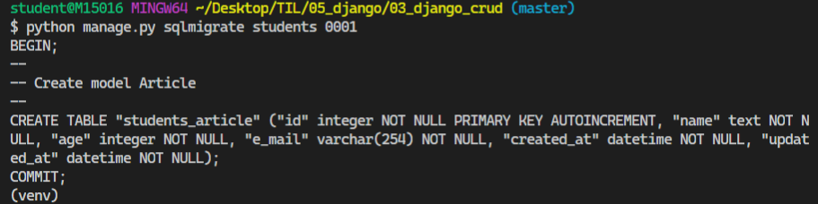

   `showmigrations` : migration 설계도를 작성했는데, 이설계도가 실제 DB에 반영되었는지 **확인**한다.

   ```bash
   $ python manage.py showmigrations
   ```

   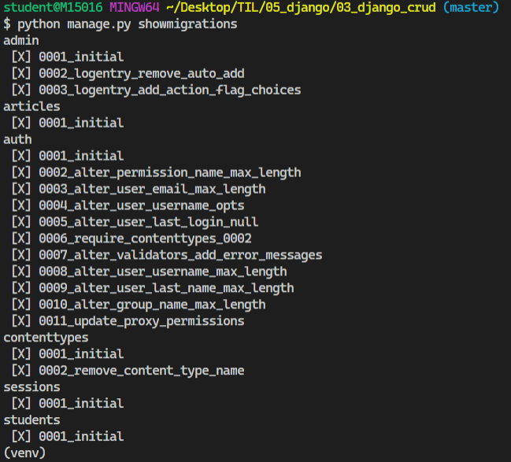

   `migrate` : makemigrations로 만든 설계도를 실제 데이터베이스(sqlite3)에 **반영**

   ```bash
   $ python manage.py migrate
   ```

   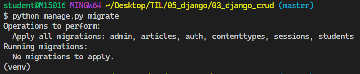

   `shell` 실행

   ```bash
   # shell 실행
   $ python manage.py shell_plus
   ```

   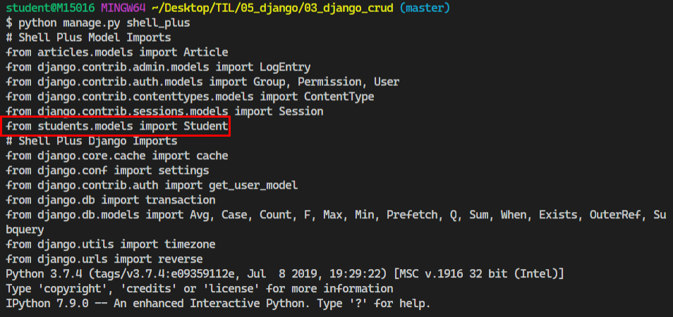

   ```sqlite
   In [1]: from students.models import Student
   
   In [2]: Student.objects.all()
   Out[2]: <QuerySet []>
   
   In [3]: Student.objects.create(name='김영선',age=24 )
   Out[3]: <Student: [1번 학생]: 김영선|24|>
   
   In [4]: Student.objects.create(name='ooo',age=20, e_mail="aaa@gmail.com" )
   Out[4]: <Student: [2번 학생]: ooo|20|aaa@gmail.com>
   
   In [5]: Student.objects.create(name='bbb',age=27, email="bbbb@gmail.com" )
   Out[5]: <Student: [3번 학생]: bbb|27|bbbb@gmail.com>
   
   In [6]: Student.objects.all()
   Out[6]: <QuerySet [<Student: [1번 학생]: 김영선|24|>, <Student: [2번 학생]: ooo|20|aaa@gmail.com>, <Student: [3번 학생]: bbb|27|bbbb@gmail.com>]>
   ```

   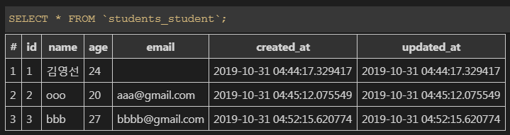

    - **Django Shell 으로 Student 데이터를 만들고, 관리자 페이지에서 데이터가 잘 만들어졌는지 확인해보기**

   이미 관리자(admin)는 생성되어 있으므로 관리자 만들기(createsuperuser) 생략

   students/admin.py 코드 수정

   ```python
   # students/admin.py
   
   from django.contrib import admin
   from .models import Student
   
   class StudentAdmin(admin.ModelAdmin):
       list_display = ('pk','name','age','email','created_at', 'updated_at')
   
   admin.site.register(Student, StudentAdmin)
   ```

   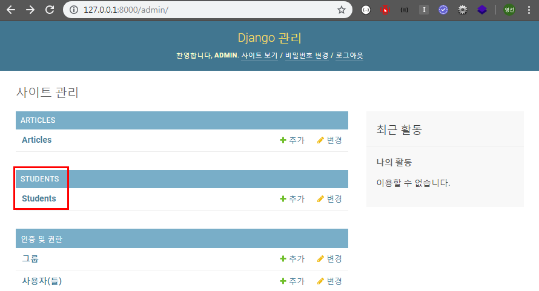

   Students 를 클릭하게 되면 아래 그림과 같이 Students 목록이 보여진다.

   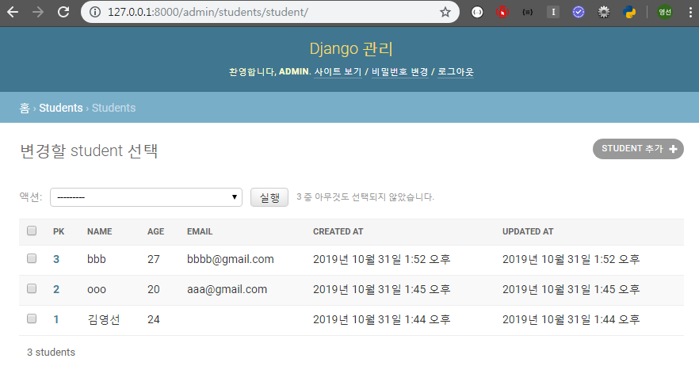

   

   ​	로직을 만들기전에 templates에 students 폴더를 추가해준다.

   

    - **READ 로직 1 : Index 페이지 (학생들 목록)**

   ```python
   # students/views.py
   
   from django.shortcuts import render
   from .models import Student
   
   # index 페이지 - 학생들 목록
   def index(request):
       students = Student.objects.all()[::-1]
       context = {'students':students}
       return render(request, 'students/index.html', context)
   ```

   ```python
   # students/urls.py
   
   from django.urls import path
   from . import views
   
   app_name = 'students'
   
   urlpatterns = [
       path('',views.index , name='index'),
       ...
   
   ]
   ```

   ```html
   <!-- index.html -->
   
   <!-- 상속 받는 코드 -->
   
   
   
     <h1 class="text-center">Students</h1>
     <a href="">[NEW]</a>
     <hr>
     
     <p> 이름 : [{{student.name }}] | 이메일 : {{ student.email }}</p>
        <a href="/articles/{{article.pk }}">[DETAIL]</a> 
        장고에서 제공하는 url 템플릿 태그 사용  ,(콤마)없이 넘겨줄 값 입력  
       <a href="">[DETAIL]</a> 
     <hr>
     
   
   ```

   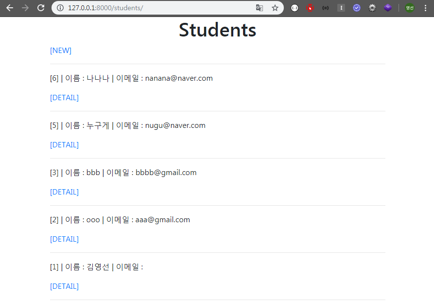

   

    - **CREATE 로직 : new, create**

   ````python
   # students/views.py
   
   from django.shortcuts import render
   from .models import Student
   
   # CREATE
   def new(requset):
       return render(requset, 'students/new.html')
   
   def create(request):
       name = request.POST.get('name')
       age = request.POST.get('age')
       email = request.POST.get('email')
   
       student = Student(name=name, age=age, email=email)
       student.save()
   
       return redirect('students:detail', student.pk)
   ````

   ```html
   <!-- new.html -->
   
   <!-- 상속 받는 코드 -->
   
   
   
   <h1 class="text-center">NEW</h1>
   <form action="" method="POST">
   <!-- POST 요청할 때 반드시 설정 -->
    
     <label for = "name">이름</label>
     <input type="text" name="name"><br>
     <label for = "age">나이</label>
     <input type="text" name="age"><br>
     <label for = "email">이메일</label>
     <input type="email" name="email"><br>
     <input type="submit">
   </form>
   <hr>
   <a href="">[BACK]</a>
   
   ```

   ```python
   # students/urls.py
   
   from django.urls import path
   from . import views
   
   app_name = 'students'
   
   urlpatterns = [
       ...
       path('new/', views.new, name='new'),
       path('create/', views.create, name='create'),
       ...
   
   ]
   ```

   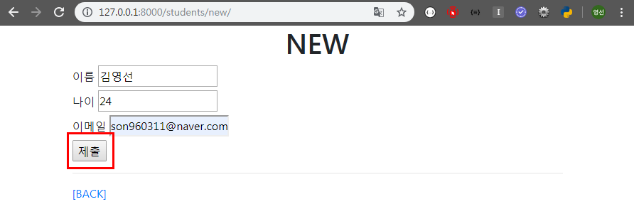

   제출버튼누루면

   

   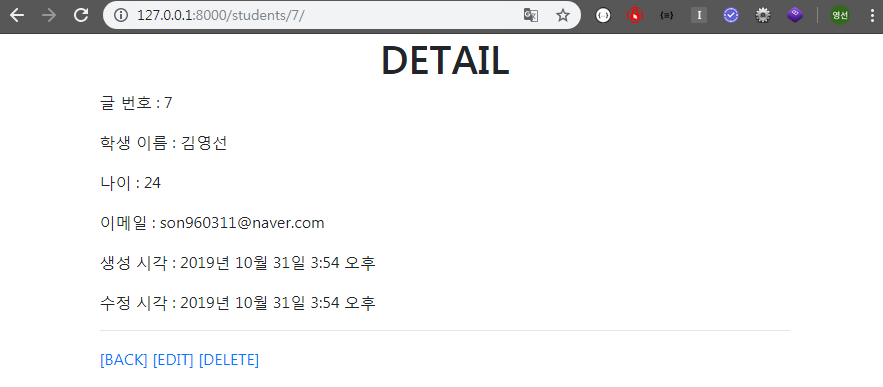

   저장된 정보 보여준다.

   

    - **READ 로직 2 : Detail 페이지(학생 상세정보)**

   ```python
   # students/views.py
   
   from django.shortcuts import render
   from .models import Student
   
   # detail 페이지 - 학생 상세정보 
   def detail(request, student_pk):
       student = Student.objects.get(pk = student_pk)
       context = {'student':student}
       return render(request, 'students/detail.html', context)
   ```

   ```html
   <!-- detail.html -->
   
   <!-- 상속 받는 코드 -->
   
   
   
   <h1 class="text-center">DETAIL</h1>
   <p>글 번호 : {{ student.pk }}</p>
   <p>학생 이름 : {{ student.name }}</p>
   <p>나이 : {{ student.age }}</p>
   <p>이메일 : {{ student.email }}</p>
   <p>생성 시각 : {{ student.created_at }}</p>
   <p>수정 시각 : {{ student.updated_at }}</p>
   <hr>
   <a href="">[BACK]</a>
   <a href="">[EDIT]</a>
   <a href="">[DELETE]</a>
   
   ```

   

   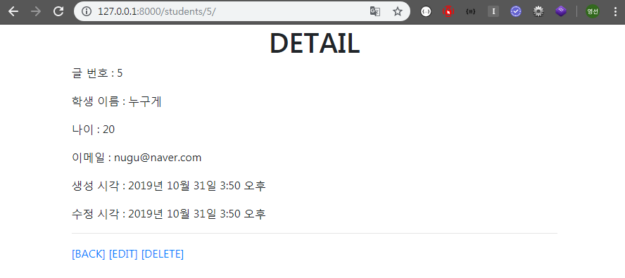

    - **DELETE 로직**

   ```python
   # students/views.py
   
   from django.shortcuts import render
   from .models import Student
   
   # delete 페이지
   def delete(request, student_pk):
       student = Student.objects.get(pk = student_pk)
       student.delete()
       return redirect('students:index')
   ```

   ```python
   # students/urls.py
   
   from django.urls import path
   from . import views
   
   app_name = 'students'
   
   urlpatterns = [
       ...
       path('<int:student_pk>/delete/', views.delete, name='delete'),
       ...
   
   ]
   ```

   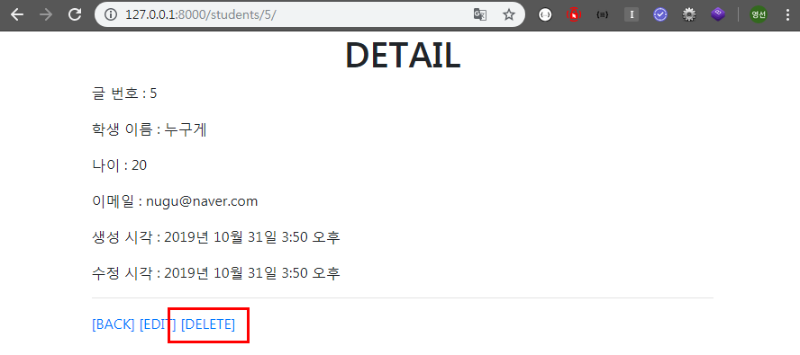

   DELETE 버튼을 누르면

   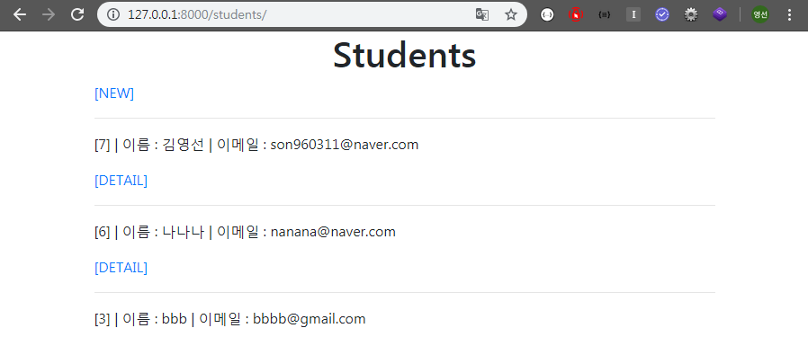

   pk = 5 인 해당 학생의 정보가 삭제 되었다.

   

    - **UPDATE 로직**

   ```python
   # students/views.py
   
   from django.shortcuts import render
   from .models import Student
   
   # UPDATE
   def edit(request, student_pk):
       student = Student.objects.get(pk = student_pk)
       context = {'student':student}
       return render(request, 'students/edit.html', context)
   
   def update(request, student_pk):
       student = Student.objects.get(pk = student_pk)
       
       student.name = request.POST.get('name')
       student.age = request.POST.get('age')
       student.email = request.POST.get('email')
       
       student.save()
   
       return redirect('students:detail', student_pk)
   ```

   ```python
   # students/urls.py
   
   from django.urls import path
   from . import views
   
   app_name = 'students'
   
   urlpatterns = [
       ...
       path('<int:student_pk>/edit/', views.edit, name='edit'),
       path('<int:student_pk>/update/', views.update, name='update'),
       ...
   
   ]
   ```

   ```html
   <!-- edit.html -->
   
   <!-- 상속 받는 코드 -->
   
   
   
   <h1 class="text-center">EDIT</h1>
   <form action="" method="POST">
   <!-- POST 요청할 때 반드시 설정 -->
    
     <label for = "name">이름</label>
     <input type="text" name="name" value="{{ student.name }}"><br>
     <label for = "age">나이</label>
     <input type="text" name="age" value="{{ student.age }}"><br>
     <label for = "email">이메일</label>
     <input type="email" name="email" value="{{ student.email }}"><br>
     <input type="submit">
   </form>
   <hr>
   <a href="">[BACK]</a>
   
   ```

   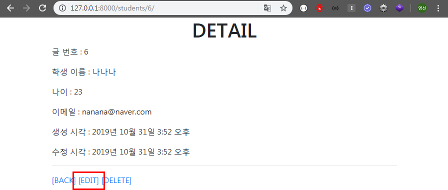

   EDIT 버튼을 누르면

   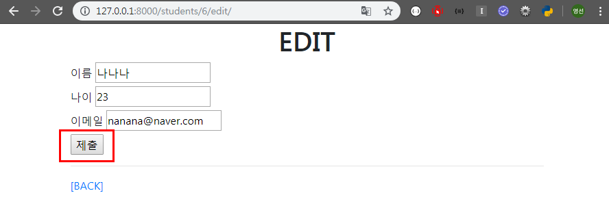

   수정 페이지 화면이 뜨고 내용을 변경하고 제출을 클릭하면

   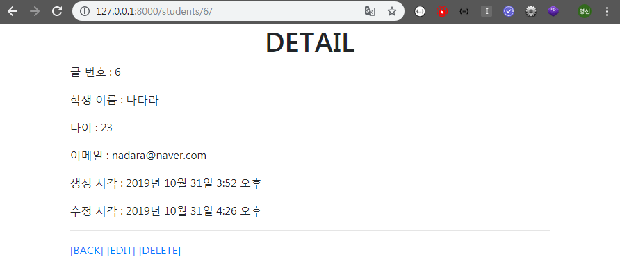

   수정한내용으로 변경되어서 저장된다.


#### 2. Faker API에 맞게 DB 모델링해서 데이터 저장시켜보기

https://faker.readthedocs.io/en/master/

[전생 직업 APP 만들기]
[1. 사전작업]

- Faker API 사용법 익히기 -> Shell Plus 이용
- jobs 애플리케이션 생성
- 'Job' 모델 클래스 생성
  - name 필드 : 입력받은 사용자 이름
  - past_job 필드 :전생 직업
- 관리자 페이지 등록

[2. 기능구현]

- 사용자 이름 입력을 받은 함수(HTML Form 건네줌)

- [기본] 이름에 따라 전생 직업을 알려주는 함수

  - Faker API를 통해 직업정보 가져오기
  - 해당 이름을 처음 조회할 때 이름-직업 정보를 DB에 저장시켜버림
  - 즉 이름을 여러번 조회하더라도 처음 저장된 직업이 바뀌지 않음

- [심화] GIPHY API를 사용해서 직업에 따른 움짤도 함께 보여주기

  - GIPHY API 회원가입 & API Key발급받기

  - 공식문서보면서 요청 보내서 움짤 받아보기

  - (주소창에 URL + 쿼리스트링 직접 넣어보면서 사진정보가 잘 나오는지 확인 먼저 해보는게 좋음)

    