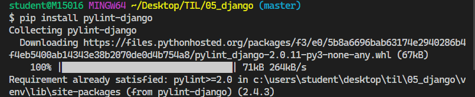
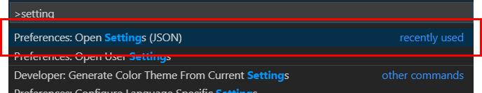
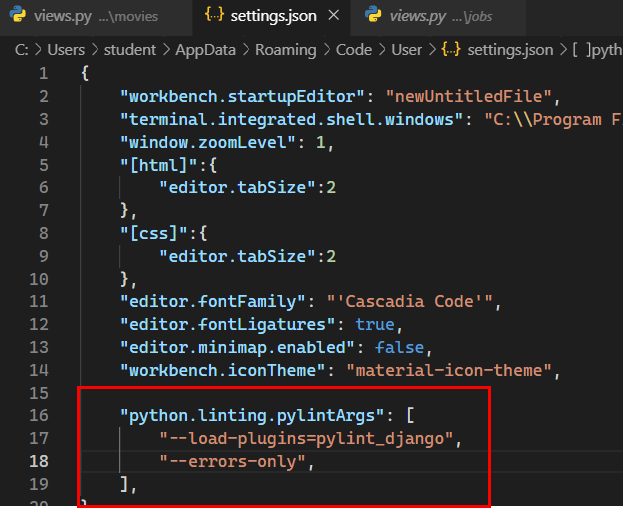

### 2019-11-01

# 해피해킹 종합실습 프로젝트 # 01_connected_PRJ1

[프로젝트 명세서]

## 1. 목표
- 데이터를 생성, 조회, 삭제, 수정할 수 있는 Web Application 제작
- Python Web Framework를 통한 데이터 조작
- Object Relational Mapping에 대한 이해
- Template Variable을 활용한 Template 제작
- 영화 추천 사이트의 영화 정보 데이터 관리

## 2. 준비 사항

1. (필수) Python Web Framework - Django
2. (필수) Python Web Framework 사용을 위한 환경 설정 - Python 3.7+
3. (참고) 샘플 영화 정보
   - 예시 영화 Input인 data.csv 가 있습니다.

## 3. 요구 사항

1. 데이터베이스

  - ORM을 통해서 작성될 클래스의 이름은 Movie 이며, 다음과 같은 정보를 저장합니다.

| 필드명      | 자료형  | 설명              |
| ----------- | ------- | ----------------- |
| title       | String  | 영화명            |
| title_en    | String  | 영화명(영문)      |
| audience    | Integer | 누적 관객수       |
| open_date   | Date    | 개봉일            |
| genre       | String  | 장르              |
| watch_grade | String  | 관람등급          |
| score       | Float   | 평점              |
| poster_url  | Text    | 포스터 이미지 URL |
| description | Text    | 영화 소개         |


2. 페이지

	1. 영화 목록
		1. (필수) 해당 페이지에 접근하는 URL은 /movies/ 입니다.
		2. (필수) 데이터베이스에 존재하는 모든 영화의 목록이 표시 되며, 각 영화의 title , score 가 표시
          됩니다.
		3. (필수) title 을 클릭 시, 해당 영화 정보 조회 페이지로 이동합니다.
      4. (필수) 영화 목록 최상단에 새 영화 등록 링크가 있으며, 클릭 시 영화 정보 생성 Form 페이지로
          이동합니다.
      5. (선택) 추가적인 영화 정보가 표시됩니다.
      6. (선택) 사용 되는 html 태그의 제한은 없습니다.

	2. 영화 정보 생성 Form
		1. (필수) 해당 페이지에 접근하는 URL은 /movies/new/ 입니다.
      2. (필수) 영화 정보를 작성할 수 있는 Form이 표시 되며, 다음과 같은 input들을 가지고 있습니다.
   
      | 필드명      | HTML Tag | Type   |
      | ----------- | -------- | ------ |
      | title       | input    | text   |
      | title_en    | input    | text   |
      | audience    | input    | number |
      | open_date   | input    | date   |
      | genre       | input    | text   |
      | watch_grade | input    | text   |
      | score       | input    | number |
      | poster_url  | input    | text   |
      | description | textarea | (없음) |
   
      3. (필수) Form에 작성된 정보는 Form Submit 버튼 클릭 시 영화 정보 생성 페이지로 생성 요청
         (request)과 함께 전송됩니다.
   
      4. (선택) 요청을 보내는 방식(method)은 GET, POST 중 어느 것을 사용하여도 무관합니다.

	3. 영화 정보 생성
		1. (필수) 해당 페이지에 접근하는 URL은 /movies/create/ 입니다.
      2. (필수) 이전 페이지로부터 전송 받은 데이터를 데이터베이스에 저장합니다.
      3. (필수 - 택1)
        - '영화 정보 생성이 완료되었습니다.' 메시지가 표시되며, 영화 목록 으로 이동하는 링크가 표시
          됩니다.
        - 해당 페이지에서 저장한 영화 정보를 조회하는 영화 정보 조회 페이지로 Redirect 합니다.

	4. 영화 정보 조회
		1. (필수) 해당 페이지에 접근하는 URL은 /movies/1/ , /movies/2/ 등 이며, 동적으로 할당되는 부분이 존재합니다. 동적으로 할당되는 부분에는 데이터베이스에 저장된 영화 정보의 Primary Key
         가 들어갑니다.
   
      2. (필수) 해당 Primary Key를 가진 영화의 모든 정보가 표시됩니다.
      3. (필수) 영화 정보의 최하단에는 목록 , 수정 , 삭제 링크가 있으며, 클릭 시 각각 영화 목록 , 해당 영
          화 정보 수정 Form , 해당 영화 정보 삭제 페이지로 이동합니다.

	5. 영화 정보 수정 Form
		1. (필수) 해당 페이지에 접근하는 URL은 /movies/1/edit/ , /movies/2/edit/ 등 이며, 동
          적으로 할당되는 부분이 존재합니다. 동적으로 할당되는 부분에는 데이터베이스에 저장된 영화 정보
          의 Primary Key가 들어갑니다.
      2. (필수) 해당 Primary Key를 가진 영화 정보를 수정할 수 있는 Form이 표시 되며, 정보가 입력된 채로 다음과 같은 input들을 가지고 있습니다.
      | 필드명      | HTML Tag | Type   |
      | ----------- | -------- | ------ |
      | title       | input    | text   |
      | title_en    | input    | text   |
      | audience    | input    | number |
      | open_date   | input    | date   |
      | genre       | input    | text   |
      | watch_grade | input    | text   |
      | score       | input    | number |
      | poster_url  | input    | text   |
      | description | textarea | (없음) |
      3. (필수) Form에 작성된 정보는 Form Submit 버튼 클릭 시 영화 정보 수정 페이지로 수정 요청
          (request)과 함께 전송됩니다.
   
      4. (선택) 요청을 보내는 방식(method)은 GET, POST 중 어느 것을 사용하여도 무관합니다.

   6. 영화 정보 수정

      1. (필수) 해당 페이지에 접근하는 URL은 /movies/1/update/ , /movies/2/update/ 등 이
          며, 동적으로 할당되는 부분이 존재합니다. 동적으로 할당되는 부분에는 데이터베이스에 저장된 영
          화 정보의 Primary Key가 들어갑니다.

      2. (필수) 해당 Primary Key를 가진 영화 정보를 이전 페이지로부터 전송 받은 데이터로 변경하여 데
          이터베이스에 저장합니다.

      3. (필수 - 택1)
          '영화 정보 수정이 완료되었습니다.' 메시지가 표시되며, 영화 목록 으로 이동하는 링크가 표시
          됩니다.
          해당 페이지에서 수정한 영화 정보를 조회하는 영화 정보 조회 페이지로 Redirect 합니다.

   7. 영화 정보 삭제

      1. (필수) 해당 페이지에 접근하는 URL은 /movies/1/delete/ , /movies/2/delete/ 등 이
         며, 동적으로 할당되는 부분이 존재합니다. 동적으로 할당되는 부분에는 데이터베이스에 저장된 영
         화 정보의 Primary Key가 들어갑니다.

      2. (필수) 해당 Primary Key를 가진 영화 정보를 데이터베이스에서 삭제합니다.

      3. (필수 - 택1)
           '영화 정보 삭제가 완료되었습니다.' 메시지가 표시되며, 영화 목록 으로 이동하는 링크가 표시됩니다.

         영화 정보 목록 페이지로 redirect 합니다.
         
         

---

### + pylint 

> **뷰에서 모델에 빨간줄뜨는거 없애기**

- pylint-django 설치

```bash
$ pip install pylint-django
```



- `ctrl + shift + p`  ->  open settings



- 추가 입력해주기

```json
 "python.linting.pylintArgs": [
        "--load-plugins=pylint_django",
        "--errors-only",
    ],
```

