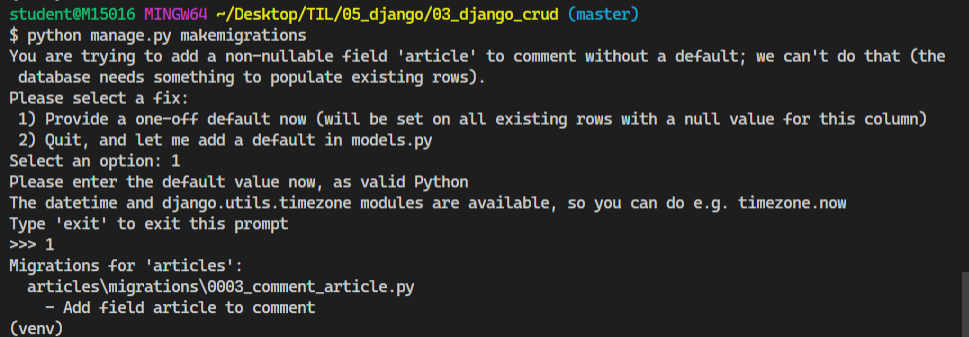
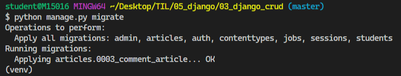
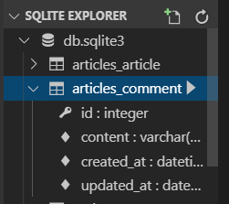
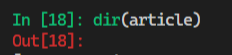
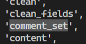

### 2019-11-04

# 1. Seed Data(Initial Data) 입력하기

> 우리가 애플리케이션을 제작할 때 미리 준비해둔 데이터 혹은 애플리케이션 테스트용 데이터가 필요한 경우가 있다. 이때, 데이터를 하드코딩으로 일일이 넣을 수도 있다. 하지만 **`fixtures`라는 기능을 이용해서 준비해둔 데이터를 쉽게 데이터 베이스에 넣을 수 있다.**


## 1.1 이미 데이터가 있을 경우

google 스프레드시트를 활용하여 기존의 data.csv 파일을 pk값을 입력해 수정한 뒤  csv파일(`data - data.csv`)을 다시 저장한다음 파일을 fixtures에 이동시켜 이름을 movies.csv로 변경시켜준다. 


- `dumpdata` 명령어를 통해서 현재 앱에서 가지고 있는 데이터를 뺴낼 수 있다.

```bash
$ python manage.py dumpdata > movies.json
```


명령어를 통해서 movies.json 파일을 만들어준다.


shift + alt + f => json파일을 보기 편한 형식으로 보이게 해준다.


- 이전 DB가 날라가더라도 dumpdata를 통해 빼둔 데이터들을 다시 한번 활용할 수 있다.


## 1.2 준비해둔 fixture 데이터들을 넣고 싶을 경우

- CSV(Comma-Seperated Values)
  - 데이터들을 콤마`(,)`로 구분해서 비교적 간단한 텍스트 형태의 포맷으로 바꾼 형식
  - 스프레드 시트, 엑셀에서 주로 활용한다.(데이터 크기 축소)
- **`fixture`는 장고가 데이터베이스에 import 할 수 있는 데이터의 모음** 
  - `JSON`,`XML`,`YAML` 포맷의 `fixture`를 불러올 수 있다.
- 장고에서 모델링한 데이터가 어떻게 생겼는지 확인

```json
[
    {
        "model": "movies.movie",
        "pk": 1,
        "fields": {
            "title": "\ub9d0\ubaa8\uc774",
            "title_en": "MAL\u00b7MO\u00b7E: The Secret Mission",
            "audience": 2224910,
            "open_date": "2019-01-09T04:38:58Z",
            ...
        }
    },
    ...
]
```


생성된 movies.json 파일을 fixtures에 이동시켜준다. 기존에 있던 movies.csv파일은 삭제한다.


- 프로젝트를  진행할 때  Seed Data(Initial Data)를 제공받았을 경우, Seed Data 형식을 먼저 확인하고 형식에 맞게 **모델링**을 진행하자!!


- Seed Data 활용하는 방법 2가지

  1. 애플리케이션의 데이터베이스를 하드코딩으로 미리 만든다. 이후 `dumpdata `명령어를 통해 fixture 데이터 형태로 만들어두고, 그 다음부턴 데이터베이스를 초기화시켜도` loaddata `명령어를 통해 다시 데이터를 불러와서 사용할 수 있다.

     

  2. 이미 Seed Data를 제공받았을 경우, 그냥 fixture 폴더에 넣어두고 불러와서 사용한다.

- `fixture` 데이터 내용을 바꾸거나, 모델링해둔 내용을 바꾸고 싶으면 당연히 다시` loaddata` 과정을 수행한다.

## 1.3 장고가 Fixture 파일을 찾는 방식

- 기본적으로 애플리케이션 안에 있는 `fixtures`라는 디렉토리를 탐색한다.

```bash
connected_PRJ1/
	config/
	movies/
		fixtures/
			movies.json
```

- 환경설정에  `FIXTURE_DIRS` 옵션을 통해 장고가 바라보는 또다른 디렉토리를 정의 할 수 있다.
  - `loaddata` 명령어를 수행할 때 다른경로보다 우선으로 탐색한다.


# 2. RESTFul API

> HTTP URL을 통해 자원(Resource)을 명시하고, HTTP Method(GET, POST, PUT, DELETE)를 통해 해당 자원에 대한 CRUD 로직을 적용하는 것
>
> - 혼자 개발해서 혼자 사용할 용도면 `articles/1/butterfly/show/magic` 처럼 그냥 마구잡이로 개발하고 작동만 하면 된다.
> - 하지만 다른 사람이 사용하는 것을 염두해 둔다면 `[GET] articles/1`과 같이 전 세계 개발자들이 사용하는 

HTML 에서 공식적인 지원은 GET/POST

- 일부 프레임워크를 제외하고는 대부분 위 두가지로 수행해야한다.

- **REST 핵심 구성요소**

  1. 자원(Resource) : `URI`
  2. 행위(Verb) : `HTTP Method`

- **REST API 디자인 가이드**

  - URI는 **정보의 자원**을 표현해야 한다.
  
```bash
  # URI는 자원을 표현하는데 중점을 둔다. 따라서 show, read와 같은 행위에 대한 표현이 들어가서는 안된다.
  
  GET /articles/show/1 (X)
  GET /articles/1 (O)
```

- 자원에 대한 행위는 **HTTP Method**로 표현한다.
  
```bash
  # GET Method는 리소스 생성/삭제 등의 행위에는 어울리지 않는다.
  
  GET / articles/1/update (X)
PUT / articles/1 (O)
```

  -  But! Django에서는 PUT, DELETE와 같은 비공식적 요청을 default로 지원하지 않고 있기 때문에 어느정도의 절충안이 필요하다. 

  ```bash
  GET /articles/2/update/     # 사용자에게 수정 페이지 보여줌
  POST /articles/2/update/    # 수정 작업 수행
  ```

  

- **실습**(`03_django_crud` > `articles` 코드 수정)

  - urls.py 코드 수정

  ```python
  # articles/urls.py
  
  from django.urls import path
  from . import views
  
  app_name = 'articles'
  
  urlpatterns = [           
      ...
      # path('new/', views.new , name='new'), # CREATE Logic - 사용자에게 폼 전달 
      # GET(new) / POST(create)
      path('create/', views.create, name='create'), # CREATE Logic - 데이터베이스에 저장
      ...
      # path('<int:article_pk>/edit/', views.edit, name='edit'), # UPDATE Logic - 폼 전달
      # GET(edit) / POST(update)
      path('<int:article_pk>/update/', views.update, name='update'), # UPDATE Logic - DB 저장
      
  ]
  ```

  - views.py 코드 수정

  ```python
  # articles/views.py
  
  # 사용자에게 게시글 작성 폼을 보여 주는 함수
  # def new(request):
  #     return render(request,'articles/new.html') 
  # new 함수는 주석처리 해준다.
  
  def create(request):
  
      # POST 요청일 경우 -> 게시글 생성 로직 수행
      if request.method == 'POST':
          title = request.POST.get('title')
          content = request.POST.get('content')
          article = Article(title=title, content=content)
          article.save()
          return redirect('articles:detail',article.pk) # URL Namespace
      # GET 요청일 경우 -> 사용자에게 폼 보여주기
      else:
          return render(request,'articles/create.html') # new.html -> create.html 로 수정
  ```

  ```python
  # 게시글 수정하는 함수 - 사용자한테 게시글 수정 폼을 전달
  # def edit(request, article_pk):
  #     article = Article.objects.get(pk=article_pk)
  #     context = {'article':article}
  #     return render(request, 'articles/edit.html', context)
  # edit 함수는 주석으로 처리한다.
  
  # 수정 내용 전달받아서 DB에 저장(반영)
  def update(request, article_pk):
      article = Article.objects.get(pk=article_pk) # 중복되므로 밖으로 빼줌
      
      # POST 요청 -> DB에 수정사항 반영
      if request.method == "POST":
          article.title = request.POST.get('title')
          article.content = request.POST.get('content')
          article.save()
          return redirect('articles:detail', article_pk)
      # GET 요청 -> 사용자에게 수정 Form 전달
      else:
          context = {'article':article}
          return render(request, 'articles/update.html', context) # exit.html -> update.html로 수정
  ```

  - html 코드 수정

  ```html
  <!-- index.html -->
  
  <!-- 상속 받는 코드 -->
  
  
  
    <h1 class="text-center">Articles</h1>
  <!-- new로 연결되있던 것을 create로 연결시켜준다. -->
    <a href="">[NEW]</a> 
    <hr>
    
    <p> [{{article.pk }}] {{ article.title }}</p>
       <a href="/articles/{{article.pk }}">[DETAIL]</a> 
       장고에서 제공하는 url 템플릿 태그 사용  ,(콤마)없이 넘겨줄 값 입력  
      <a href="">[DETAIL]</a> 
    <hr>
    
  
  ```

  ```html
  <!-- detail.html -->
  
  <!-- 상속 받는 코드 -->
  
  
  
  <h1 class="text-center">DETAIL</h1>
  <p>글 번호 : {{ article.pk }}</p>
  <p>글 제목 : {{ article.title }}</p>
  <p>글 내용 : {{ article.content }}</p>
  <p>생성 시각 : {{ article.created_at }}</p>
  <p>수정 시각 : {{ article.updated_at }}</p>
  <hr>
  <a href="">[BACK]</a>
  <a href="">[EDIT]</a>
  <!-- a태그로 연결되어있던 delete를 form을 이용해 POST방법으로 삭제되게 바꿔준다. -->
  <form action="" method="POST" 
  style="display:inline;" onclick="return confirm('진짜 삭제....?')">
     <!-- POST 방식을 쓰면 반드시 써야함!! -->
    <input type="submit" value="DELETE">
  </form>
  
  ```

  ```html
  <!-- new.html -> create.html 이름 변경 -->
  
  <!-- edit.html -> update.html 이름 변경 -->
  ```


#  3. 1 : N Relation

- Foreign Key(외래키)

  - 참조 키의 값으로는 부모 테이블에 존재하는 키의 값만을 넣을 수 있다.

    참조 무결성을 위해 참조 키를 사용하여 **부모 테이블의 유일한 값을 참조**한다.

    (-> 부모 테이블의 기본키를 참조)

  - 참조 키의 값이 부모 테이블의 기본키일 필요는 없지만 **유일**해야 한다.


## 3.1 Modeling (models.py)

```bash
$ python manage.py makemigrations
```



```bash
$ python manage.py migrate
```



DB 생성됨



- possible values for `on_delete`
  - `CASCADE` : 부모 객체가 삭제되면 참조하는 객체도 삭제한다.
  - `PROTECT` : 참조가 되어 있는 경우 오류 발생.
  - `SET_NULL` :  부모객체가 삭제되면 모든 값을 NULL로 치환(NOT NULL 조건이면 불가능!!!)
  - `SET_DEFAULT` : 모든 값이 DEFAULT 값으로 치환(해당 값이 DEFAULT 값이 지정되어 있어야함)
  - `SET()` :  특정 함수 호출
  - `DO_NOTHING` : 아무것도 하지 않는다. 다만, DB 필드에 대한 SQL `ON DELETE` 제한 조건이 설정되어 있어야 한다.


```bash
$ python manage.py shell_plus
```


## 3.2 ORM 실습

- **댓글 생성 및 조회**

- **1:N Relation 활용하기**
  - **Article(1) : Comment(N)** -> `comment_set`
    - `article.comment` 형태로는 가져올 수 없다. 게시글에 몇 개의 댓글이 있는지 Django ORM 측에서 보장할 수가 없다.
  - **Comment(N) : Article(1)** -> `article`
    - 댓글의 경우 `comment.article`식으로 접근이 가능하다. 어떤 댓글이든 본인이 참조하고 있는 게시글은 반드시 있다. 따라서 이런 식으로 접근할 수 있다.

```sqlite
In [1]: article = Article.objects.get(pk=1)

In [2]: comment = Comment()

In [3]: comment
Out[3]: <Comment: >

In [4]: comment.content = 'HIhi........!!'

In [6]: comment.article = article

In [7]: comment.article
Out[7]: <Article: [1번글]: second|django>

In [8]: comment.save()

In [9]: comment
Out[9]: <Comment: HIhi........!!>

In [10]: Comment.objects.all()
Out[10]: <QuerySet [<Comment: HIhi........!!>]>

In [11]: comment.article.pk
Out[11]: 1

In [12]: comment.article.title
Out[12]: 'second'

In [13]: comment = Comment(article=article, content='second content')

In [14]: Comment.objects.all()
Out[14]: <QuerySet [<Comment: HIhi........!!>]>

In [15]: comment.save()

In [16]: Comment.objects.all()
Out[16]: <QuerySet [<Comment: second content>, <Comment: HIhi........!!>]>

In [17]: article
Out[17]: <Article: [1번글]: second|django>

In [18]: dir(article)
Out[18]: 
['DoesNotExist',
 'MultipleObjectsReturned',
 '__class__',
 '__delattr__',
 ...
 'updated_at',
 'validate_unique']
 
In [19]: article
Out[19]: <Article: [1번글]: second|django>

In [20]: comments = article.comment_set.all()

In [21]: comments
Out[21]: <QuerySet [<Comment: second content>, <Comment: HIhi........!!>]>

In [22]: comments.first()
Out[22]: <Comment: second content>

In [23]: comments.first().content
Out[23]: 'second content'

In [24]: comment = comments.first()

In [25]: comment.article
Out[25]: <Article: [1번글]: second|django>
```




comment_set 이용하기

