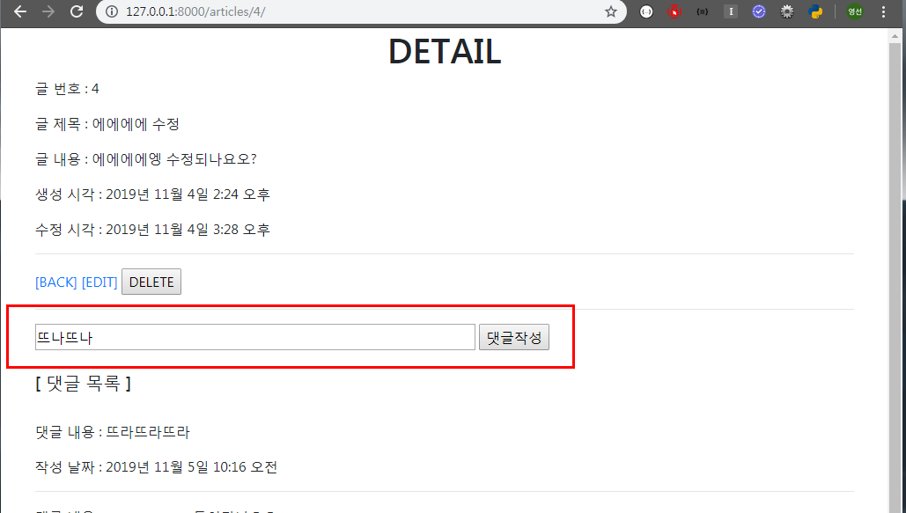

### 2019-11-05

# 1. ORM 실습

어제하던거 이어서....

- **댓글 생성 및 조회**

 detail 페이지에 댓글 등록, 삭제하기 만들기


detail 페이지에서 댓글 목록이 뜨는 것을 확인할 수 있다.


- **댓글 등록**

```python
# articles/views.py

# 댓글 생성 뷰 함수
def comments_create(request, article_pk):
    article = Article.objects.get(pk=article_pk)
    if request.method == 'POST':
       # comment.article = request.POST.get('article')
       content = request.POST.get('content')
       comment = Comment(article=article, content=content)
       # comment.article = article
       comment.save()
       return redirect('articles:detail', article_pk)
    else:
        return redirect('articles:detail', article_pk)
```
```python
# articles/admin.py

# article 추가
class CommentAdmin(admin.ModelAdmin):
    list_display = ('pk', 'content', 'article', 'created_at', 'updated_at',)
```
```python
# articles/urls.py

from django.urls import path
from . import views

# app name을 지정해줄 수 있음 - 다른 애플리케이션에서 중복되지 않게 해줌
app_name = 'articles'

urlpatterns = [            
    ...
    path('<int:article_pk>/comments/', views.comments_create, name='comments_create'),
    ...
]
```

```html
<!-- detail.html  -->

...
<!--  댓글 작성 Form -->
<form action="" method="POST">
  
   <input type="text" name="article"> 
  <input type="text" name="content" style="width:500px;">
  <input type="submit" value="댓글작성">
</form>
<hr>
<br>
<h5>[ 댓글 목록 ]</h5><br>
<p>{{ comments|length }}개의 댓글이 있습니다.</p>
 {{ article.comment_set.all|length }}
{{ comments.count }} 
...
```




- **댓글 삭제**

```python
# articles/views.py

# 댓글 삭제 뷰 함수
def comments_delete(request, article_pk, comment_pk):
    
    if request.method == 'POST':
        comment = Comment.objects.get(pk=comment_pk)
        comment.delete()
    return redirect('articles:detail', article_pk)
    #     return redirect('articles:detail', article_pk)
    # else:
    #     return redirect('articles:detail', article_pk)
```

```python
# articles/urls.py

from django.urls import path
from . import views

# app name을 지정해줄 수 있음 - 다른 애플리케이션에서 중복되지 않게 해줌
app_name = 'articles'

urlpatterns = [            
    ...
    # 게시글들 중/O번 게시클/의 댓글들중/O번 댓글/삭제
    path('<int:article_pk>/comments/<int:comment_pk>/delete/',views.comments_delete, name='comments_delete'),
]
```
```html
<!-- detail.html  -->

...

<p>댓글 내용 : {{ comment.content }}</p>
<p>작성 날짜 : {{ comment.created_at }} </p>
<form action="" method="POST">
  
  <input type="submit" value="댓글삭제">
</form>
<hr>

  <p>댓글이 없는데요오ㅜㅜㅜ</p>


```


삭제되었다...!

# 2. 지난주 종합 실습 프로젝트 코드 리팩토링

### 2.1 RESTFul 하게 로직 변경(URL & View)

- new & create -> create
- edit & update -> update

### 2.2 댓글 기능 추가(1:N)

- Comment 클래스

### 2.3 디자인 보안 

- CSS + Bootstrap

