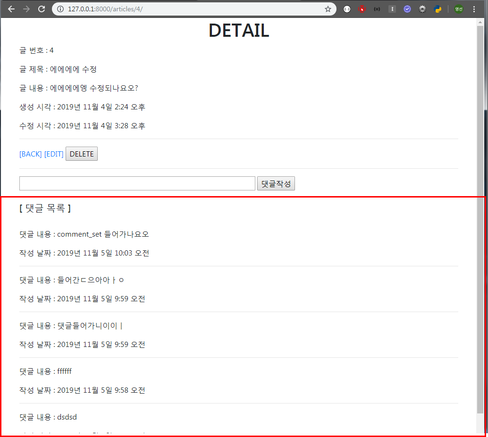
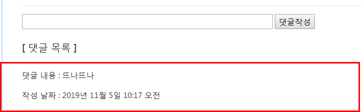
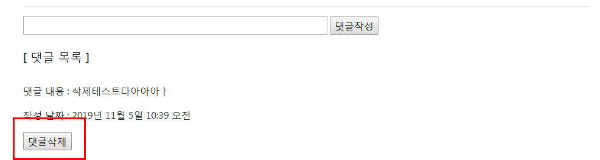
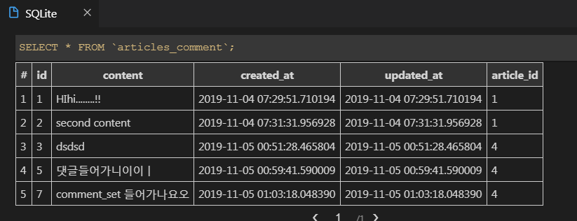
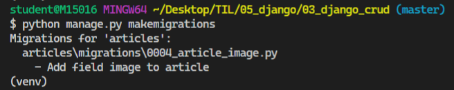
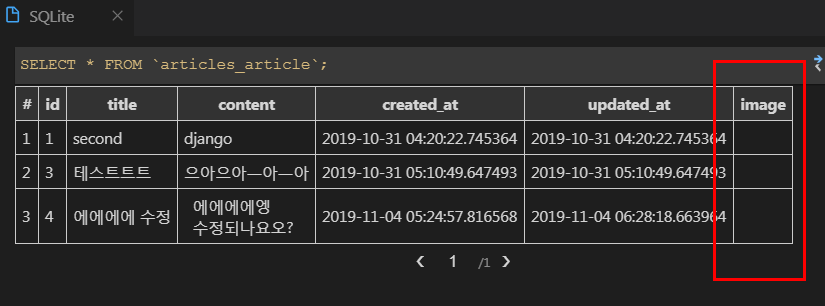

### 2019-11-05

# 1. ORM 실습

어제하던거 이어서....

- **댓글 생성 및 조회**

 detail 페이지에 댓글 등록, 삭제하기 만들기


detail 페이지에서 댓글 목록이 뜨는 것을 확인할 수 있다.



- **댓글 등록**

```python
# articles/views.py

# 댓글 생성 뷰 함수
def comments_create(request, article_pk):
    article = Article.objects.get(pk=article_pk)
    if request.method == 'POST':
       # comment.article = request.POST.get('article')
       content = request.POST.get('content')
       comment = Comment(article=article, content=content)
       # comment.article = article
       comment.save()
       return redirect('articles:detail', article_pk)
    else:
        return redirect('articles:detail', article_pk)
```
```python
# articles/admin.py

# article 추가
class CommentAdmin(admin.ModelAdmin):
    list_display = ('pk', 'content', 'article', 'created_at', 'updated_at',)
```
```python
# articles/urls.py

from django.urls import path
from . import views

# app name을 지정해줄 수 있음 - 다른 애플리케이션에서 중복되지 않게 해줌
app_name = 'articles'

urlpatterns = [            
    ...
    path('<int:article_pk>/comments/', views.comments_create, name='comments_create'),
    ...
]
```

```html
<!-- detail.html  -->

...
<!--  댓글 작성 Form -->
<form action="" method="POST">
  
   <input type="text" name="article"> 
  <input type="text" name="content" style="width:500px;">
  <input type="submit" value="댓글작성">
</form>
<hr>
<br>
<h5>[ 댓글 목록 ]</h5><br>
<p>{{ comments|length }}개의 댓글이 있습니다.</p>
 {{ article.comment_set.all|length }}
{{ comments.count }} 
...
```




- **댓글 삭제**

```python
# articles/views.py

# 댓글 삭제 뷰 함수
def comments_delete(request, article_pk, comment_pk):
    
    if request.method == 'POST':
        comment = Comment.objects.get(pk=comment_pk)
        comment.delete()
    return redirect('articles:detail', article_pk)
    #     return redirect('articles:detail', article_pk)
    # else:
    #     return redirect('articles:detail', article_pk)
```

```python
# articles/urls.py

from django.urls import path
from . import views

# app name을 지정해줄 수 있음 - 다른 애플리케이션에서 중복되지 않게 해줌
app_name = 'articles'

urlpatterns = [            
    ...
    # 게시글들 중/O번 게시클/의 댓글들중/O번 댓글/삭제
    path('<int:article_pk>/comments/<int:comment_pk>/delete/',views.comments_delete, name='comments_delete'),
]
```
```html
<!-- detail.html  -->

...

<p>댓글 내용 : {{ comment.content }}</p>
<p>작성 날짜 : {{ comment.created_at }} </p>
<form action="" method="POST">
  
  <input type="submit" value="댓글삭제">
</form>
<hr>

  <p>댓글이 없는데요오ㅜㅜㅜ</p>


```







삭제되었다...!

# 2. 지난주 종합 실습 프로젝트 코드 리팩토링

### 2.1 RESTFul 하게 로직 변경(URL & View)

- new & create -> create
- edit & update -> update

### 2.2 댓글 기능 추가(1:N)

- Comment 클래스

### 2.3 디자인 보안 

- CSS + Bootstrap


# 3. Static files

- Static files 기본 경로
  - 기본적으로 애플리케이션 안에 있는 `static` 디렉토리를 탐색해서 정적 파일을 가져온다.
- ``
  - 해당 페이지에 정적 파일들을 불러와서 사용하겠다고 선언
  - 일반적으로는 HTML 문서 상단에 위치, 상속받는 `` 태그가 존재하면, 상속 태그 밑에 위치한다.
- ``
  - 해당하는 경로에 있는 파일에 대해, 장고가 접근할 수 있는 절대 URL 경로를 생성한다.
  - 실제 파일이 위치한 경로는 아님
  - 127.0.0.0:8000**/static/**articles/images/sample.png

### 3.1 Static files 경로 커스터마이징

```python
# settings.py

# 웹 사이트에서 사용할 정적 파일의 최상위 URL 경로
STATIC_URL = '/static/'

# 정적 파일이 위치한 경로
# 앞으로 static 파일을 찾을 때 아래에 설정한 경로에 찾아가서 탐색한다.
# 개발 단계에서 사용 -> 실제 프로덕션 배포 단계에서는 다른 방식 사용
STATICFILES_DIRS = [
    os.path.join(BASE_DIR, 'config', 'assets'),

]
```


config 폴더 안에 assets 폴더를 만든다. 그리고 articles폴더 안에 있는 static 폴더에는 articles폴더 그안에 이미지폴더를 생성했었는데  articles 폴더를 새로만든 assets 폴더로 이동시키고 static 폴더는 삭제한다. 

config/assets/articles/images/~.jpg 


### 3.2 사용자 이미지 업로드 받기

- articles/models.py 코드 추가

```python
# articles/models.py

class Article(models.Model):
    ...
    # 원래대로라면 새로운 필드를 추가하고 나면 makemigrations 할때,어떤 값을 넣을 것인지 Django가 물어본다. 
    # 기본적으로  blank=False이기 때문이다.
    # blank=True -> '빈 문자열'이 들어가도 된다.
    image = models.ImageField(blank=True)
    ...
```

- 이미지 추가 하려고 하다가 오류나서 `pip install Pillow` 하라고 뜸

```bash
$ pip install Pillow
```


- makemigrations

```bash
$ python manage.py makemigrations
```



- showmigrations

```bash
$ python manage.py showmigrations
```


- migrate

```bash
$ python manage.py migrate
```


- showmigrations


데이터 베이스에 `image`가 생성되었다.



- admin.py 코드수정

```python
# admin.py

# image 추가
class ArticleAdmin(admin.ModelAdmin):
    list_display = ('pk', 'title', 'content', 'image', 'created_at', 'updated_at',)
```

- views.py 코드 수정

```python
# articles/views.py
# image 추가해주기!!

def create(request):

    # POST 요청일 경우 -> 게시글 생성 로직 수행
    if request.method == 'POST':
        ...
       	# image 추가해주기!! 파일은 POST를 사용하지 않고 FILES로 찾아서 사용해야한다.
        image = request.FILES.get('image')
        article = Article(title=title, content=content, image=image)
        article.save()
        return redirect('articles:detail',article.pk) # URL Namespace
    # GET 요청일 경우 -> 사용자에게 폼 보여주기
    else:
        return render(request,'articles/create.html')
```

- create.html 코드수정 

```html
<!-- create.html -->

<!-- 상속 받는 코드 -->



<h1 class="text-center">NEW</h1>
<!-- 
  enctype 
  1. apllication/x-www-form-urlencoded : (기본값) 모든 문자 인코딩
  2. multipart/form-data : 파일 형태 첨부시 필수 사용 / 데이터를 나누어 전송한다.
  3. text/plain : 인코딩X -> 사실상 안쓰임!!
-->
<form action="" method="POST" enctype="multipart/form-data">
...
  <label for="image">IMAGE</label>
  <input type="file" name="image" id="image" accept="image/*">
...

```

- `enctype` (인코딩)
  - `apllication/x-www-form-urlencoded` : (기본값) 모든 문자 인코딩
  - `multipart/form-data` : 전송되는 데이터 형식 지정(파일/이미지 업로드 시 반드시 사용)
- `<input ... accept="image/*">`


- 사진이 안뜨는 현상이 발생된다.


settings.py를 수정하기 전에는 이미지를 저장해도 최상의 루트에 저장되었다. 


- settings.py 코드수정

```python
# settings.py

# Media files
# 업로드된 파일의 주소를 만들어주는 역할
MEDIA_URL = '/media/'

# 실제로 파일이 업로드된 다음에 어디로 배치될 것인지 경로를 정하는 설정
MEDIA_ROOT = os.path.join(BASE_DIR, 'media')
```

코드를 수정한 뒤에는 media 폴더가 생성되어 그안에 이미지가 저장되었다.


- config/urls.py

```python
# config/urls.py

# settings와 static을 import 해준다
from django.conf import settings
from django.conf.urls.static import static

# static()
# 첫번째 인자 : 어떤 URL을 정적으로 추가할 지(Media file)
# 두번째 인자 : 실제 해당 미디어 파일은 어디에 있는지?

urlpatterns += static(settings.MEDIA_URL,document_root=settings.MEDIA_ROOT)
```


- 이미지를 게시글 수정할 때와 이미 올라온 게시글에 대해서 정의해주기
- detail.html 코드 수정 - 이미 올라와있는 글에대해서 오류가 나서 이미지 파일이 없다고 정의해주기

```html
<!-- detail.html -->


...
<!--
  1. 샘플 이미지를 넣어두고, 이미지 없는 게시글은 샘플 이미지가 나오도록 한다.
  2. 이미지가 있는 경우에만 보여준다.
-->


  

  <p>사진이 없어용,,,</p>
  

<br><br>
...
```


- update.html 코드 수정 - 

``` html
<!-- update.html -->

...
<!--
  input type file일 경우 value값 지정을 못한다. 당장 해결 방법은?
  이미지 파일은 바이너리 데이터(하나의 덩어리)로 들어가서, 텍스트를 수정하듯이 일부만
  수정하는게 불가능하다. 새로운 사진을 덮어씌우는 방식을 사용한다.
  
  -> 똑같은 사진을 업로드 하도록 유도..! 사진 파일을 업데이트 페이지에 띄워놓는다.
-->
...
<p>업로드 되어있는 사진</p>


...
  <label for="image">IMAGE</label>
  <input type="file" name="image" id="image" accept="image/*">
...
```


