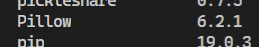
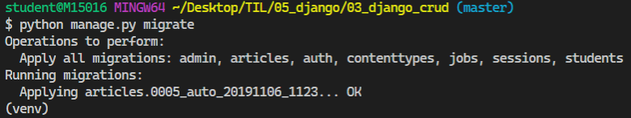
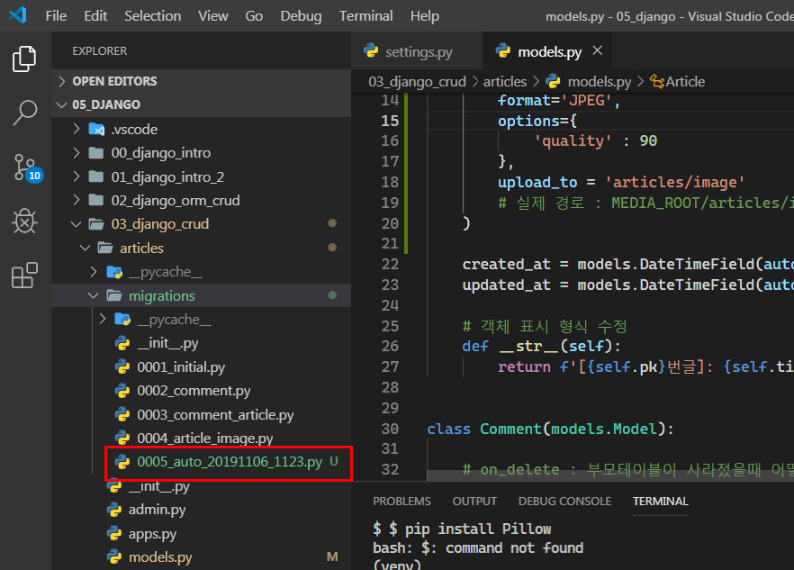

### 2019-11-06

# Django Form

## Image Resizing(ProcessedImageField)

> 이미지 업로드를 통해 사용자로부터 이미지를 받을 때, 과도한 크기의 이미지가 업로드 되면 서버의 부하를 야기시킨다. 또 Thumbnail 크기가 너무 커지기 때문에 조절이 필요하다.

**djangi-imagekit을 활용해서 이미지 업로드 이미지 크기를 조절해보자!**

- 사용자로부터 이미지를 업로드 받는 그 순간에 조절된 이미지 크기를 받을 수 있다. 
- READ 로직을 수행할 때에도 일정하고 동일한 크기로 이미지를 보일 수 있다.

### 1.라이브러리 설치

```bash
$ pip install Pillow
$ pip install pilkit
$ pip install django-imagekit
```

#### [ Pillow ]

- PIL (Python Image Library) 프로젝트에서 fork 되어 나온 라이브러리
- Python3을 지원하지 않기 때문에 Pillow를 많이 쓴다.



#### [ pilkit ]

- Pillow를 쉽게 쓸 수 있도록 도와주는 라이브러리
- 다양한 Processsors 지원
  - Thumbnail
  - Resize
  - Crop ...


#### [ django-imagekit ]

- 이미지 썸네일 Helper


- 라이브러리 설치 확인

  

### 2. App 등록

#### INSTALLED_APPS 등록

- settings.py

  ```python 
  INSTALLED_APPS = [
      'articles',
      'students',
      'jobs',
      .
      .
  
      'imagekit',
      
      .
      .
      .
  ]
  ```


### 3. Modeling

- models.py 코드 수정

  ```python 
  from django.db import models
  from imagekit.models import ProcessedImageField
  from imagekit.processors import Thumbnail
  # improt 추가 - ProcessedImageField, Thumbnail
  
  class Article(models.Model):
      title = models.CharField(max_length=40)
      content = models.TextField()
      
  	# 이미지 - ProcessedImageField를 활용하는 코드로 변경
      image = ProcessedImageField(
          processors=[Thumbnail(200,300)],    # 처리할 작업
          format='JPEG',                      # 이미지 포맷
          options={                           # 각종 추가 옵션
              'quality' : 90
          },
          upload_to = 'articles/image'        # 저장 위치
          # 실제 경로 : MEDIA_ROOT/articles/image
      )
  
      created_at = models.DateTimeField(auto_now_add=True)
      updated_at = models.DateTimeField(auto_now=True)
  
      # 객체 표시 형식 수정 
      def __str__(self):
        return f'[{self.pk}번글]: {self.title}|{self.content}'
  ```
  
  

### 4. Migration

```bash
$ python manage.py makemigrations
$ python manage.py migrate
```




- ProcessedImageField의 인자로 들어가는 옵션들은 수정을 하더라도 다시 migration 하지 않아도 **바로바로 적용**이 된다.




## 구현 해보기

### 1. 사전 준비

> Django Form을 적용하기 전, 이때까지 우리가 학습했던 HTML Form으로 앱을 구현해보자.

- **프로젝트 생성**

  ```bash
  $ mkdir 04_django_form
  $ cd 04_django_form
  ```

  ```bash
  $ django-admin startproject config .
  ```

- **앱 생성**

  ```bash
  $ python manage.py startapp articles
  ```

- **Article Model**

  ```python
  # models.py
  ```

- **URL 설정**

  ```python
  # config/urls.py
  ```

  ```python
  # articles/urls.py
  ```

- **base.html 생성** (부트스트랩 적용X)

- **Index 페이지** (-> 모든 게시글 보여주기)

  ```python
  # views.py
  def index(request):
      pass
  ```

  ```html
  <!-- index.html -->
  ```

- **Create 페이지**

  ```python
  # views.py
  def create(request):
      pass
  ```

  ```
  <!-- create.html -->
  ```

- **Detail 페이지**

  ```python
  # views.py
  def detail(request, article_pk):
      pass
  ```

  ```html
  <!-- detail.html -->
  ```