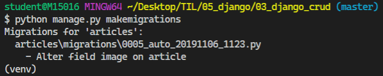
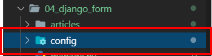
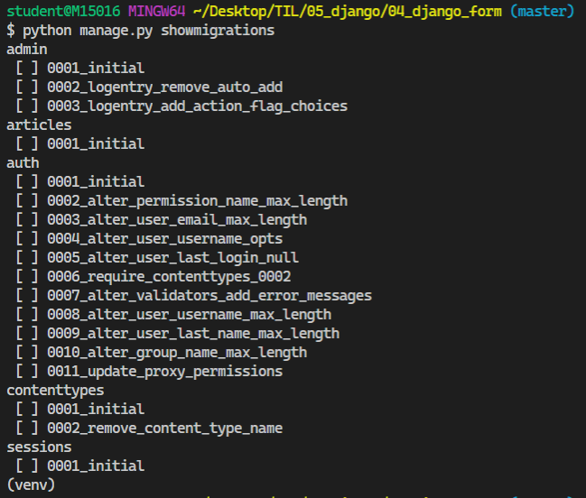

### 2019-11-06

# Image Resizing(ProcessedImageField)

> 이미지 업로드를 통해 사용자로부터 이미지를 받을 때, 과도한 크기의 이미지가 업로드 되면 서버의 부하를 야기시킨다. 또 Thumbnail 크기가 너무 커지기 때문에 조절이 필요하다.

**djangi-imagekit을 활용해서 이미지 업로드 이미지 크기를 조절해보자!**

- 사용자로부터 이미지를 업로드 받는 그 순간에 조절된 이미지 크기를 받을 수 있다. 
- READ 로직을 수행할 때에도 일정하고 동일한 크기로 이미지를 보일 수 있다.

### 1.라이브러리 설치

```bash
$ pip install Pillow
$ pip install pilkit
$ pip install django-imagekit
```

#### [ Pillow ]

- PIL (Python Image Library) 프로젝트에서 fork 되어 나온 라이브러리
- Python3을 지원하지 않기 때문에 Pillow를 많이 쓴다.


#### [ pilkit ]

- Pillow를 쉽게 쓸 수 있도록 도와주는 라이브러리
- 다양한 Processsors 지원
  - Thumbnail
  - Resize
  - Crop ...


#### [ django-imagekit ]

- 이미지 썸네일 Helper


- 라이브러리 설치 확인

  

### 2. App 등록

#### INSTALLED_APPS 등록

- settings.py

  ```python 
  INSTALLED_APPS = [
      'articles',
      'students',
      'jobs',
      .
      .
  
      'imagekit',
      
      .
      .
      .
  ]
  ```


### 3. Modeling

- models.py 코드 수정

  ```python 
  from django.db import models
  from imagekit.models import ProcessedImageField
  from imagekit.processors import Thumbnail
  # improt 추가 - ProcessedImageField, Thumbnail
  
  class Article(models.Model):
      title = models.CharField(max_length=40)
      content = models.TextField()
      
  	# 이미지 - ProcessedImageField를 활용하는 코드로 변경
      image = ProcessedImageField(
          processors=[Thumbnail(200,300)],    # 처리할 작업
          format='JPEG',                      # 이미지 포맷
          options={                           # 각종 추가 옵션
              'quality' : 90
          },
          upload_to = 'articles/image'        # 저장 위치
          # 실제 경로 : MEDIA_ROOT/articles/image
      )
  
      created_at = models.DateTimeField(auto_now_add=True)
      updated_at = models.DateTimeField(auto_now=True)
  
      # 객체 표시 형식 수정 
      def __str__(self):
        return f'[{self.pk}번글]: {self.title}|{self.content}'
  ```
  
  

### 4. Migration

```bash
$ python manage.py makemigrations
$ python manage.py migrate
```




- ProcessedImageField의 인자로 들어가는 옵션들은 수정을 하더라도 다시 migration 하지 않아도 **바로바로 적용**이 된다.


# Django Form class

## 구현 해보기

### 1. 사전 준비

> Django Form을 적용하기 전, 이때까지 우리가 학습했던 HTML Form으로 앱을 구현해보자.

- **프로젝트 생성**

  ```bash
  $ mkdir 04_django_form
  $ cd 04_django_form
  ```
  
  

  ```bash
  $ django-admin startproject config .
  ```



- **앱 생성**

  ```bash
  $ python manage.py startapp articles
  ```


- **Article Model**

  ```python
  # models.py
  
  from django.db import models
  
  class Article(models.Model):
      title = models.CharField(max_length=40)
      content = models.TextField()
      created_at = models.DateTimeField(auto_now_add=True)
      updated_at = models.DateTimeField(auto_now=True)
  
      # 객체 표시 형식 
      def __str__(self):
           return f'[{self.pk}번글]: {self.title}|{self.content}'
  
  ```

모델 설정하고 makemigrations 


showmigrations



migrate


- **admin 설정**

  ```bash
$ python manage.py createsuperuser
  ```


- **URL 설정**

  ```python
  # config/urls.py
  
  from django.contrib import admin
  from django.urls import path, include
  
  urlpatterns = [
      path('articles/', include('articles.urls')),
      path('admin/', admin.site.urls),
  ]
  ```

  ```python
  # articles/urls.py
  
  from django.urls import path
  from . import views
  
  app_name = 'articles'
  
  urlpatterns = [
      path('', views.index, name='index'),
      path('create/', views.create, name='create'),
      path('<int:article_pk>/', views.detail, name='detail'),
  ]
  ```

- **base.html 생성** (부트스트랩 적용X)

  ```django
  <!-- base.html -->
  
  <!DOCTYPE html>
  <html lang="en">
  <head>
    <meta charset="UTF-8">
    <meta name="viewport" content="width=device-width, initial-scale=1.0">
    <meta http-equiv="X-UA-Compatible" content="ie=edge">
    <title>04_django_form</title>
  </head>
  <body>  
      
      
  </body>
  </html>
  ```

- **Index 페이지** (-> 모든 게시글 보여주기)

  ```python
  # articles/views.py
  
  from django.shortcuts import render, redirect
  from .models import Article
  
  def index(request):
      articles = Article.objects.all()
      context = {'articles':articles,}
      return render(request,'articles/index.html', context)
  ```

  ```django
  <!-- index.html -->
  
  
  
  
  <br>
  <h1>Articles</h1>
  <hr>
  
  <a href="">[NEW]</a>
  <hr>
  
  <p> [{{article.pk }}]번</p>
  <p> 제목 : {{ article.title }}</p>
  <a href="">[DETAIL]</a> 
  <hr>
  
  
  ```


- **Create 페이지**

  ```python
  # articles/views.py
  
  def create(request):
  
      if request.method == 'POST':
        title = request.POST.get('title')
          content = request.POST.get('content')
          article = Article(title=title, content=content)
          article.save()
          return redirect('articles:detail',article.pk) # URL Namespace
      else:
          return render(request,'articles/create.html')
  ```
  
  ```django
  <!-- create.html -->
  
  
  
  
  <br>
  <h1>CREATE</h1>
  <hr>
  <!--
  action 값이 공백일 경우, 현재 위치하고 있는 주소로 요청을 보낸다. 폼을 던져주는 경로,
  DB에 저장하는 경로가 동일하다면 공백으로 해도 정상적으로 동작한다.
  -->
  <form action="" method="POST">
  <!-- POST 요청할 때 반드시 설정 -->
   
  <label for="title" >TITLE</label>
  <input type="text" id="title" name="title"> <br>
  
  <label for="content">CONTENT </label>
  <textarea type="text" id="content" name="content" cols="30" rows="10"> </textarea> <br>
  
  <input type="submit">
  </form>
  <hr>
  <a href="">[BACK]</a>
  
  ```

- **Detail 페이지**

  ```python
  # articles/views.py
  
  def detail(request, article_pk):
      article = Article.objects.get(pk=article_pk)
      context = {'article':article,} 
      return render(request, 'articles/detail.html', context)
  ```

  ```django
  <!-- detail.html -->
  
  
  
  
  <br>
  <h1>DETAIL</h1>
  <hr>
  
  <p>글 번호 : {{ article.pk }}</p>
  <p>글 제목 : {{ article.title }}</p>
  <p>글 내용 : {{ article.content }}</p>
  <p>생성 시각 : {{ article.created_at }}</p>
  <p>수정 시각 : {{ article.updated_at }}</p>
  <hr>
  <a href="">[BACK]</a>
  
  <hr>
  <br>
  
  ```


 


  

## Django Form

> Django에서 제공하는 Form 클래스를 이용해서 편리하게 폼 정보를 관리하고 유효성 검증을 진행하고, 비유효 fileId에 대한 에러 메세지를 결정한다.
>
> 즉, HTML으로 Form 입력을 관리하던 것을 Django에서 제공하는 Form 클래스로 바꿔보는 작업을 해보자.

#### **Form 의 장점(->자동화)**

- `blank=True`와 같은 옵션을 따로 지정해주지 않았으면, HTML 태그에 required 옵션이 자동으로 붙는다.
- 기존에 max_length와 같은 조건을 어길 경우 에러 페이지를 출력했는데,  Django Form을 써서 에러 메시지를 출력해준다. 

#### **Django Form 실습**

- forms.py 파일을 04_django_form/articles 에 생성하고 코드를 작성한다.


- forms.py 코드 수정

```python
# articles/forms.py

from django import forms
from .models import Article

class ArticleForm(forms.Form):
    title = forms.CharField(
        max_length=30,
        # HTML Tag와 동일
        label='제목',
        widget=forms.TextInput(
            attrs={
                'class':'title',
                'placeholder':'제목을 입력해 주세요...!',
            }
        )
    )
    content = forms.CharField(
        label='내용',
        # widget : Input Type 지정 -> Textarea / 알맞은 속성값 부여
        widget=forms.Textarea(
            attrs={
                'class':'content',
                'placeholder':'내용을 입력해 주세요오오오옹',
                'rows':5,
                'cols':30,
            }
        )
    )
```

- views.py 코드 수정

```python
# articles/views.py

from IPython import embed
from .forms import ArticleForm

def create(request):
    
    if request.method == 'POST':
        # Binding 과정
        # 폼 인스턴스를 생성하고, 전달받은 데이터를 채운다.
        # 인스턴스에 데이터를 채워서, 유효성 검증을 진행한다. (그래서 변수에 담음)
        form = ArticleForm(request.POST)
        # shell_plus 열기
        embed()

        if form.is_valid():
            # cleaned_data를 통해 딕셔너리 안 데이터를 검증한다.
            title = form.cleaned_data.get('title')
            content = form.cleaned_data.get('content')
            article = Article.objects.create(title=title, content=content)
          
        return redirect('articles:detail', article.pk)
    else:
        form = ArticleForm()

    # form으로 전달받는 형태가 2가지
    # 1. GET 요청 -> 비어있는 폼 전달
    # 2. 유효성 검증 실패 -> 에러 메세지를 포함한 채로 폼 전달
    context = {'form':form}
    return render(request,'articles/create.html', context)
```
```django
<!-- create.html -->

...
<form action="" method="POST">
<!-- POST 요청할 때 반드시 설정 -->
   
  {{ form.as_p }}
   
  {{form.as_p}}: 각각의 input 태그를 p 태그로 감싼다.
  {{form.as_table}}: 각각의 input 태그를 테이블 태그로 감싼다.
  

  <input type="submit">
</form>
...
```

- `IPython` :  `embed`

```python
In [1]: form
Out[1]: <ArticleForm bound=True, valid=Unknown, fields=(title;content)>

In [2]: request.POST
Out[2]: <QueryDict: {'csrfmiddlewaretoken': ['hDIVifOjEGF9GSPPWGp51l4LqEDk0FPkhTdLumU3AhCoGAbf95kqAbUbDXeGJERc'], 'title': ['제목고고고'], 'content': ['ㅇㄴㅇㄴㅇㄴㅇㄴ']}>

In [3]: form.is_valid()
Out[3]: True

In [4]: form
Out[4]: <ArticleForm bound=True, valid=True, fields=(title;content)>
```

`get_object_or_404`

- 500 에러는 내부 서버 오류로, '서버에 오류가 발생하여 요청을 처리할 수 없다'는 의미다. 예를 들어 articles/38513858135와 같이 존재하지 않는 상세정보 페이지를 요청하면 500 에러가 발생한다.
- 하지만 이 경우엔 사용자의 요청이 잘못된 경우이기 때문에 '서버에 존재하지 않는 페이지에 대한 요청'이라는 의미를 가진 404 에러를 돌려주어야 한다.
- 500 에러를 돌려주면 "선생님, 깃헙 폭파됐는데요?"라는 말이 나올거고, 404 에러를 돌려주면 "아, 선생님이 주소를 잘못 줬거나 내가 잘못 쳤구나..."라는 말이 나올 것.


- detail & delete & update 에 ` get_object_or_404` 적용시켜보기
  
  ```python
  # articles/views.py
  
  # detail
  def detail(request, article_pk):
      article = get_object_or_404(Article, pk=article_pk)
      context = {'article':article,} 
      return render(request, 'articles/detail.html', context)
  
  # delete
  def delete(request, article_pk):
      article = get_object_or_404(Article,pk=article_pk)
      
      if request.method == 'POST':    
          article.delete()
          return redirect('articles:index')
      else:
          return redirect('articles:detail', article.pk)
  
  # update
  def update(request, article_pk):
      article = get_object_or_404(Article,pk=article_pk)
      
      if request.method == "POST":
          form = ArticleForm(request.POST, instance=article)
          if form.is_valid():
              article.title = form.cleaned_data.get('title')
              article.content = form.cleaned_data.get('content')
              article.save()
              
              return redirect('articles:detail', article.pk)
      else:
          form = ArticleForm(initial={
              'title':article.title,
              'content':article.content,
          })
  
      # context로 전달되는 2가지 form 형식
      # 1. GET -> 초기값을 폼에 넣어서 사용자에게 던져줌
      # 2. POST -> is_valid가 False가 리턴됬을 때, 오류 메세지를 포함해서 동작한다.
      context = {'form':form}
      return render(request, 'articles/create.html', context)
  ```
  
  


- **Delete 페이지**

  ```python
  # articles/views.py
  
  def delete(request, article_pk):
      article = Article.objects.get(pk=article_pk)
      article.delete()
      return redirect('articles:index')
  ```
  
  ```django
  <!-- detail.html -->
  <!-- [DELETE] 추가해주기 -->
  
  
  
  
  ...
  <a href="">[DELETE]<a>
  
  <hr>
  <br>
  
  ```


## Django ModelForm

- 개념
  - Django의 큰 특징 중 하나
  - Model 클래스 정의와 비슷하게 Form 클래스를 선언할 수 있다.
- 역할
  1.  HTML 입력 폼 생성 : `as_p()`, `as_table()`
  2. 유효성 검증 : `is_vaild()`
  3. 검증 통과한 값 딕셔너리로 제공 : `cleaned_data`

- forms.py 코드 수정

```python
# articles/forms.py

from .forms import ArticleForm

# ModelForm
# 1. ModelForm 클래스를 상속받아 사용한다.
# 2. 메타데이터로 Model 정보를 건네주면, ModelForm이
#    자동으로 field에 맞춰 input을 생성해준다.
class ArticleForm(forms.ModelForm):
    title = forms.CharField(
        label='제목',
        max_length=10,
        widget=forms.TextInput(
            attrs={
                'class':'title',
                'placeholder':'제목 입력해라아....',
            }
        )
    )

    content = forms.CharField(
        label='내용',
        widget=forms.Textarea(
            attrs={
                'class':'content',
                'placeholder':'내용 입력해라아아아....',
                'row':5,
                'cols':30,
            }
        )
    )

    # 메타데이터 -> 데이터의 데이터
    # ex) 사진 한장 (촬영장비이름, 촬영환경 등)
    class Meta:
        model = Article
        # fields = ('title', 'content',) # 지정해서 가져오기
        fields = '__all__' # 전체가져오기
```

- `Form` vs `ModelForm`

```python

```