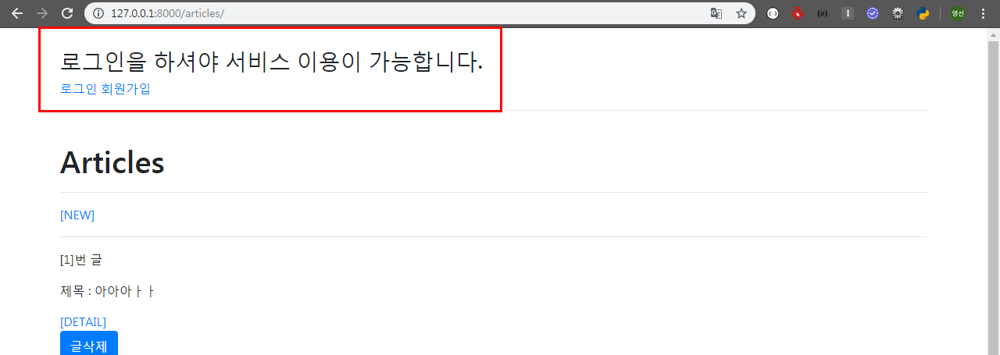

### 2019-11-07

# Django Form 마무리

## 1. URL Resolver

- CREATE 로직과 UPDATE 로직이 같은 탬플릿(`form.html`)을 공유하고 있는데, 둘 다 `<h1>CREATE</h1>`라는 헤더가 출력되고 있다.

- 사용자가 요청한 URL과 장고 내부로 들어오는 URL 사이에서 번역 역할을 해준다.


- embed() 

```python
In [1]: request.resolver_match
Out[1]: ResolverMatch(func=articles.views.create, args=(), kwargs={}, url_name=create, app_names=['articles'], namespaces=['articles'], route=articles/create/)

In [2]: request.resolver_match.url_name
Out[2]: 'create'

In [3]: exit()
```
- form.html

```django
<!-- form.html -->

...


  <br>
  <h1>CREATE</h1>
  <hr>

  <br>
  <h1>UPDATE</h1>
  <hr>


...


  <a href="">[BACK]</a>

  <a href="">[BACK]</a>


...
```

- views.py - update 코드 수정

```python
# views.py

def update(request, article_pk):
   ...
    context = {
        'form':form,
        'article':article, # context에 article을 추가해준다.
        }
    return render(request, 'articles/form.html', context)
```


## 2. Django Bootstrap

 https://django-bootstrap4.readthedocs.io/en/latest/ 

- bootstrap4 설치

```bash
$ pip install django-bootstrap4
```


- settings.py 에서 INSTALLED_APPS 등록

```python
# settings.py

INSTALLED_APPS = [
 	...
    'bootstrap4',
    ...
]
```

- base.html  코드 수정

```django
<!-- base.html -->

  <!-- bootstrap4를 load 해준다. -->

<!DOCTYPE html>
...
<!-- bootstrap4 css 추가 -->
    
</head>
<body>  
<!-- body를 container로 묶어준다. -->
  <div class="container">
    
    
  </div>
<!-- bootstrap4 javascript 추가 -->
  

</body>
</html>
```

- form.html 코드 수정

```django
<!-- form.html -->





...

<form action="" method="POST">
<!-- POST 요청할 때 반드시 설정 -->
   
<!-- bootstrap_form 적용 -->   
  
   {{form.as_p}} 

<!-- 제출버튼 -->
   <input type="submit"> 
  <div class="text-center">
    
    
  </div>
</form>
<hr>
...


```


---

- VS Code mode 변경 세팅  -  beautify 설치


Ctrl + Shift + p -> settings.json

```json
# settings.py 

"beautify.language": {
    "js": {
        "type": ["javascript", "json"],
        "filename": [".jshintrc", ".jsbeautifyrc"]
        // "ext": ["js", "json"]
        // ^^ to set extensions to be beautified using the javascript beautifier
    },
    "css": ["css", "scss"],
    "html": ["htm", "html", "django-html"]
},
```

`alt + shift + f`  누르면 사용가능


## 3. Comment - ModelForm

- Comment **Model** 생성 - models.py

```python
# models.py

class Comment(models.Model):
    article = models.ForeignKey(Article, on_delete=models.CASCADE) 
    content = models.TextField()
    created_at = models.DateTimeField(auto_now_add=True)
    updated_at = models.DateTimeField(auto_now=True)

    # Model Level에서 메타데이터 옵션 설정 => 정렬 기능 사용
    class Meta:
        ordering = ['-pk',]

    # 객체 표현 방식
    def __str__(self):
        return self.content
```

makemigrations


migrate


- **ModelForm** 생성 - forms.py

```python
# forms.py

from django import forms
from .models import Article
from .models import Comment

...

class CommentForm(forms.ModelForm):
    content = forms.CharField(
        label = '댓글',
        max_length=100,
        widget=forms.Textarea(
            attrs={
                'class':'content',
                'placeholder':'댓글을 입력해주세요!!',
                'rows':5,
                'cols':30,
            }
        )
    )

    class Meta:
        model = Comment
        fields = ('content',)
```

- **admin** 등록 - admin.py

```python
# admin.py

from django.contrib import admin
from .models import Comment

...

class CommentAdmin(admin.ModelAdmin):
    list_display = ('pk', 'article', 'content', 'created_at', 'updated_at')
...
admin.site.register(Comment, CommentAdmin)
```

- views.py 코드 수정 -  comments_create,delete 추가

```python
# views.py

# comments_create
def comments_create(request, article_pk):
    article = get_object_or_404(Article,pk=article_pk)
    if request.method == 'POST':
        comment_form = CommentForm(request.POST)
        if comment_form.is_valid():
            # save 메서드 -> 선택 인자 : (기본값) commit=True -> DB에 저장
            # DB에 바로 저장되는 것을 막아준다. -> commit=False
            comment = comment_form.save(commit=False) 
            comment.article = article
            comment.save()
            return redirect('articles:detail', article.pk)
    return redirect('articles:detail', article.pk)

# comments_delete
def comments_delete(request, article_pk, comment_pk):
    if request.method == 'POST':
        comment = Comment.objects.get(pk=comment_pk)
        comment.delete()
    return redirect('articles:detail', article_pk)
```

- detail.html 코드 수정

```django
<!-- detail.html -->

...

<!-- 댓글 입력하는 Form -->
<form action="" method="POST">

 {{ comment_form }} 


<div class="text-center">
    
    
</div>
</form>

<hr>
<p><b>댓글 목록({{ comments|length }}개)</b></p>

 <p>[{{ comment.pk }}]</p> 
<p>[{{ forloop.revcounter }}]번 댓글</p> <!-- revcounter : counter를 반대로 사용 -->
<p>댓글 내용 : {{ comment.content }}</p>
<p>작성 날짜 : {{ comment.created_at }} </p>
<form action="" method="POST">
  
 <div>
    
    
</div>
</form>
<hr>


...
```


## 4. View Decorator

> Django가 제공하는 decorator 활용하기


### 4.1 `require_POST`

- view 함수가 POST메서드 요청만 승인하도록 하는 데코레이터
- 일치하지 않는 요청이면 `405 Method Not Allowed` 에러를 발생 시킨다.

- views.py에 `require_POST` 에 import 해주기

```python
# views.py

from django.views.decorators.http import require_POST

# delete
@require_POST
def delete(request, article_pk):
    article = get_object_or_404(Article,pk=article_pk)
    article.delete()
        return redirect('articles:index')
  
# comments_create
@require_POST
def comments_create(request, article_pk):
    article = get_object_or_404(Article,pk=article_pk)
    comment_form = CommentForm(request.POST)
    if comment_form.is_valid():
        # save 메서드 -> 선택 인자 : (기본값) commit=True -> DB에 저장
        # DB에 바로 저장되는 것을 막아준다. -> commit=False
        comment = comment_form.save(commit=False) 
        comment.article = article
        comment.save()
    return redirect('articles:detail', article.pk)

# comments_delete
@require_POST
def comments_delete(request, article_pk, comment_pk):
    comment = Comment.objects.get(pk=comment_pk)
    comment.delete()
    return redirect('articles:detail', article_pk)
```


## Authentication(인증)

> 장고에서 이미 Auth 관련 기능을 만들어두었고, 우리는 자연스럽게 사용하고 있었다. `createsuperuser`를 통해 관리자 계정도 만들었고, 어드민 페이지에서 로그인 기능도 사용하고 있었다.


## 1. Accounts

- 기존 앱에서 구현해도 되지만, 장고에서는 기능 단위로 애플리케이션을 나누는 것이 일반적이므로 `accounts`라는 앱을 만들어보자.


- accounts 앱 생성/등록

```bash
$ django-admin startapp accounts
```

```python
# settings.py

INSTALLED_APPS = [
   	...
    'accounts',
    ...
]
```

- URL 분리

```python
# config/urls.py

from django.contrib import admin
from django.urls import path, include

urlpatterns = [
   	...
    path('accounts/', include('accounts.urls')),
]

# accounts/urls.py

from django.urls import path
from . import views

app_name = 'accounts'

urlpatterns = [
   
]
```

- templates 에 accounts 폴더 생성


## 2. SignUp

- views.py

```python
# views.py

from django.contrib.auth.forms import UserCreationForm

def signup(request):
    if request.user.is_authenticated:
        return redirect('articles:index')

    if request.method == 'POST':
        form = UserCreationForm(request.POST)
        if form.is_valid():
            user = form.save()
            auth_login(request, user)
            return redirect('articles:index')
    else:
        form = UserCreationForm
    context = {'form':form}
    return render(request, 'accounts/signup.html', context)
```

- signup.html

```django
<!-- signup.html -->





<br>
<h1>회원가입</h1>
<hr>
<form action="" method="POST">
  
  
  
  

</form>

```

- accounts/urls.py

```python
# accounts/urls.py

from django.urls import path
from . import views

app_name = 'accounts'

urlpatterns = [
    path('signup/', views.signup, name='signup'),
   	...

]
```


##  3. Login

- views.py

```python
# views.py

from django.contrib.auth import login as auth_login
from django.contrib.auth import logout as auth_logout
from django.contrib.auth.forms import UserCreationForm, AuthenticationForm

def login(request):
    if request.user.is_authenticated:
        return redirect('articles:index')

    if request.method == 'POST':
        form = AuthenticationForm(request, request.POST)
        if form.is_valid():
            auth_login(request, form.get_user())
            return redirect('articles:index')
    else:
        form = AuthenticationForm()
    context = {'form':form}
    return render(request, 'accounts/login.html', context)
```
- login.html

```django
<!-- login.html -->





<br>
<h1>로그인</h1>
<hr>
<form action="" method="POST">
  
  
  
  

</form>

```

- accounts/urls.py

```python
# accounts/urls.py

from django.urls import path
from . import views

app_name = 'accounts'

urlpatterns = [
    ...
    path('login/', views.login, name='login'),
   	...

]
```

- base.html 

```django
<!-- base.html -->



...

  <br>
  <div class="container">
  
    <h2>어서오세요. {{ user.username }}</h2>
    <a href="">로그아웃</a>
  
  <h3>로그인을 하셔야 서비스 이용이 가능합니다.</h3>
    <a href="">로그인</a>
    <a href="">회원가입</a>
  
  <hr>
    
    
  </div>

...
```


## 4. Logout

- views.py

```python
# views.py

from django.contrib.auth import login as auth_login
from django.contrib.auth import logout as auth_logout
from django.contrib.auth.forms import UserCreationForm, AuthenticationForm

def logout(request):
    auth_logout(request)
    return redirect('articles:index')
```
- accounts/urls.py

```python
# accounts/urls.py

from django.urls import path
from . import views

app_name = 'accounts'

urlpatterns = [
   	...
    path('logout/', views.logout, name='logout'),

]
```


