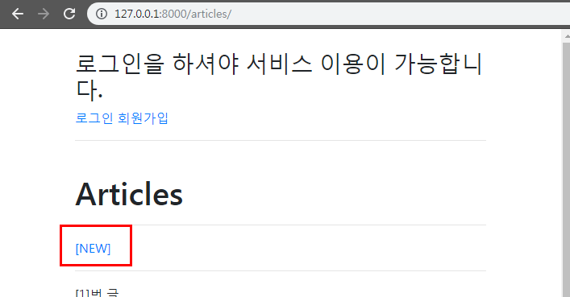
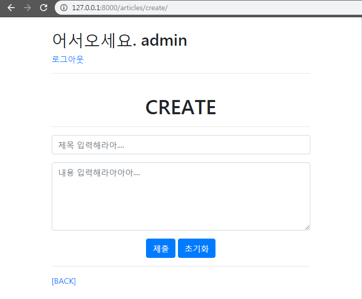
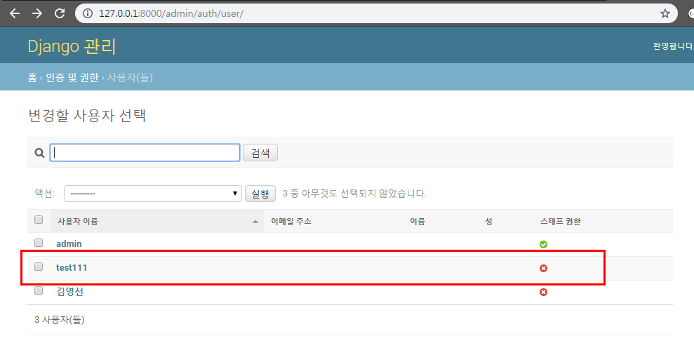
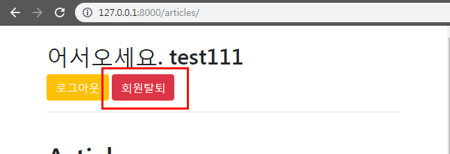
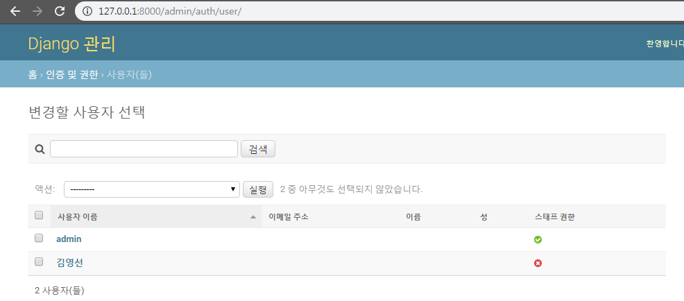

### 2019-11-11

# Authentication (인증)

## 1. Accounts

#### 세션(session)

- 클라이언트가 서버에 접속하면, 서버가 특정한 session_id를 발급한다. 클라이언트는 session_id를 쿠키를 사용해 저장한다.
- 클라이언트가 서버측 여러 페이지에 이동할 때마다, 해당 쿠키(session_id)를 이용해서 서버에 session_id를 전달한다. 
- 따라서 서버는 페이지가 바뀌더라도 같은 사용자임을 인지할 수 있다.


- 쿠키 vs 세션
  - `쿠키` : 클라이언트 로컬에 파일로 저장
  - `세션` : 서버에 저장 (session_id는 쿠키 형태로 클라이언트 로컬에 저장됨)


- 로그인한 상태 - dir : 속성들 알수 있음

```sqlite
In [1]: request
Out[1]: <WSGIRequest: GET '/articles/'>

In [2]: dir(request)  
Out[2]:
['COOKIES',
 'FILES',
 'GET',
 'META',
 'POST',
 '__class__',
 '__delattr__',
 '__dict__',
 '__dir__',
 '__doc__',
 '__eq__',
 '__format__',
 '__ge__',
 '__getattribute__',
 '__gt__',
 '__hash__',
 '__init__',
 '__init_subclass__',
 '__iter__',
 '__le__',
 '__lt__',
 '__module__',
 '__ne__',
 '__new__',
 '__reduce__',
 '__reduce_ex__',
 '__repr__',
 '__setattr__',
 '__sizeof__',
 '__str__',
 '__subclasshook__',
 '__weakref__',
 '_current_scheme_host',
 '_encoding',
 '_get_full_path',
 '_get_post',
 '_get_raw_host',
 '_get_scheme',
 '_initialize_handlers',
 '_load_post_and_files',
 '_mark_post_parse_error',
 '_messages',
 '_read_started',
 '_set_post',
 '_stream',
 '_upload_handlers',
 'body',
 'build_absolute_uri',
 'close',
 'content_params',
 'content_type',
 'csrf_processing_done',
 'encoding',
 'environ',
 'get_full_path',
 'get_full_path_info',
 'get_host',
 'get_port',
 'get_raw_uri',
 'get_signed_cookie',
 'headers',
 'is_ajax',
 'is_secure',
 'method',
 'parse_file_upload',
 'path',
 'path_info',
 'read',
 'readline',
 'readlines',
 'resolver_match',
 'scheme',
 'session',
 'upload_handlers',
 'user',
 'xreadlines']

In [3]: request.session
Out[3]: <django.contrib.sessions.backends.db.SessionStore at 0x4f23290>

In [4]: dir(request.session)
Out[4]:
['TEST_COOKIE_NAME',
 'TEST_COOKIE_VALUE',
 '_SessionBase__not_given',
 '_SessionBase__session_key',
 '__class__',
 '__contains__',
 '__delattr__',
 '__delitem__',
 '__dict__',
 '__dir__',
 '__doc__',
 '__eq__',
 '__format__',
 '__ge__',
 '__getattribute__',
 '__getitem__',
 '__gt__',
 '__hash__',
 '__init__',
 '__init_subclass__',
 '__le__',
 '__lt__',
 '__module__',
 '__ne__',
 '__new__',
 '__reduce__',
 '__reduce_ex__',
 '__repr__',
 '__setattr__',
 '__setitem__',
 '__sizeof__',
 '__str__',
 '__subclasshook__',
 '__weakref__',
 '_get_new_session_key',
 '_get_or_create_session_key',
 '_get_session',
 '_get_session_from_db',
 '_get_session_key',
 '_hash',
 '_session',
 '_session_key',
 '_set_session_key',
 '_validate_session_key',
 'accessed',
 'clear',
 'clear_expired',
 'create',
 'create_model_instance',
 'cycle_key',
 'decode',
 'delete',
 'delete_test_cookie',
 'encode',
 'exists',
 'flush',
 'get',
 'get_expire_at_browser_close',
 'get_expiry_age',
 'get_expiry_date',
 'get_model_class',
 'has_key',
 'is_empty',
 'items',
 'keys',
 'load',
 'model',
 'modified',
 'pop',
 'save',
 'serializer',
 'session_key',
 'set_expiry',
 'set_test_cookie',
 'setdefault',
 'test_cookie_worked',
 'update',
 'values']

In [5]: request.session._session
Out[5]:
{'_auth_user_id': '1',
 '_auth_user_backend': 'django.contrib.auth.backends.ModelBackend',
 '_auth_user_hash': 'b68e7b784086249cb396ac1a066f8ea016218b69'}

In [6]: request.session.items()
Out[6]: dict_items([('_auth_user_id', '1'), ('_auth_user_backend', 'django.contrib.auth.backends.ModelBackend'), ('_auth_user_hash', 'b68e7b784086249cb396ac1a066f8ea016218b69')])

In [7]: exit()
```

- 로그아웃한 상태

```sqlite

```


## 2. SignUp

- 회원가입 로직은 CRUD 중에 'CREATE'에 가깝다.
- `class User`는 이미 장고가 만들어 두었고, User 클래스와 연동되는 ModelForm인 ` UserCreationFrom`도 장고가 이미 준비해두었다.

```python
def signup(request):
    if request.user.is_authenticated:
        return redirect('articles:index')

    if request.method == 'POST':
        form = UserCreationForm(request.POST)
        # embed()
        if form.is_valid():
            user = form.save()
            auth_login(request, user)
            return redirect('articles:index')
    else:
        form = UserCreationForm
    context = {'form':form}
    return render(request, 'accounts/signup.html', context)
```

```sqlite
In [1]: form
Out[1]: <UserCreationForm bound=True, valid=Unknown, fields=(username;password1;password2)>
```

 

## 3. Login

- 장고에서 로그인하는 것은 session을 create라는 것과 같다.

  (장고는 session에 대한 매커니즘을 생각하지 않아도 쉽게 사용할 수 있다.)

  - session 사용자가 로그인을 하면, 사용자가 로그아웃을 하거나 정해진 일정한 시간이 지나기 전까지는 계속 유지됨.

- User를 인증하는 ModelForm : `AuthenticationForm`

  - `AuthenticationForm(request, request.POST)`

```python
def login(request):
    if request.user.is_authenticated:
        return redirect('articles:index')

    if request.method == 'POST':
        form = AuthenticationForm(request, request.POST)
        # embed()
        if form.is_valid():
            auth_login(request, form.get_user())
            return redirect('articles:index')
    else:
        form = AuthenticationForm()
    context = {'form':form}
    return render(request, 'accounts/login.html', context)
```

```sqlite
In [1]: form
Out[1]: <AuthenticationForm bound=True, valid=Unknown, fields=(username;password)>

In [2]: dir(form)
Out[2]:
['__class__',
 '__delattr__',
 '__dict__',
 '__dir__',
 '__doc__',
 '__eq__',
 '__format__',
 '__ge__',
 '__getattribute__',
 '__getitem__',
 '__gt__',
 '__hash__',
 '__html__',
 '__init__',
 '__init_subclass__',
 '__iter__',
 '__le__',
 '__lt__',
 '__module__',
 '__ne__',
 '__new__',
 '__reduce__',
 '__reduce_ex__',
 '__repr__',
 '__setattr__',
 '__sizeof__',
 '__str__',
 '__subclasshook__',
 '__weakref__',
 '_bound_fields_cache',
 '_clean_fields',
 '_clean_form',
 '_errors',
 '_html_output',
 '_post_clean',
 'add_error',
 'add_initial_prefix',
 'add_prefix',
 'as_p',
 'as_table',
 'as_ul',
 'auto_id',
 'base_fields',
 'changed_data',
 'clean',
 'confirm_login_allowed',
 'data',
 'declared_fields',
 'default_renderer',
 'empty_permitted',
 'error_class',
 'error_messages',
 'errors',
 'field_order',
 'fields',
 'files',
 'full_clean',
 'get_initial_for_field',
 'get_invalid_login_error',
 'get_user',
 'has_changed',
 'has_error',
 'hidden_fields',
 'initial',
 'is_bound',
 'is_multipart',
 'is_valid',
 'label_suffix',
 'media',
 'non_field_errors',
 'order_fields',
 'prefix',
 'renderer',
 'request',
 'use_required_attribute',
 'user_cache',
 'username_field',
 'visible_fields']
```

- `login_required` 데코레이터 - create, delete, update
  - 로그인하지 않은 사용자의 경우 `settings.py LOGIN_URL`에 설정된 절대 경로로 리다이렉트 된다.
    - LOGIN_URL의 기본 경로는 `/accounts/login`이다.
    - 우리가 앱 이름을 `acccounts`라고  했던 이유들 중 하나.
- login_required를 사용했을 경우, 주소창에 특이한 쿼리스트링이 붙는다.
  - `"next"` 쿼리 스트링 파라미터
    - @login_required는 기본적으로 성공한 뒤에 사용자를 어디로 보낼지(리다이렉트)에 대한 경로를 next라는 파라미터에 저장한다.
    - 사용자가 접근했던 페이지가 반드시 로그인이 필요한 페이지였기 때문에, 일단 로그인 페이지로 강제로 보낸 다음에 로그인을 끝내고 나면 **원래 요청했던 주소로 보내주기 위해 경로를 keep** 해둔다.
    - 우리가 따로 설정해주지 않으면, view에 설정해둔 redirect 경로로 이동한다. next에 담긴 경로로 이동시키기 위해 코드를 바꾸어야 한다.

```python
def login(request):
    ...
            # return redirect('articles:index')
            # next 파라미터 내용이 있으면 next 경로로 보내고, 없으면 메인 페이지로 보낸다.
            return redirect(request.GET.get('next') or 'articles:index')
    else:
        ...
```








## 4. Logout

- `auto_logout(request)`
  - 현재 유지하고 있는 session을 DELETE하는 로직

```python
def logout(request):
    auth_logout(request)
    return redirect('articles:index')
```


## 5. SignOut(회원탈퇴)

- CRUD 로직에서 User 테이블에서 User 레코드 하나를 삭제 시키는 DELETE로직과 흡사하다.
- 로그인 된 상태에서만 회원 탈퇴 링크를 만들어서 접근 할 수 있도록 한다.

회원가입 test111 계정을 생성했다.



회원탈퇴 버튼을 누르게 되면 회원탈퇴가 된다.



test111 사용자 계정이 삭제 되었다.




## 6. 회원정보 수정

