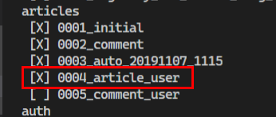

# User - Article & Comment

- **User 클래스 가져오는 법**

- `settings.AUTH_USER_MODEL`
- return str
 - models.py 에서 모델 정의할 때만 사용

 ```python
 # models.py
 
 from django.conf import settings
 settings.AUTH_USER_MODEL
 ```

- `get_user_model()`

   - return class 형태로 리턴됨
   - models.py 제외한 모든 곳에 사용

   ```python
   # models.py
   
   from django.contrib.auth import get_user_model 
   get_user_model()
   ```

   

## 1. User - Article

#### 1.1  Article 모델 클래스 수정 - user 추가해주기

```python
# models.py

from django.conf import settings

class Article(models.Model):
    ...
    user = models.ForeignKey(settings.AUTH_USER_MODEL, on_delete=models.CASCADE)
```

makemigrations

```bash
$ python manage.py makemigrations
You are trying to add a non-nullable field 'user' to article without a default; we can't do that (the database needs something to populate existing rows).
Please select a fix:
 1) Provide a one-off default now (will be set on all existing rows with a null value for this column)
 2) Quit, and let me add a default in models.py
Select an option: 1
Please enter the default value now, as valid Python
The datetime and django.utils.timezone modules are available, so you can do e.g. timezone.now
Type 'exit' to exit this prompt
>>> 2
Migrations for 'articles':
  articles\migrations\0004_article_user.py
    - Add field user to article
(venv)
```
migrate
```bash
$ python manage.py migrate
Operations to perform:
  Apply all migrations: admin, articles, auth, contenttypes, sessions
Running migrations:
  Applying articles.0004_article_user... OK
(venv)
```



#### 1.2 views.py - create 코드 수정

```python
# articles/views.py

@login_required # 데코레이트 지정
def create(request):
    
    ...
            article = form.save(commit=False)
            article.user = request.user
            article.save()
    ...
```

index.html - 사용자 추가 해주기

```django
<!-- index.html  -->

...
  
  <p> 작성자 : {{ article.user }} </p>
...
```


#### 1.3 views.py - Update, Delete 코드 수정

detail.html 코드수정

```django
<!-- detail.html -->
```

views.py 코드 수정 (update)

```python
# articles/views.py

@login_required
def update(request, article_pk):
    article = get_object_or_404(Article,pk=article_pk)
    # 지금 로그인한 사용자와 게시글 작성자 비교
    if request.user == article.user:
        ...
```

views.py 코드 수정 (delete)

```python
# articles/views.py

@require_POST
def delete(request, article_pk):
    # 지금 사용자가 로그인 되어 있는지?
    if request.user.is_authenticated:
        # 삭제할 게시글 가져오기
        article = get_object_or_404(Article,pk=article_pk)
        # 지금 로그인한 사용자와 게시글 작성자 비교
        if request.user == article.user:
            article.delete()    
        else:
            return redirect('articles:detail', article.pk)
    return redirect('articles:index')
```


## 2. User - Comment

#### 2.1 Comment 모델 클래스 코드수정 - user 추가해주기

```python
# articles/models.py

class Comment(models.Model):
    # Comment -> 이중 1:N 관계 (Article, User)
    ...
    user = models.ForeignKey(settings.AUTH_USER_MODEL, on_delete=models.CASCADE)
    ...
```

- 데이터 베이스에 반영
  - vvv


makemigrations

```bash
$ python manage.py makemigrations
You are trying to add a non-nullable field 'user' to comment without a default; we can't do that (the database needs something to populate existing rows).
Please select a fix:
 1) Provide a one-off default now (will be set on all existing rows with a null value for this column)
 2) Quit, and let me add a default in models.py
Select an option: 1
Please enter the default value now, as valid Python
The datetime and django.utils.timezone modules are available, so you can do e.g. timezone.now
Type 'exit' to exit this prompt
>>> 2
Migrations for 'articles':
  articles\migrations\0005_comment_user.py
    - Add field user to comment
(venv)
```

migrate

```bash
$ python manage.py migrate
Operations to perform:
  Apply all migrations: admin, articles, auth, contenttypes, sessions
Running migrations:
  Applying articles.0005_comment_user... OK
(venv)
```


#### 2.2 views.py  - comments_create 코드수정

```python
# articles/views.py

@require_POST
def comments_create(request, article_pk):
    # article = get_object_or_404(Article,pk=article_pk)
    if request.user.is_authenticated:
        comment_form = CommentForm(request.POST)
        if comment_form.is_valid():
            # save 메서드 -> 선택 인자 : (기본값) commit=True -> DB에 저장
            # DB에 바로 저장되는 것을 막아준다. -> commit=False
            comment = comment_form.save(commit=False) 
            comment.user = request.user
            comment.article_id = article_pk # 장고가 만들어준 테이블 형식으로 불러오기
            comment.save()
        return redirect('articles:detail', article_pk)
```

detail.html 코드 수정 - 댓글 입력하는 폼에 if 문 추가 해주기

```django
<!-- detail.html -->


<!-- 댓글 입력하는 Form -->
  <form action="" method="POST">
  
   {{ comment_form }} 
  

  <div class="text-center">
      
      
  </div>
  </form>

  <a href="">[댓글을 작성하려면 로그인 해주세요!]</a>

```

로그아웃 했을 때 댓글에 삭제 보여주지 않기


#### 2.3 views.py  - comments_delete 코드수정

```python
# articles/views.py


@require_POST
def comments_delete(request, article_pk, comment_pk):
    # 1. 로그인 여부 확인
    if request.user.is_authenticated:
        comment = Comment.objects.get(pk=comment_pk)
        # 2. 로그인한 사용자와 댓글 작성자가 같을 경우
        if request.user == comment.user:
            comment.delete()
    return redirect('articles:detail', article_pk)
```

detail.html 코드 수정 - 댓글 작성하는 사용자와 로그인한 사용자가 같은지 if문 추가해주기

```django
<!-- detail.html  -->


...

  <form action="" method="POST">
    
  <div>
      
      
  </div>
  </form>

<hr>

```

로그인 했을 때 댓글에 삭제 보여주기


## [Movies 프로젝트 추가 개발]

#### - Authentication : 회원가입, 로그인, 로그아웃

#### - 댓글(User 정보 포함) 기능


# Model Relationship

## 1.Many to one

- 코드 ~
  - ~~

#### 


## 2. Many to Many

> 단순히 

#### 2.1 1:N의 한계

#### 2.2  중개 모델 생성

- 1:N으로만 구현하려니 예약 정보 시스템을 표현하기가 어렵다.
  - 예를 들어 Patient가 다른 Doctor에게 진료를 받고자 할 때, 기존 기록을 지우지 않으려면 새로운 Patient 인스턴스를 생성해야 한다.
- 중개 모델(class Reservation)을 만들어서 Doctor와  Patient를 이어주는 예약 정보를 담아보자.

#### 2.3 through 옵션

- Patient 입장에서 중개 모델을 거쳐서 `reservation_set`형태로 예약 정보를 가져오는 것은 너무 불편하다.
  - 마찬가지로 Doctor도 `reservation_set`형태로 예약 정보를 먼저 불러온 뒤에 Patient의 정보를 꺼내 올 수 있다.
- Doctor 정보를 중개 모델을 거치지 않고, 다이렉트로 가져와보자.

#### 2.4 `related_name`

- 이제 Patient의 입장에서는 `patient.doctors.all()`과 같은 형태로 쉽게 Doctor 정보를 가져올 수 있다.
- 마찬가지로 Doctor의 입장에서도 `doctor.patients.all()`과 같은 형태로 Patient의 정보를 가져올 수 있게끔, `related_name`옵션을 사용해 보자.

#### 2.5 Many To Many

- 단순히 Doctor와 Patient를 이어줄 생각이라면 , 굳이 중개모델이 필요 없다. `ManyToManyField`만 사용하면 장고가 자동으로 중개 테이블을 만들어준다.

```python
# manytomany/models.py

class Doctor(models.Model):
    name = models.TextField()

    def __str__(self):
        return f'{self.pk}번 의사 {self.name}'

class Patient(models.Model):
    name = models.TextField()
    # doctor = models.ManyToManyField(Doctor, through='Reservation', related_name='patients')
    doctor = models.ManyToManyField(Doctor,related_name='patients')

    def __str__(self):
        return f'{self.pk}번 환자 {self.name}'

```

- 중개모델을 만들지 않았지만 DB를 확인해보면 임의의 테이블을 자동으로 생성해준 것을 확인 할 수 있다.


ex) 1:N ( 의사 : 환자 )

```shell
In [1]: doctor1 = Doctor.objects.create(name='도현')

In [2]: doctor2 = Doctor.objects.create(name='은애')

In [3]: patient1 = Patient.objects.create(name='민승')

In [4]: patient2 = Patient.objects.create(name='세환')

In [5]: Reservation.objects.create(doctor=doctor1, patient=patient2)
Out[5]: <Reservation: Reservation object (1)>

In [6]: Reservation.objects.create(doctor=doctor2, patient=patient2)
Out[6]: <Reservation: Reservation object (2)>

In [7]: Reservation.objects.get(pk=1)
Out[7]: <Reservation: 1의사의 2번 환자>


```


삭제하기


마이그레이션에 있는  0001도 삭제


다시 makemigration, migrate


```shell
In [1]: Doctor.objects.create(name='은애')
Out[1]: <Doctor: 1번 의사 은애>

In [2]: Doctor.objects.create(name='도현')
Out[2]: <Doctor: 2번 의사 도현>

In [3]: doctor1 = Doctor.objects.get(pk=1)

In [4]: doctor2 = Doctor.objects.get(pk=2)

In [5]: patient1 = Patient.objects.create(name='세환')

In [6]: patient2 = Patient.objects.create(name='민승')

In [7]: doctor1.patients.all()
Out[7]: <QuerySet []>

In [8]: doctor2.patients.all()
Out[8]: <QuerySet []>

In [9]: doctor1.patients.add(patient1)

In [10]: doctor1.patients.all()
Out[10]: <QuerySet [<Patient: 1번 환자 세환>]>

In [11]: doctor1.patients.add(patient2)

In [12]: doctor1.patients.all()
Out[12]: <QuerySet [<Patient: 1번 환자 세환>, <Patient: 2번 환자 민승>]>

In [13]: doctor1.patients.remove(patient1)

In [14]: doctor1.patients.all()
Out[14]: <QuerySet [<Patient: 2번 환자 민승>]>
```

