# Like, Profile, Follow

## 1. Like

> `User`는 여러개의 `Article`에 좋아요 표시를할 수 있고, `Article`은 여러명의 `User`에게 좋아요를 받을수 있다.

### 1.1 Model 설정

- `blank=True`
  - 최초 작성되는 글에는 좋아요가 없고, 글이 작성되더라도 좋아요를 받지 못할 수 도 있다.
  - 이 옵션을 줘서 유효성 검사를 통과한다.
  - 실제 데이터베이스는 null이 들어가는게아니라 빈 스트링(`''`)의 형태로 들어간다.

```python
# 04_django_form/articles/models.py

class Article(models.Model):
    ...
    user = models.ForeignKey(settings.AUTH_USER_MODEL, on_delete=models.CASCADE)
    # article1.like_users
    like_users = models.ManyToManyField(settings.AUTH_USER_MODEL, related_name='like_articles', blank=True)

```

임의의 테이블이 생성되었다.

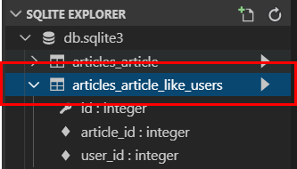

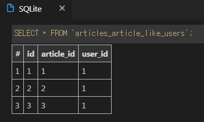

- 현재 상황에서 `related_name`설정은 필수
  - `like_users` 필드에 `related_name`을 쓰지 않으면 User 입장에서 article_set을 사용할 경우 user 필드를 갖고올지 like_users 필드를 갖고 올지 인식을 하지 못한다.
  - `related_name` 설정과 함께 해당필드는 article_set과 같은 방식으로 호출하지 못하고 `like_users `방식으로 호출해야 한다.
- 사용할 수 있는 `ORM` 기능(명령어)
  - `user.article_set.all()` : 유저가 작성한 게시글 전부
  - `user.like_articles.all()` : 유저가 좋아요 누른 게시글 전부
  - `article.user` : 게시글 작성한 유저 - 1:N
  - `article.like_users` : 게시글 좋아요 누른 유저 전부 - M:N

### 1.2 View & URL

- `exists()` & `filter()`
  - `filter()` :  특정한 조건에 맞는 레코드들을 가져온다. 
  - `exists()` : 최소한 하느의 레코드가 존재하는지 여부를 말해준다.
- `get()`vs `filter()` -> 데이터가 없는 경우 에러여부 
  - `get()`은 에러가나고 `filter()` 는 에러가 나지 않는다.

```python
# 04_django_form/articles/views.py

# 좋아요 기능
@login_required
def like(request, article_pk):
    # 좋아요 누를 게시글 가져오기
    article = get_object_or_404(Article, pk=article_pk)
    # 현재 접속하고 있는 유저
    user = request.user

    # 현재 게시글을 좋아요 누른 사람 목록에서, 현재 접속한 
    # 유저가 있을 경우 -> 좋아요 취소
    # if article.like_users.filter(pk=user.pk).exists():
    if user in article.like_users.all():
        article.like_users.remove(user)
    # 목록에없을경우 -> 좋아요 누르기
    else:
        # article.like_users.add(user)
        article.like_users.add(user)
    return redirect('articles:index')
```

### 1.3 Template

#### 1.3.1 Template 분리 (`_artilce.html`)

- 모듈화한 템플릿은 제목 앞에 언더스코어(`_`)를 붙여주는 것이 코딩 컨벤션!!

```
articles/
	templates/
		articles/
			_article.html
			index.html
			...
```

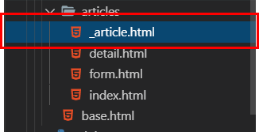

- Bootstrap Card 컴포넌트를 사용해서 예쁘게 꾸며보자.
  - Bootstrap 공식 홈페이지 -> Documentation -> [Cards](https://getbootstrap.com/docs/4.3/components/card/)

```django
<!-- articles/index.html -->





  <br>
  <h1>Articles</h1>
  <hr>

  <a href="">[NEW]</a>
  <hr>
  <div class="row">
  
    <!-- 모듈화 시켜둥 article 템플릿 가져오기 -->
    
  
  <div>

```

```django
<!-- articles/_articles.html -->

<div class="col-12 col-md-6 mb-2">
    <div class="card">
      <div class="card-body">
        <h5 class="card-title">
          글 제목 : {{ article.title }}
        </h5>
        <p class="card-text">
          생성시각 : {{ article.created_at }}
        </p>
        <a href="" 
        class="btn btn-primary">상세보기</a>
      </div>
    </div>
  </div>
```

#### 1.3.2 Font- Awesome 아이콘 적용 및 분기

> [Font- Awesome 홈페이지]( https://fontawesome.com/ ) 들어가서 가입 후  Kits로 들어가서 코드 복사

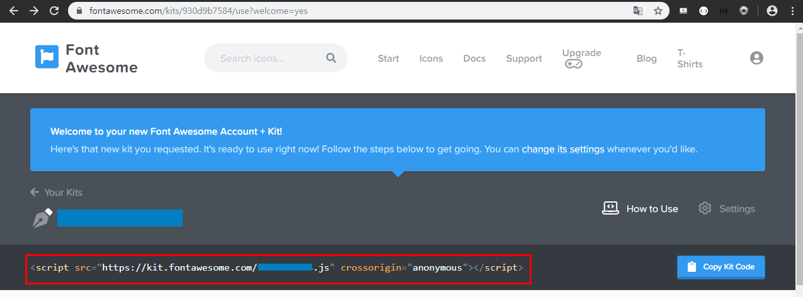

```django
<!-- base.html -->

<!DOCTYPE html>
  ...
  <!-- FontAwesome -->
  <script src="https://kit.fontawesome.com/ kits 코드번호.js" crossorigin="anonymous"></script>
</head>
```

```django
<!-- articles/_articles.html -->

...
        <p class="card-text">
        <a href="">
            <!-- 사용자가 좋아요 안누른 상태면 -> 빈하트 -->
            
              <i class="fas fa-heart"></i>
            <!-- 사용자가 좋아요 누른 상태면 -> 꽉찬하트 -->
            
              <i class="far fa-heart"></i>
            
          </a><br>
          {{ article.like_users.all|length }}명이 이글을 좋아합니다.<br>
          생성시각 : {{ article.created_at }}
        </p>
...
```

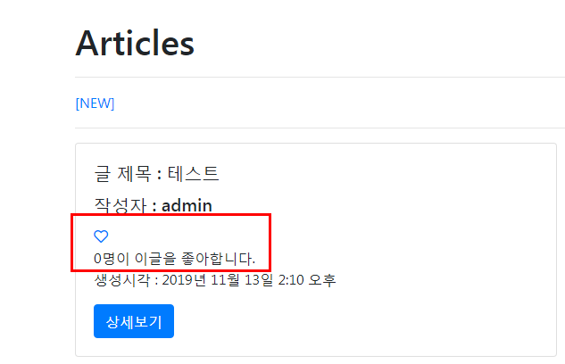

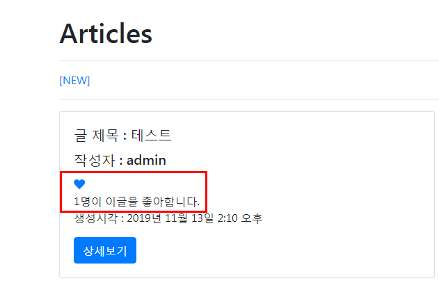

## 2. Profile 페이지

> 각 유저마다 프로필 페이지를 만들어주자.

- User에 대해서 CRUD 로직을 구현한다고 생각하면,  READ(Detail)에 속한다.

#### 2.1 View & URL

- User에 대한 CRUD 로직 대부분을 accounts 앱에서 구현했으므로, Profile 페이지 역시 accounts 앱에 구현해보자.

```python
# 04_django_form/accounts/views.py

# Profile
def profile(request, username):
    person = get_object_or_404(get_user_model(), username=username)
    context = {'person':person}
    return render(request,'accounts/profile.html', context)
```

```python
# accounts/urls.py

from django.urls import path
from . import views

app_name = 'accounts'

urlpatterns = [
   	...
    # url 패던에서 str을 사용하면 맨아래에 위치해서 마지막에 탐색되게 해야한다. 조건을 붙일경우에는 위치상관없음
    path('<str:username>/', views.profile, name='profile'),

]
```

#### 2.2 Template

profile.html 만들기

```django
<!-- accounts/profile.html -->




<h1 class="text-center mt-3">{{ person.username }}님의 Profile</h1>
<hr>
<h3 class="text-center mb-3">{{ person.username }}님이 작성한 게시글</h3>
<div class="row">

  <div class="col-12 col-md-6 mb-2">
    <div class="card">
      <div class="card-body">
        <h5 class="card-title">
          글 제목 : {{ article.title }}
        </h5>
      </div>
    </div>
  </div>
  
</div>
      <h3 class="text-center mb-3">{{ person.username }}님이 작성한 댓글</h3>
      <div class="row">
        
          <div class="col-12 col-md-6 mb-3">
           <div class="card">
             <div class="card-body">
               <h5 class="card-title">
                  댓글 내용 : {{ comment.content }}
               </h5>
                <p class="card-text">
                  작성시각 : {{ comment.created_at|date:"SHORT_DATETIME_FORMAT" }}
                </p>
            <a href="" 
            class="btn btn-primary">게시글 확인</a>
          </div>
        </div>
      </div>
  
</div>

```

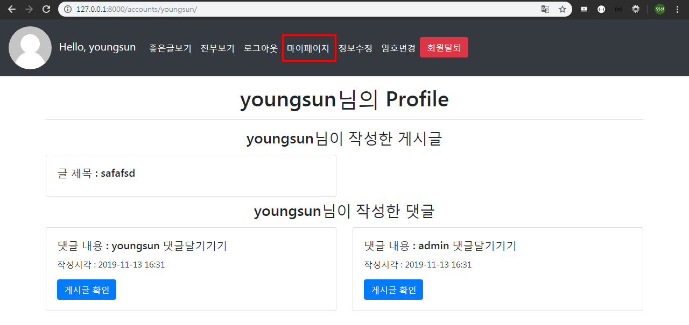

_nav.html 만들기

```django
<!-- articles/_nav.html -->



<nav class="navbar navbar-expand-lg navbar-dark bg-dark">
  <a class="navbar-brand" href="">
    
    Hello, {{ user.username }}
  </a>
  <button class="navbar-toggler" type="button" data-toggle="collapse" data-target="#navbarNav" aria-controls="navbarNav" aria-expanded="false" aria-label="Toggle navigation">
    <span class="navbar-toggler-icon"></span>
  </button>
  <div class="collapse navbar-collapse" id="navbarNav">
    <ul class="navbar-nav">
      
        <li class="nav-item active">
          <a class="nav-link" href="">로그아웃</a>
        </li>
        <li class="nav-item active">
          <a class="nav-link" href="">마이페이지</a>
        </li>
        <li class="nav-item active">
          <a class="nav-link" href="">정보수정</a>
        </li>
        <li class="nav-item active">
          <a class="nav-link" href="">암호변경</a>
        </li>
        <form action="" method="POST" style="display: inline;">
          
          <input type="submit" value="회원탈퇴" class="btn btn-danger">
        </form>
      
        <li class="nav-item active">
          <a class="nav-link" href="">로그인</a>
        </li>
        <li class="nav-item active">
          <a class="nav-link" href="">회원가입</span></a>
        </li>
      
    </ul>
  </div>
</nav>
```

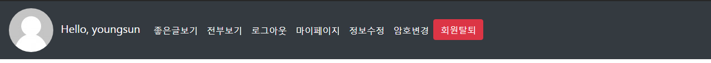

반응형으로 크기 줄였을 때 바뀌는 nav 모습

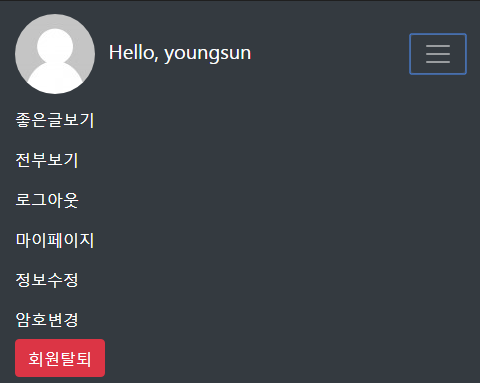


## 3. Follow

- Follow는 User와 User의 M:N 관계이다.
- 장고가 제공하고 있는 User모델을 대체해서 사용한다. 처음부터 User모델을 만드는게 아니라, 장고가 개발자들이 자신만의 User모델을 만들 수 있도록 제공해준다.
  - `AbstractUser`

#### 3.1 User 모델 대체하기

accounts/models.py

```python
# accounts/models.py

from django.db import models
from django.conf import settings
from django.contrib.auth.models import AbstractUser

# Create your models here.
class User(AbstractUser):
    followers = models.ManyToManyField(settings.AUTH_USER_MODEL, related_name='followings')
```

`ManyToManyField`를 사용하면 자동으로 테이블을 만들어준다. 양쪽접근가능

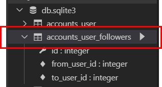

04_django_form/config/settings.py

```python
# config/settings.py

# 기본값 : auth.User
AUTH_USER_MODEL = 'accounts.User'
```


새로운 **마이그레이션**을 해줘야한다. 

기존에 있던 articles/migrations에 있는 파일들 중 `000숫자`가 붙은 파일들을 삭제하고 `db.sqlite3` 파일도 삭제해 준다.

```bash
$ python manage.py makemigrations
Migrations for 'accounts':
  accounts\migrations\0001_initial.py
    - Create model User
Migrations for 'articles':
  articles\migrations\0001_initial.py
    - Create model Article
    - Create model Comment
(venv)

$ python manage.py migrate
```

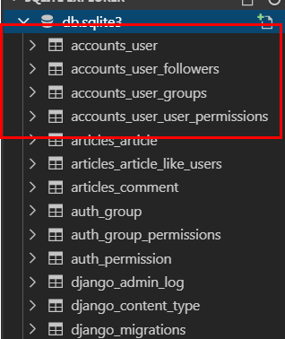

새로운 테이블들이 생성되었다.

##### 3.1.1 admin 추가

새로운 user를 생성해줘야한다.  -  `createsuperuser`

```bash
$ python manage.py createsuperuser
사용자 이름: admin
이메일 주소:
Password:
Password (again):
비밀번호가 사용자 이름와 너무 유사합니다.
비밀번호가 너무 짧습니다. 최소 8 문자를 포함해야 합니다.
비밀번호가 너무 일상적인 단어입니다.
Bypass password validation and create user anyway? [y/N]: y
Superuser created successfully.
(venv)
```

accounts/admin.py - 코드 추가

```python
# accounts/admin.py

from django.contrib import admin
from django.contrib.auth.admin import UserAdmin
from .models import User

# Register your models here.
admin.site.register(User, UserAdmin)
```

원래 admin 페이지에서 로그인을 하면 아래와 같은 이미지로 보여진다.

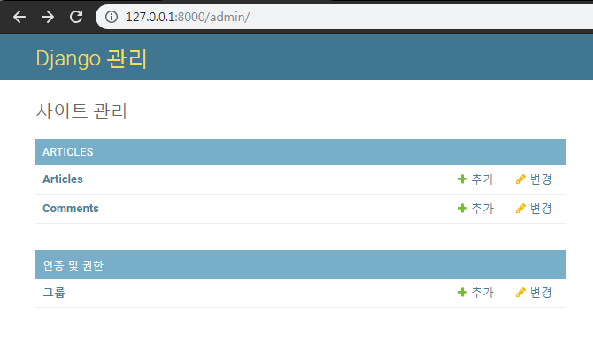

하지만 admin.py를 수정한 뒤 화면을 보면 ACCOUNTS가 추가된 것을 볼 수 있다.

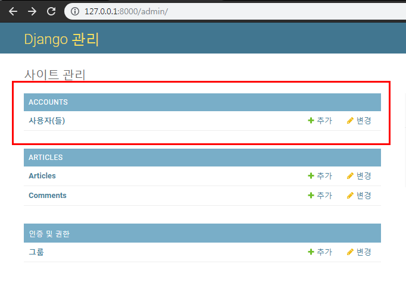

#### 3.2 View & URL 

views.py

```python
# articles/views.py

from django.contrib.auth import get_user_model

# 팔로우 기능
@login_required
def follow(request, article_pk, user_pk):
    # 게시글 작성한 유저
    person = get_object_or_404(get_user_model(), pk=user_pk)
    # 지금 접속하고 있는 유저
    user = request.user
    
    if person != user:
        # 게시글 작성 유저 팔로워 명단에 접속중인 유저가 있을 경우
        # -> Unfollow
        if user in person.followers.all():
            person.followers.remove(user)
        # 목록에 없으면 -> Follow
        else:
            person.followers.add(user)
    # 게시글 상세정보로 redirect
    return redirect('articles:detail', article_pk)
```

articles/urls.py

```python
# articles/urls.py

from django.urls import path
from . import views

app_name = 'articles'

urlpatterns = [
    ...
    path('<int:article_pk>/follow/<int:user_pk>/', views.follow, name='follow'),

]
```

#### 3.3 Template

_follow.html 만들기

```django
<!-- _follow.html -->

<div class="jumbotron">
  <h1 class="display-4">
    {{ person.username }}
  </h1>
  <p class="lead">
    팔로워 : {{ person.followers.all|length }}명 | 팔로잉 : {{ person.followings.all|length }}명
  </p>
  <hr class="my-4">
  
    <a href="" class="btn btn-primary btn-lg" role="button">
      
        Unfollow
      
        Follow
      
    </a>
      
</div>
```

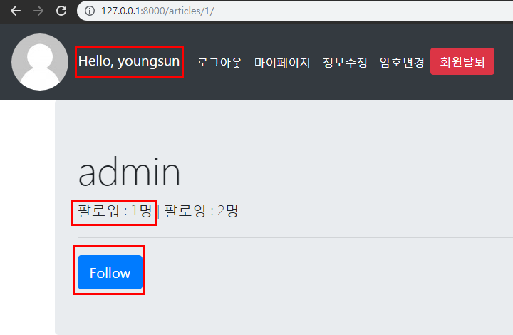

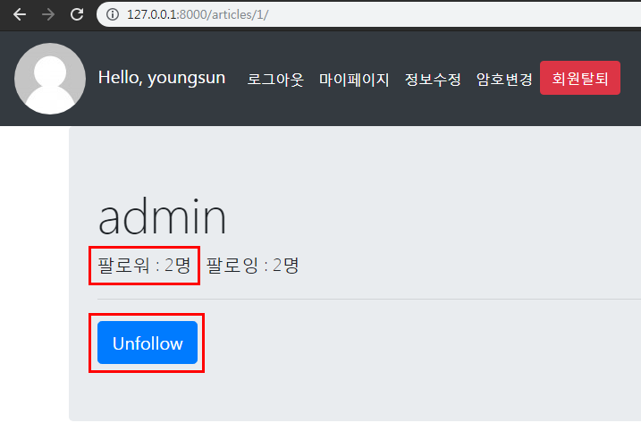

**+ 팔로워하는 사람들 보여주기 ** -  _follow.html 코드 수정

```django
<!-- _follow.html -->

  ...
  <h4>팔로워 다 나와랏!</h4>
    
      <p>{{ follower.username }}</p>
    
      <p>팔로워가 없어용...</p>
    
  ...
```

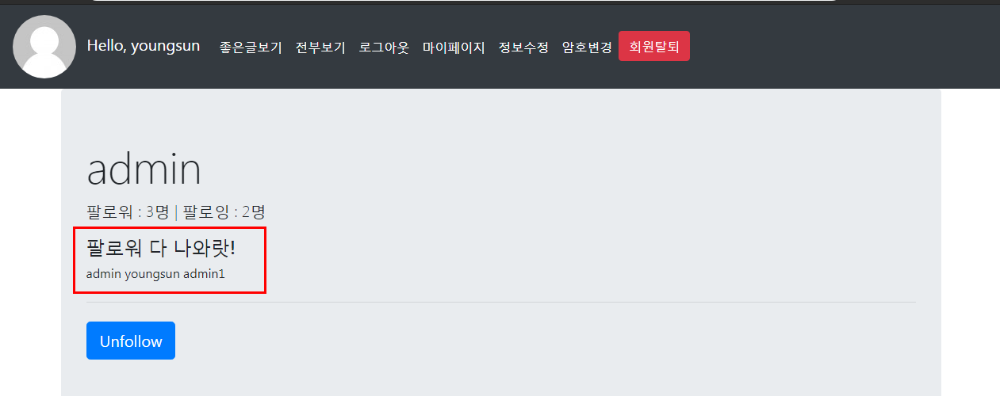


## 4.  내가 팔로우 하는 사람의 글 + 내가 작성한 글, 모든사람의 글 보여주기

#### 4.1 View & URL

articles/views.py

```python
# articles/views.py

# 내가 팔로우 하는 사람의 글 + 내가 작성한 글
def list(request):
    # 내가 팔로우하고 있는 사람들
    followings = request.user.followings.all()
    # 내가 팔로우하고 있는 사람들 + 나 -> 합치기
    followings = chain(followings, [request.user])
    # 위 명단 사람들 게시글 가져오기
    articles = Article.objects.filter(user__in=followings).order_by('-pk').all()
    comment_form = CommentForm()
    context = {
        'articles':articles,
        'comment_form':comment_form,
    }
    return render(request, 'articles/article_list.html', context)

# 모든 사람 글 보여주기
def explore(request):
    articles = Article.objects.all()
    comment_form = CommentForm()
    context = {
        'articles':articles,
        'comment_form':comment_form,
    }    
    return render(request, 'articles/article_list.html', context)
```

articles/urls.py

```python
# articles/urls.py

from django.urls import path
from . import views

app_name = 'articles'

urlpatterns = [
    ...
    path('list/', views.list, name='list'),
    path('explore/', views.explore, name='explore'),

]
```

#### 4.2 Template

article_list.html 만들기

```django
<!-- article_list.html -->





<!-- URL Resolver를 사용해서 제목값 분기 -->

  <br>
  <h1>List</h1>

  <h1>Explore</h1>



  <p> 글 작성자 : {{ article.user }}</p>
  <p> 글 제목 : {{ article.title }}</p>
  <p> 글 내용 : {{ article.content }}</p>
  <hr>
  <form action="" method='POST' >
    
    
    
    
  </form>


```

_nav.html - 코드 수정 

```django
<!-- _nav.html -->

<ul class="navbar-nav">
      
        <li class="nav-item active">
          <a class="nav-link" href="">좋은글보기</a>
        </li>
        <li class="nav-item active">
          <a class="nav-link" href="">전부보기</a>
        </li>
        ...
```

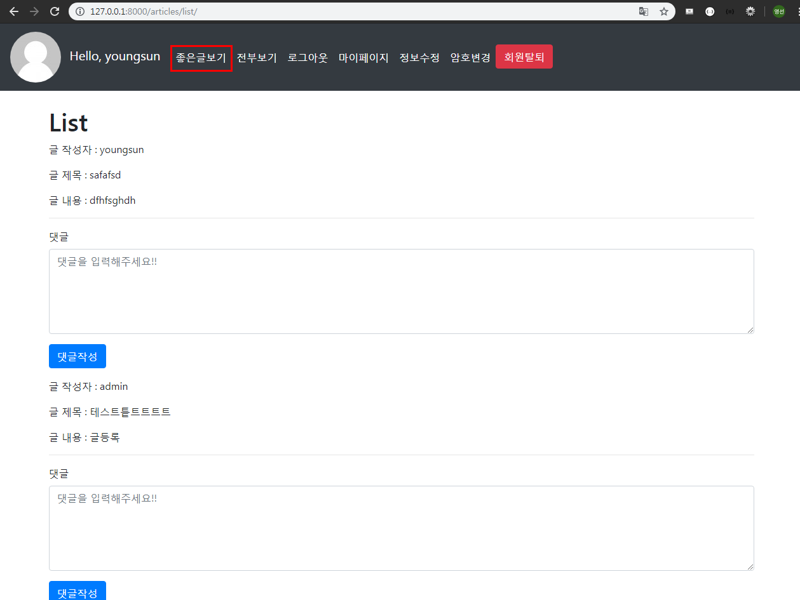


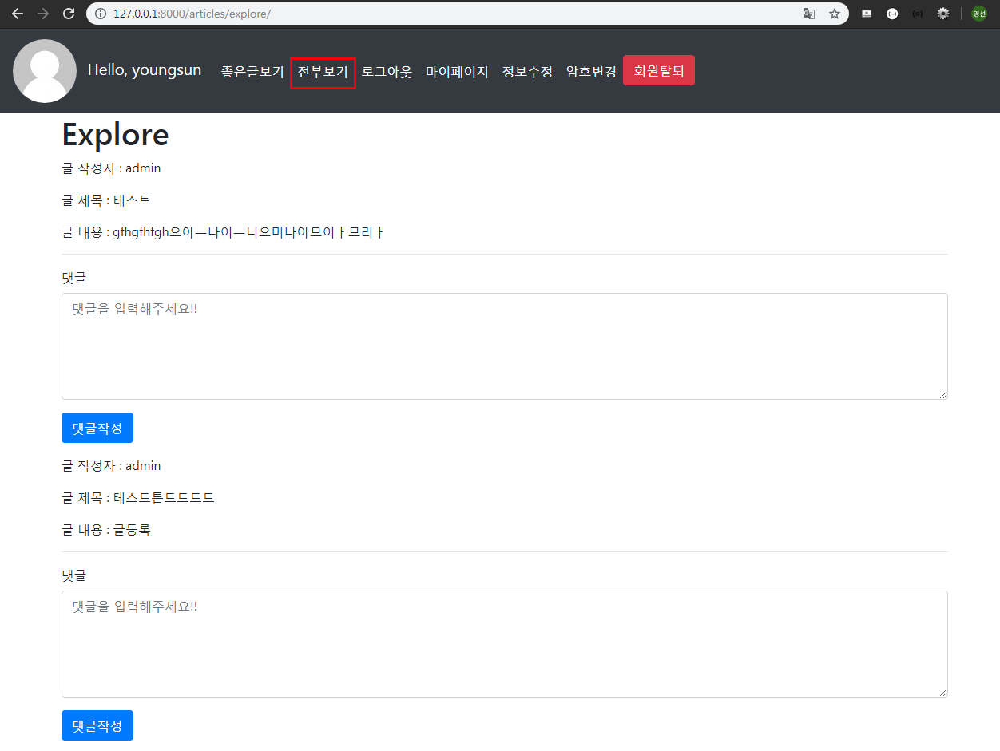