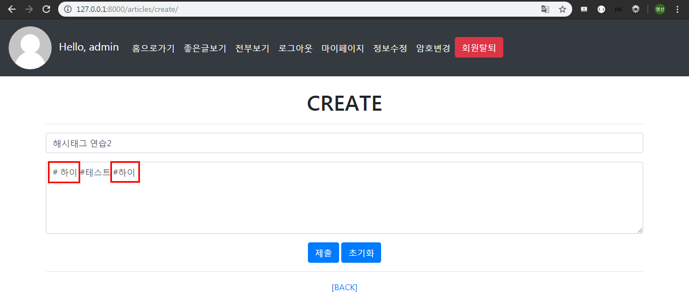
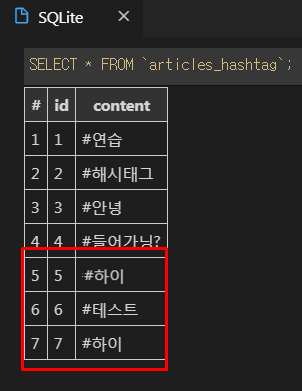

# Hashtag & Social Login

## 1. Hashtag 

>  Article과 Hashtag는 M:N 관계이다. 그리고 Hashtag는 고유한 값이어야 한다(`unique=True`)

### 1.1 Model

- Article 클래스에서 Hashtag 모델을 사용하기 때문에 Hashtag 클래스를 Article 클래스보다 위에다 작성

- `unique=True` 
  - True인 경우, 필드는 테이블 전체에서 고유한 값이어야 한다.
  - 유효성 검사 단계에서 실행되며, **중복값이 있는 모델을 저장하려고 하면 `.save()` 메서드로 인해서 에러가 발생**한다.

```python
# articles/models.py 

# Article 클래스에서 Hashtag 모델을 사용하기 때문에 Hashtag 클래스를 Article 클래스보다 위에다 작성
class Hashtag(models.Model):
    content = models.TextField(unique=True)
    
class Article(models.Model):
    ...
     # 해시태그가 없어도 작성될수 있게 blank=True
    Hashtags = models.ManyToManyField(Hashtag, blank=True)

```

마이그레이션, 마이그레이트

```bash
$ python manage.py makemigrations
Migrations for 'articles':
  articles\migrations\0002_auto_20191114_0927.py
    - Create model Hashtag
    - Add field Hashtags to article
(venv)

$ python manage.py migrate
Operations to perform:
  Apply all migrations: accounts, admin, articles, auth, contenttypes, sessions
Running migrations:
  Applying articles.0002_auto_20191114_0927... OK
(venv)
```

해시태그 테이블이 자동생성 되었다.


#### 1.1.1 admin 수정

```python
# articles/admin.py

from .models import Hashtag

...
class HashtagAdmin(admin.ModelAdmin):
    list_display = ('content',) 
    
admin.site.register(Hashtag, HashtagAdmin)    
```


### 1.2 CREATE

#### 1.2.1 로직 설계하기

1. **사용자가 업로드한 content 확인**

   "오늘 수능날이라고 한다... 하지만 난 오늘도 신나는 마음으로 출근을 한다... #행복 그 자체다...ㅎ 옛날 생각 나네 또.. #감성 #추억 #뿌듯 #행복 #수능왕"

2. **split로 잘라서 리스트로 변환**

   ~~

3. **리스트 반복문 돌리기**

   ~~

4. **동시에 해당 게시글 해시태그 목록에 추가**

```
title : 출근
content :

str 타입

1. 사용자가 업로드한 content
"오늘 수능날이라고 한다... 하지만 난 오늘도 신나는 마음으로 출근을 한다... #행복 그 자체다...ㅎ 옛날 생각 나네 또.. #감성 #추억 #뿌듯 #행복 #수능왕".split(')

2. .splite() 메소드로 리스트 형식으로 변환
['오늘', '수능날이라고', '한다..','하지만','난','오늘도','#행복',]

3. 리스트 반복문 돌리기 : 앞자리가 '#'으로 시작하는 단어를 해시태그 테이블에 등록
- 같은 해시태그가 오면 unique=True 옵션으로 인해 에러 발생.이를 방지하기 위해 get_or_create() 사용.

4. 동시에 해당 게시글 해시태그 목록에 추가해줌
-> article.hashtags.add(word)
```

- `get_or_create()` 
  - word와 같은 해시태그를 찾고있ㅇ면 기존 객체 반환, 없으면 새로운 객체 생성
  - `split()` : 띄어쓰기로 나눠줌
  - `hashtag, created = Hashtag.objects.get_or_create(content=word)`
    - 새로운 객체 생성되면 `creates=True`
    - 기존 객체 반환되면 `creates=False`


#### 1.2.2 View - hashtag 추가

```python
# articles/views.py

@login_required # 데코레이트 지정
def create(request):
    ...
            article.save()
            # hashtag
            # 게시글 내용을 split해서 리스트로 만듦
            for word in article.content.split():
                # word가 '#'으로 시작할 경우 해시태그 등록
                if word.startswith('#'):
                    hashtag, created = Hashtag.objects.get_or_create(content=word)
                    article.hashtags.add(hashtag)

        return redirect('articles:detail', article.pk)
    ...
```

해쉬태그를 중복해서 입력하면, `get_or_create` 가 중복제거해서 DB에 저장한다.






### 1.3 UPDATE - hashtag 추가

> 이미 article에 등록된 hashtag가 있으므로 `clear()`로 hashtag를 초기화해주고 새롭게 등록을 해보자

```python
# articles/views.py

@login_required
def update(request, article_pk):
    ...
                # hashtag
                article.hashtags.clear()
                for word in article.content.split():
                    if word.startswith('#'):
                        hashtag, created = Hashtag.objects.get_or_create(content=word)
                        article.hashtags.add(hashtag)

                return redirect('articles:detail', article.pk)
    ...
```


### 1.4 READ - Hastag 글 모아보기

#### 1.4.1 View & URL

Article과 Hashtag는 M:N 관계이지만 내가 변수명을 따로 커스터마이징을 하지 않았기 때문에 `hashtag.article_set` 으로 hashtag를 참조하는 article들을 query_set으로 받아온다.

articles/views.py

```python
# articles/views.py

# Hastag 글 모아보기
def hashtag(request, hash_pk):
    # 해시태그 가져오기
    hashtag = get_object_or_404(Hashtag, pk=hash_pk)
    # 해당 해시태그를 참조하는 게시글들 가져오기
    articles = hashtag.article_set.order_by('-pk')
    context = {
        'hashtag':hashtag,
        'articles':articles,
    }
    return render(request, 'articles/hashtag.html', context)
```

articles/urls.py

```python
# articles/urls.py

from django.urls import path
from . import views

app_name = 'articles'

urlpatterns = [
    ...
    path('<int:hash_pk>/hashtag/', views.hashtag, name='hashtag'),

]
```

#### 1.4.2 Template

hashtag.html

```django
<!-- hashtag.html --->





<h1>{{ hashtag.content }} 게시글 모아보기</h1>
<h4>{{ articles|length }}개의 글이 있습니다.</h4>
<hr>

  <p>글 제목 : {{ article.title }}</p>
  <p>글 내용 : {{ article.content }}</p>
  <P>{{ article.comment_set.all|length }}개의 댓글이 있습니다.</p>
  <P>{{ article.like_users.all|length }}명이 이글을 좋아합니다.</p>
  <a href="" class="btn btn-primary">게시글 바로가기</a>


```


### 1.5 Hashtag에 link 걸어주기

articles폴더에 templatetags 폴더를 생성해준다.  그리고 templatetags폴더안에 make_link.py 파일을 생성해준다.

```python
# articles/templatetags/make_link.py

from django import template

register = template.Library()

@register.filter
def hashtag_link(article):
    # #안녕 을 입력하고 스페이스로 띄어쓰기를 해주기 때문에 ' '(공백)을 표시해줘야함
    content = article.content + ' '
    hashtags = article.hashtags.all()

    for hashtag in hashtags:
        content = content.replace(
            hashtag.content+' ',
            f'<a href="/articles/{hashtag.pk}/hashtag/">{hashtag.content}</a> '
        )
    return content
```

detail.html - 코드수정

```django
<!-- detail.html -->

...



...
<!-- safe : 사용을 안하게 되면 html태그가 화면상에 보이게 된다. html escape -->
<p>글 내용 : {{ article|hashtag_link|safe }}</p>
...

```


