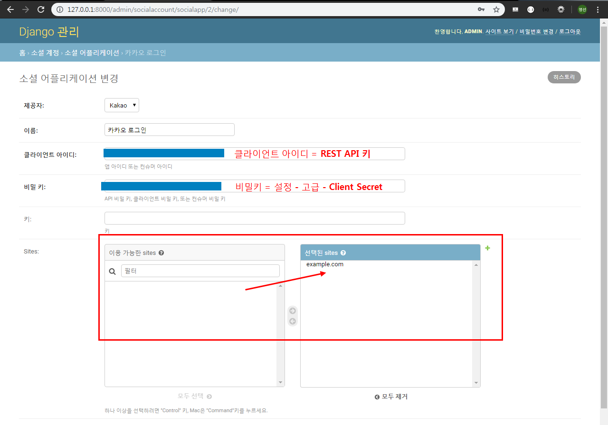

# Hashtag & Social Login

## 1. Hashtag 

>  Article과 Hashtag는 M:N 관계이다. 그리고 Hashtag는 고유한 값이어야 한다(`unique=True`)

### 1.1 Model

- Article 클래스에서 Hashtag 모델을 사용하기 때문에 Hashtag 클래스를 Article 클래스보다 위에다 작성

- `unique=True` 
  - True인 경우, 필드는 테이블 전체에서 고유한 값이어야 한다.
  - 유효성 검사 단계에서 실행되며, **중복값이 있는 모델을 저장하려고 하면 `.save()` 메서드로 인해서 에러가 발생**한다.

```python
# articles/models.py 

# Article 클래스에서 Hashtag 모델을 사용하기 때문에 Hashtag 클래스를 Article 클래스보다 위에다 작성
class Hashtag(models.Model):
    content = models.TextField(unique=True)
    
class Article(models.Model):
    ...
     # 해시태그가 없어도 작성될수 있게 blank=True
    hashtags = models.ManyToManyField(Hashtag, blank=True)

```

마이그레이션, 마이그레이트

```bash
$ python manage.py makemigrations
Migrations for 'articles':
  articles\migrations\0002_auto_20191114_0927.py
    - Create model Hashtag
    - Add field Hashtags to article
(venv)

$ python manage.py migrate
Operations to perform:
  Apply all migrations: accounts, admin, articles, auth, contenttypes, sessions
Running migrations:
  Applying articles.0002_auto_20191114_0927... OK
(venv)
```

해시태그 테이블이 자동생성 되었다.


#### 1.1.1 admin 수정

```python
# articles/admin.py

from .models import Hashtag

...
class HashtagAdmin(admin.ModelAdmin):
    list_display = ('content',) 
    
admin.site.register(Hashtag, HashtagAdmin)    
```


### 1.2 CREATE

#### 1.2.1 로직 설계하기

1. **사용자가 업로드한 content 확인**

   "오늘 수능날이라고 한다... 하지만 난 오늘도 신나는 마음으로 출근을 한다... #행복 그 자체다.. ㅎ.. 옛날 생각 나네 또.. #감성 #추억 #뿌듯 #행복 #수능왕"

2. **split로 잘라서 리스트로 변환**

   ['오늘', '수능날이라고', '한다...', '하지만', .... '#행복', '#뿌듯', '#감성', ... '#행복', '#수능왕']

3. **리스트 반복문 돌리기**

   `for word in article.content.split():`

4. **동시에 해당 게시글 해시태그 목록에 추가**

   `add()`

```
title : 출근
content :

str 타입

1. 사용자가 업로드한 content
"오늘 수능날이라고 한다... 하지만 난 오늘도 신나는 마음으로 출근을 한다... #행복 그 자체다...ㅎ 옛날 생각 나네 또.. #감성 #추억 #뿌듯 #행복 #수능왕".split(')

2. .splite() 메소드로 리스트 형식으로 변환
['오늘', '수능날이라고', '한다...', '하지만', .... '#행복', '#뿌듯', '#감성', ... '#행복', '#수능왕']

3. 리스트 반복문 돌리기 : 앞자리가 '#'으로 시작하는 단어를 해시태그 테이블에 등록
- 같은 해시태그가 오면 unique=True 옵션으로 인해 에러 발생.이를 방지하기 위해 get_or_create() 사용.

4. 동시에 해당 게시글 해시태그 목록에 추가해줌
-> article.hashtags.add(word)
```

- `get_or_create()` 
  - word와 같은 해시태그를 찾고있ㅇ면 기존 객체 반환, 없으면 새로운 객체 생성
  - `split()` : 띄어쓰기로 나눠줌
  - `hashtag, created = Hashtag.objects.get_or_create(content=word)`
    - 새로운 객체 생성되면 `creates=True`
    - 기존 객체 반환되면 `creates=False`


#### 1.2.2 View - hashtag 추가

```python
# articles/views.py

@login_required # 데코레이트 지정
def create(request):
    ...
            article.save()
            # hashtag
            # 게시글 내용을 split해서 리스트로 만듦
            for word in article.content.split():
                # word가 '#'으로 시작할 경우 해시태그 등록
                if word.startswith('#'):
                    hashtag, created = Hashtag.objects.get_or_create(content=word)
                    article.hashtags.add(hashtag)

        return redirect('articles:detail', article.pk)
    ...
```

해쉬태그를 중복해서 입력하면, `get_or_create` 가 중복제거해서 DB에 저장한다.


### 1.3 UPDATE - hashtag 추가

> 이미 article에 등록된 hashtag가 있으므로 `clear()`로 hashtag를 초기화하고 새롭게 등록을 해보자

```python
# articles/views.py

@login_required
def update(request, article_pk):
    ...
                # hashtag
                article.hashtags.clear()
                for word in article.content.split():
                    if word.startswith('#'):
                        hashtag, created = Hashtag.objects.get_or_create(content=word)
                        article.hashtags.add(hashtag)

                return redirect('articles:detail', article.pk)
    ...
```


### 1.4 READ - Hastag 글 모아보기

#### 1.4.1 View & URL

Article과 Hashtag는 M:N 관계이지만 내가 변수명을 따로 커스터마이징을 하지 않았기 때문에 `hashtag.article_set` 으로 hashtag를 참조하는 article들을 query_set으로 받아온다.

articles/views.py

```python
# articles/views.py

# Hastag 글 모아보기
def hashtag(request, hash_pk):
    # 해시태그 가져오기
    hashtag = get_object_or_404(Hashtag, pk=hash_pk)
    # 해당 해시태그를 참조하는 게시글들 가져오기
    articles = hashtag.article_set.order_by('-pk')
    context = {
        'hashtag':hashtag,
        'articles':articles,
    }
    return render(request, 'articles/hashtag.html', context)
```

articles/urls.py

```python
# articles/urls.py

from django.urls import path
from . import views

app_name = 'articles'

urlpatterns = [
    ...
    path('<int:hash_pk>/hashtag/', views.hashtag, name='hashtag'),

]
```

#### 1.4.2 Template

hashtag.html

```django
<!-- hashtag.html --->





<h1>{{ hashtag.content }} 게시글 모아보기</h1>
<h4>{{ articles|length }}개의 글이 있습니다.</h4>
<hr>

  <p>글 제목 : {{ article.title }}</p>
  <p>글 내용 : {{ article.content }}</p>
  <P>{{ article.comment_set.all|length }}개의 댓글이 있습니다.</p>
  <P>{{ article.like_users.all|length }}명이 이글을 좋아합니다.</p>
  <a href="" class="btn btn-primary">게시글 바로가기</a>


```


### 1.5 Hashtag에 link 걸어주기

articles폴더에 templatetags 폴더를 생성해준다.  그리고 templatetags폴더안에 make_link.py 파일을 생성해준다.

```python
# articles/templatetags/make_link.py

from django import template

register = template.Library()

@register.filter
def hashtag_link(article):
    # #안녕 을 입력하고 스페이스로 띄어쓰기를 해주기 때문에 ' '(공백)을 표시해줘야함
    content = article.content + ' ' 
    hashtags = article.hashtags.all()

    for hashtag in hashtags:
        # replace(바꿀거, 넣어줄거)
        # 마지막에 공백 안넣어주면 hashtag로 인식을 못함
        content = content.replace(
            hashtag.content+' ',
            f'<a href="/articles/{hashtag.pk}/hashtag/">{hashtag.content}</a> '
        )
    return content
```


detail.html - 코드수정

```django
<!-- detail.html -->

...



...
<!-- safe : 사용을 안하게 되면 html태그가 화면상에 보이게 된다. html escape -->
<p>글 내용 : {{ article|hashtag_link|safe }}</p>
...

```


## 2. Social Login

> 인증,계정,등록 등을 다루는 여러가지 방법이 존재하는데, 우리는 **`django-allauth`라는 라이브러리를 사영해서 손쉽게 Social Login을 구현해보자.**
>
> 대부분의 소셜 로그인을 지원하고 회원가입을 시킬 수 있다.

### 2.1 사전준비

사용설명 : https://django-allauth.readthedocs.io/en/latest/installation.html  보면서 하기!

```bash
$ pip install django-allauth
```


settings.py - 코드추가

```python
# settings.py 

AUTHENTICATION_BACKENDS = (
    # Needed to login by username in Django admin, regardless of `allauth`
    'django.contrib.auth.backends.ModelBackend',
)

INSTALLED_APPS = [
    ...
    'django.contrib.sites',
    'allauth',
    'allauth.account',
    'allauth.socialaccount',
    'allauth.socialaccount.providers.kakao',
   	...
]

SITE_ID = 1
```

config/urls.py

```python
# config/urls.py

from django.contrib import admin
from django.urls import path, include

urlpatterns = [
    ...
    path('accounts/', include('allauth.urls')),
]
```

마이그레이트 해주기

```bash
$ python manage.py migrate
Operations to perform:
  Apply all migrations: account, accounts, admin, articles, auth, contenttypes, sessions, sites,
socialaccount
Running migrations:
  Applying account.0001_initial... OK
  Applying account.0002_email_max_length... OK
  Applying sites.0001_initial... OK
  Applying sites.0002_alter_domain_unique... OK
  Applying socialaccount.0001_initial... OK
  Applying socialaccount.0002_token_max_lengths... OK
  Applying socialaccount.0003_extra_data_default_dict... OK
(venv)
```

accounts에 연결된 url들을 확인할 수 있다.(중복되는것은 걱정안해도 된다!) 위에뜨는것은 현재 내가 지정한  형식이고 뜨는 것이고  아래에 뜨는것은 옛날방식(1버전의 정규표현식)인데.... 위에서 오류가 나도 아래서 걸리기 때문에 괜찮다..! 그런데 아래부분은 kakao login이 걸리게 되게끔 할꺼다,,,!


admin 페이지에 들어가면 새로운 계정, 사이트, 소셜 계정이 생성된 것을 확인 할 수 있다.


### 2.2 Kakao Developer `OAuth`등록

#### 2.2.1 앱만들기


#### 2.2.2 플랫폼 추가해주기


만든 플랫폼을 저장해준다.


#### 2.2.3 사용자 관리

off -> on으로 바꿔준다.


로그인 동의항목에서 프로필정보와 카카오계정을 on으로 변경해주고  수집목적을 입력해준다.


로그인 Redirect URI 에서 `http://127.0.0.1:8000/accounts/kakao/login/callback/` 추가 해준다.


#### 2.2.4 admin  페이지에서 소셜 어플리케이션에 카카오 로그인 을 새로 추가해 준다.


Sites에서 example.com을 화살표 방향으로 이동시켜줘야한다.(의미X, 로컬주소 넣어줘도 됨)

default값이하나 필요해서 하나 옮긴거당!!



비밀키 가져오는 방법 - 설정>고급


저장을 해주면 아래와 같이 저장된다.


#### 2.2.5 Template

Template/accounts 에서 login.html 생성 - [사이트 참고~](https://django-allauth.readthedocs.io/en/latest/templates.html)

```django
<!-- accounts/login.html -->







  <br>
  <h1>회원가입</h1>

  <br>
  <h1>로그인</h1>

  <br>
  <h1>회원정보수정</h1>

  <br>
  <h1>비밀번호변경</h1>

<hr>
<form action="" method="POST">
   
  
  
  
  <a href="" class="btn btn-warning">카카오 로그인</a>
</form>

```

#### 2.2.6 View

views.py - login 부분에서 login.html 로 변경

```python
# accounts/views.py

def login(request):
    ...
	# return render(request, 'accounts/auth_form.html', context)
    return render(request, 'accounts/login.html', context)
```

이렇게 설정하고 카카오 로그인을 하게되면 에러가 뿜뿜발생하고 경로가 이상하게 연결되어 있다..!


로그인 후 redirect 경로를 커스터마이징 해줘야한다!!

settings.py

```python
# settings.py

# 로그인 후 리다이렉트 경로
LOGIN_REDIRECT_URL ='articles:index'
```

커스터마이징 한 후 실행결과 


카카오 로그인에 성공하였다~~ 추캌