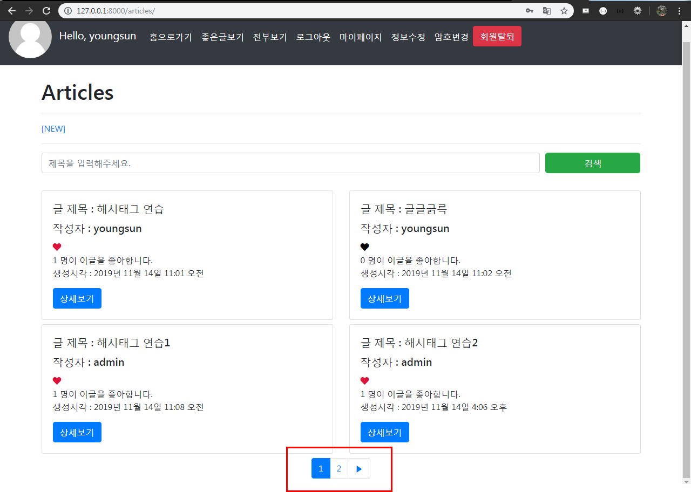

# Pagination & Search

## 1. Pagination - 페이지 정리

### 1.1 View

- `articles/views.py` - `index` 로직 수정 , `Paginator`를 import 해주기

```python
from django.core.paginator import Paginator

def index(request):
    articles = Article.objects.all()

    # 1. articles를 Paginator에 넣기
    # - Paginator(전체 리스트, 보여줄 갯수)
    paginator = Paginator(articles, 2)
    # 2. 사용자가 요청한 page가져오기
    page = request.GET.get('page')
    # 3. 해당하는 page의 article만 가져오기
    # print(dir(paginator))
    articles = paginator.get_page(page)
    print(dir(articles))
    print(dir(articles.paginator))

    context = {'articles':articles,}
    return render(request,'articles/index.html', context)
```

- 실행결과

원래의 인덱스페이지에는 다섯개의 게시글만 있었다.


보여줄 갯수를 2개로 지정하여 게시글이 두개만 보이게 된다.


쿼리 스트링으로 페이지 나눠보기 - 근데 아직은 실행이 안된당~


### 1.2 Template

https://getbootstrap.com/docs/4.3/components/pagination/

- `index.html` - bootstrap의 Pagination에서 Alignment를 사용한다.

```django
<nav aria-label="Page navigation example">
  <ul class="pagination justify-content-center">
    <li class="page-item disabled">
      <a class="page-link" href="#" tabindex="-1" aria-disabled="true">Previous</a>
    </li>
    <li class="page-item"><a class="page-link" href="#">1</a></li>
    <li class="page-item"><a class="page-link" href="#">2</a></li>
    <li class="page-item"><a class="page-link" href="#">3</a></li>
    <li class="page-item">
      <a class="page-link" href="#">Next</a>
    </li>
  </ul>
</nav>
```

- 실행결과


- `articles/views.py`에서 아래의 print  를 입력하고 서버를 실행시켜보자.

```python
print(dir(articles))
print(dir(articles.paginator))
```

그러면 아래와 같이 print가 찍히는 것을 볼 수 있다.

- `dir (articles)`

['abstractmethods__', '__class__', '__contains__', '__delattr__', '__dict__', '__dir__', '__doc__', '__eq__', '__format__', '__ge__', '__getattribute__', '__getitem__', '__gt__', '__hash__', '__init__', '__init_subclass__', '__iter__', '__le__', '__len__', '__lt__', '__module__', '__ne__', '__new__', '__reduce__', '__reduce_ex__', '__repr__', '__reversed__', '__setattr__', '__sizeof__', '__slots__', '__str__', '__subclasshook__', '__weakref__', '_abc_impl', 'count', 'end_index', `'has_next'`, 'has_other_pages', `'has_previous'`, 'index', `'next_page_number'`, 'number', 'object_list', 'paginator', `'previous_page_number'`, 'start_index']


- ` dir (articles.paginator)`

['class__', '__delattr__', '__dict__', '__dir__', '__doc__', '__eq__', '__format__', '__ge__', '__getattribute__', '__gt__', '__hash__', '__init__', '__init_subclass__', '__le__', '__lt__', '__module__', '__ne__', '__new__', '__reduce__', '__reduce_ex__', '__repr__', '__setattr__', '__sizeof__', '__str__', '__subclasshook__', '__weakref__', '_check_object_list_is_ordered', '_get_page', 'allow_empty_first_page', 'count', 'get_page', 'num_pages', 'object_list', 'orphans', 'page', `'page_range'`, 'per_page', 'validate_number']


- `index.html`  - 코드 수정 (버튼 글자를 아이콘으로 변경)

```django
<nav aria-label="Page navigation example">
  <ul class="pagination justify-content-center">
    <!-- 이전 페이지 버튼 -->
    <li class="page-item">
      <a class="page-link" href="#" tabindex="-1" aria-disabled="true">◀</a>
    </li>

    <!-- 페이지 버튼 -->
    <li class="page-item"><a class="page-link" href="#">1</a></li>
    <li class="page-item"><a class="page-link" href="#">2</a></li>
    <li class="page-item"><a class="page-link" href="#">3</a></li>

    <!-- 다음 페이지 버튼 -->
    <li class="page-item">
      <a class="page-link" href="#">▶</a>
    </li>
  </ul>
</nav>
```


- `dir (articles)` 와 ` dir (articles.paginator)` 의 print에 찍힌 내용들을 사용해서 페이지 쿼리스트링이 되게 끔 조건문을 주자.
- **이전 페이지가 있을 경우** - `previous_page_number`를 사용해서 첫번째 페이지일때 ◀ 버튼이 보이지 않게 하자.

```django
<!-- 이전 페이지가 있을 경우 -->

<li class="page-item">
  <a class="page-link" href="?page={{ articles.previous_page_number }}" tabindex="-1"
    aria-disabled="true">◀</a>
</li>

```

쿼리 스트링을 사용해서 입력해서 첫번째 페이지로 가게 되면 이전버튼이 보이지 않게 된다.


- **페이지 버튼** - 각각의 숫자 버튼을  누르면 게시글이 뜨게 하자.

```django
<!-- 페이지 버튼 -->

<li class="page-item">
  <a class="page-link" href="?page={{ num }}">{{ num }}</a>
</li>

```

- **다음 페이지가 있으면 Next 버튼 출력** - `next_page_number` 를 사용해서 마지막 페이지 일때 ▶ 버튼이 보이지 않게 하자.

```django
<!-- 다음 페이지가 있으면 Next 버튼 출력 -->

<li class="page-item">
  <a class="page-link" href="?page={{ articles.next_page_number }}">▶</a>
</li>

```

쿼리 스트링을 사용해서 입력해서 마지막 페이지로 가게 되면 다음버튼이 보이지 않게 된다.


## 2. Search

https://getbootstrap.com/docs/4.3/components/forms/

- `articles/index.html` -  Form row를 사용해서 해보자아. 

```django
<form>
  <div class="form-row">
    <div class="col">
      <input type="text" class="form-control" placeholder="First name">
    </div>
    <div class="col">
      <input type="text" class="form-control" placeholder="Last name">
    </div>
  </div>
</form>
```


- `articles/index.html` - 코드 수정 (반응형이 적용되게 바꾸고, 디자인 적용, form 의 action 부분은 나중에 쓸꺼임)

```django
<form class="mb-4" action="">
  <div class="form-row justify-content-center">
    <div class="mb-2 col-12 col-sm-9 col-md-10">
      <input type="text" name="query" class="form-control" placeholder="제목을 입력해주세요.">
    </div>
    <div class="col-12 col-sm-3 col-md-2">
      <input type="submit" class="form-control btn btn-success" value="검색">
    </div>
  </div>
</form>
```


### 2.1 View

- `articles/views.py` - search 함수 정의하기

```python
# 검색
def search(request):
    # 1. 사용자가 입력한 검색어 가져오기
    query = request.GET.get('query')
    # 2. DB에서 query가 포함된 제목을 가진 article 가져오기 (LIKE)
    # __contains : 지정한 문자열 포함하는 자료 검색
    # __icontains : 지정한 문자열 포함하는 자료 검색 (대소문자 구별X)
    articles = Article.objects.filter(title__icontains=query)
    # 3. context로 템플릿에 전달
    context = {'articles':articles}
    return render(request, 'articles/search.html', context)
```

- `urls.py` - url 연결해주기

```python
from django.urls import path
from . import views

app_name = 'articles'

urlpatterns = [
    ...
    path('search/', views.search, name='search'),
    
]
```

### 2.2 Template

https://getbootstrap.com/docs/4.3/components/list-group/#with-badges

- `articles/search.html` - List group 에 With badges를 사용해보자아 (댓글의 갯수를 보여주기 위해서)

```django




<h1 class="mt-4">검색 결과</h1>
<hr>

<ul class="list-group">
  
  <a href="" class="mb-2">
    <li class="list-group-item d-flex justify-content-between align-items-center">
      [{{ forloop.counter }}] {{ article.title }}
      <span class="badge badge-warning badge-pill">
        {{ article.comment_set.all|length }}
      </span>
    </li>
  </a>
  
</ul>

```

- `articles/index.html` - form 에 action 부분 입력해주자

```django
<form class="mb-4" action="">
  <div class="form-row justify-content-center">
    <div class="mb-2 col-12 col-sm-9 col-md-10">
      <input type="text" name="query" class="form-control" placeholder="제목을 입력해주세요.">
    </div>
    <div class="col-12 col-sm-3 col-md-2">
      <input type="submit" class="form-control btn btn-success" value="검색">
    </div>
  </div>
</form>
```

- 실행결과

검색창에 해시태그 연습이라는 제목을 입력하고 검색 버튼을 누르면


해당 제목이 포함된 게시글의 제목이 리스트로 보여지게 되며 오른쪽 끝에는 해당 게시글의  댓글의 갯수가 보여지게 된다.


- active - 버튼에 색상 넣기 `active`추가해주기

```django
<!-- 페이지 버튼 -->

<li class="page-item active">

  <a class="page-link" href="?page={{ num }}">{{ num }}</a>
</li>

```

