## 2019 - 11 - 18

# JavaScript Syntax basics

## 0. 사전준비

### 0.1 `Node.js`설치

- Node.js 발표와 동시에 JavaScript가 브라우저 종속적인 언어가 아니라 서버 구축까지 가능해지며서  핫한 언어로 급부상.
- Express.js(서버), React.js(프론트), Vue.js(프론트) 등 JavaScript 기반의 수 많은 프레임워크, 라이브러리들이 현대 웹 개발 트렌드를 주도하고 있음.

- [node.js 공식 홈페이지](https://nodejs.org/ko/)
  - **LTS** Version(안정적)
  - **Windows Installer (.msi) 64bit**

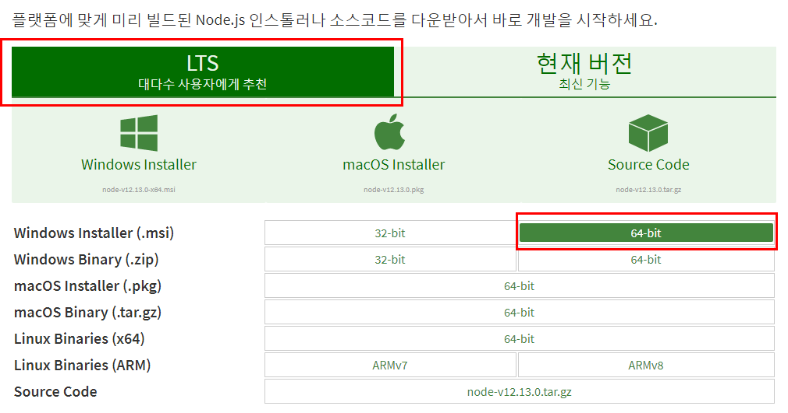

- 설치 확인

```bash
$ node -v
v12.13.0
```

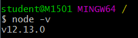

### 0.2 VScode Python & JavaScript 인덴팅 설정

settings.json

```json
{
    ...
    "editor.tabSize": 2,
    "[python]" : {
        "editor.tabSize" : 4,
    },
	...
}
```

### 0.3 Naming convention

- `lowerCamelCase`

  - 단봉낙타표기법

  

  - JavaScrip의 기본 표기법

- `UpperCamelCase`
  
  - 쌍봉낙타표기법
- `snake_case`
- `kebob_case`

### 0.4 Extensions (추천)

- `auto close tag`
- `rainbow brackets`
- `indent-rainbow`


## 1. Variable

00_variable.js

```js
// 00_variable.js
// var 사용하면 안된다. ex6이전에 사용되던 방식
// hoisting(끌어올림)
// 기본적으로 밑에 둘만 사용
let
const
```

### 1.1 let (변수)

- 값을 재할당 할 수 있는 변수를 선언하는 키워드

- 변수 선언은 한 번만 할 수 있다.

  - 하지만 할당은 여러번 할수 있다.

  ```js
  // 00_variable.js
  
  // let(변수)
  let x = 1
  x = 3       // 재할당 가능
  console.log(x)
  ```

  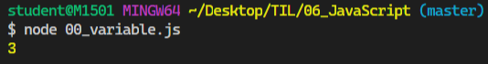

- 블록 유효 범위 (`Block Scope`) 를 갖는 지역변수

  ```js
  // 00_variable.js
  
  // let(변수)
  let x = 1
  if(x === 1){
      // if문 만큼의 유효범위르 가지고 있다.
      // 벗어나면 접근 불가능
      let x = 2
      console.log(x)  // 2
  }   
  console.log(x)      // 1
  ```

  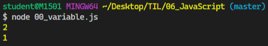

### 1.2 const (상수)

- 값이 변하지 않는 상수를 선언하는 키워드

  - 상수의 값은 재할당을 통해 바뀔 수 없고, 재선언도 불가능하다.

- let과 동일하게 `Block Scope` 를 가진다.

- 웬만하면 모든 선언에서 상수를 써야 한다.

  - 일단 상수를 사용하고, 값이 바뀌는게 자연스러운 상황이면 그때 변수(let)로 바꿔서 사용하는 것을 권장한다.

  ```js
  // 00_variable.js
  
  // const(상수)
  // 초기값을 생략하면 Error
  // const MY_FAV
  // MY_FAV를 상수로 정의하고 그 값을 7로 함.
  const MY_FAV = 7
  console.log('My Favorite number is ....' + MY_FAV)
  ```

  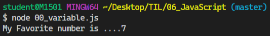

- 초기값을 생략하면 **ERROR** 발생

- 변수와 상수는 어디에 써야 할까?
  - 어디에 변수를 쓰고, 어디에는 상수를 쓰고 하는 등의 결절은 프로그래머의 몫
  - **파이 근삿값**과 같은 값은 상수가 적절 (변할 일이 없는 값)
- `var` **vs** `let` **vs** `const`
  - `var` : 할당 및 선언 자유, 함수 스코프
  - `let` :  할당 자유, 선언은 한번만, 블록 스코프
  - `const` : 할당 한번만, 선언도 한번만, 블록 스코프
- var 은 호이스팅과 같은 여러 문제를 야기하기 때문에, 앞으로 let 과 const를 사용해서 개발을 진행하자.


## 2. 조건문

### 2.1 `if`문

- 파이썬의 if문과 흡사!! `elif` 만 `else if`로 바꾸면 됨
- console
  - ctrl + r :새로고침
  - shift + enter : 줄바꿈

```js
// 01_if.js
const userName = prompt('니 이름은 뭐니?')
let message = ``
if ( userName === '도현'){
    message = `<h1>유단자... 까불지 마요...</h1>`
} else if (userName === '혁진'){
    message = `<h1>감자... 감자합니다...</h1>`
} else {
    message = `<h1>${userName}...누구??</h1>`
}
document.write(message)
```

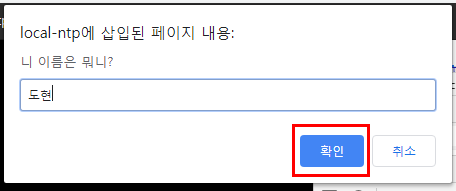

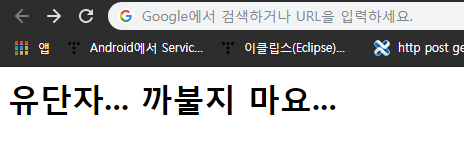

## 3. 반복문

### 3.1 while

```js
// 02_loop.js
// while loop
// while 키워드 뒤에 나오는 조건이 true인 경우 반복

let i = 0
while (i < 6){
    console.log(i)
    i++
}
```

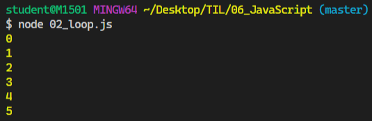

### 3.2 for

````js
// 02_loop.js
// for loop
// JavaScript 가장 기본적인 반복문. for문에서 사용할 변수를 하나 정의하고 ,
// 그 변수가 특정조건에 false 값이 될 때까지 계속 연산-반복

for (let j = 0; j < 6; j++) {
    console.log(j)
}
````

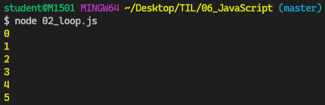

### 3.3 Python for in 문법처럼 비슷하게 사용

```js
// 02_loop.js
// Python의 for in 문법과 비슷하게 사용 가능!
const numbers = [1, 2, 3, 4, 5]
for (let number of numbers) {
    console.log(number)
}
for (let number of [1, 2, 3, 4, 5]) {
    console.log(number)
}
// number값 재할당 필요없으면 상수 사용 가능
for (const number of [1, 2, 3, 4, 5]) {
    console.log(number)
}
```

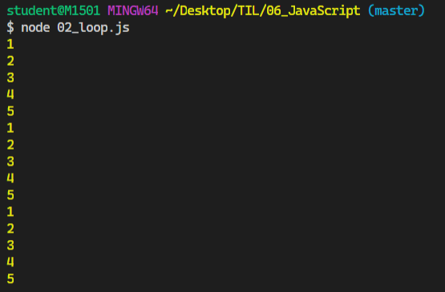


## 4. 함수

> 함수 선언식 (statement) : 코드가 실행되기 전에 로드됨.
>
> 함수 표현식(expression) : 인터프리터가 해당 코드에 도다 했을 때 로드됨

### 4.1 선언식

````js
// 03_function.js
// 선언식
function add(num1, num2){
    return num1 + num2
}
console.log(add(1, 2))
````

### 4.2 표현식

```js
// 03_function.js
// 표현식
const sub = function(num1, num2){
    return num1 - num2
}
console.log(sub(2, 1))
```

- 타입화인

```js
// 03_function.js
// 타입 확인하면 둘다 function으로 동일!
console.log(typeof add)
console.log(typeof sub)
```


## 5. 화살표 함수(Arrow function)

- ES6 이후
- **function과 중괄호 숫자를 줄이려고 고안된 문법**
  - function 키워드 생략 가능
  - 함수에 매개변수 하나 -> `()`생략 가능
  - 함수 바디에 표현식 하나 -> `{}`, `return` 생략가능
- 화살표 함수의 경우 function 키워드로 정의한 함수와 100% 동일하지 않다. 
- 화살표 함수는 항상 **익명 함수**

```js
// 03_function.js
// 화살표 함수 (Arrow function)
const iot1 = function(name) {
    return `hello ${name}!!`
}

// 1. function 키워드 삭제
const iot1 = (name) => { return `hello! ${name}` }
// 2. () 생략 (함수 매개변수 하나일 경우)
const iot1 = name => { return `hello! ${name}` }
// 3. {}, return 생략 (바디에 표현식 1개)
const iot1 = name => `hello! ${name}`
```

##### **[실습]** - 3단계에 걸쳐 화살표 함수로 바꿔보기

```js
// 03_function.js
// [실습] 3단계에 걸쳐 화살표 함수로 바꿔보기
let square = function(num) {
    return num ** 2
}

// 1. function 키워드 삭제
square = (num) => { return num ** 2 }
// 2. () 생략 (함수 매개변수 하나일 경우)
square = num => { return num ** 2 }
// 3. {}, return 생략 (바디에 표현식 1개)
square = num => num ** 2
console.log(square(2))
```

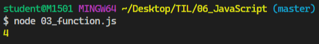

```js
// 4. 인자가 없다면...? () 혹은 _ 로 표시 가능!
let noArgs = () => `No args!!!!`
noArgs = _ => `No args...!!!!`

// 5-1. object를 return
let returnObject = () => { return {key:`value`} }
console.log(returnObject())
console.log(typeof returnObject())

// 5-2. return을 적지 않으려면 괄호 붙이기
returnObject = () => ({key:`value`})
console.log(returnObject())
console.log(typeof returnObject())

// 6. 기본 인자 부여하기 (Default Args)
// 인자 개수와 상관없이 반드시 괄호를 붙인다.
const sayHello = (name=`영선`) => `hi! ${name}`
```

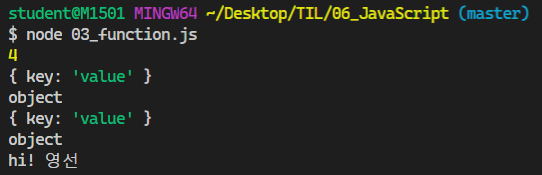

## 6. 익명 / 1회용 함수 (Anonymous function)

> JavaScript에서는 1회용으로 사용하는 함수는 이름을 짓지 않을 수 있다.
>
> 일반적으로는 함수를 정의, 변수에 함수르 저장하는 과정 등을 거쳐서 실행한다. 하지만 즉시실행함수는 함수가 선언되자마자 즉시 실행된다.
>
> 사용 이유?
>
> **초기화**에 사용한다
>
> - 즉시실행함수는 선언되자마자 실행되기 때문에, 같은 함수를 다시 호출할 수는 없다. 그래서 초기화 부분에 주로 사용된다.

```js
// JS에서는 1회용으로 사용할 함수는 이름을 짓지 않을 수 있다.
// function 키워드를 활용해서 함수를 선언할 때는, 이름을 지정하지 않으면 에러가 난다.
function (num) { return num ** 3 }

// 1. 기명함수로 만들기(변수, 상수에 할당)
const cube = function (num) { return num ** 3 }
// 화살표 함수는 기본적으로 익명 함수지만, 변수 및 상수에 할당해서 기명함수처럼 사용 가능
const squareRoot = num => num ** 0.5

// 2. 익명함수 바로 실행시키기
console.log((function (num) { return num ** 3})(2))
console.log((num => num ** 0.5)(4))
```

## 7. 배열(Array)

```js
// 04_array.js

const numbers = [1, 2, 3, 4, 5]

numbers[0]      // 1
numbers[-1]     // undefined -> 정확한 양의 정수만 가능
numbers.length  // 5


// 원본 파괴!
numbers.reverse()       // [5, 4, 3, 2, 1]
console.log(numbers)    // [5, 4, 3, 2, 1]
numbers.reverse()       // [1, 2, 3, 4, 5]
console.log(numbers)    // [1, 2, 3, 4, 5]

// push - 배열 길이 return
numbers.push('a')       // 6
console.log(numbers)    // [1, 2, 3, 4, 5, "a"]

// pop - 배열 가장 마지막 요소 제거 후 return
numbers.pop()           // "a"
console.log(numbers)    // [1, 2, 3, 4, 5]

// unshift - 배열 가장 앞에 요소 추가
numbers.unshift('a')        // 6 ( 배열의 새로운 length )
console.log(numbers)        // ["a", 1, 2, 3, 4, 5]

// shift - 배열의 가장 첫번째 요소 제거후 return
numbers.shift()         // "a"
console.log(numbers)    // [1, 2, 3, 4, 5]

(((())))
{{{{}}}}
// extensions -> rainbow brackets & indent Brackets

numbers.push('a','b')        
console.log(numbers)        // [1, 2, 3, 4, 5, "a", "b"]
numbers.unshift('a')
console.log(numbers)        // ["a", 1, 2, 3, 4, 5, "a", "b"]

// 중복된 요소가 존재하는 경우 처음 찾은 요소의 index return
numbers.indexOf('a')        // 0
numbers.indexOf('b')        // 8
numbers.indexOf('c')        // 찾는 요소가 없으면 -1

/*
    join
    배열의 요소를 join 함수 인자를 기준으로 묶어서 문자열로 return
*/
numbers.join()      // "a,1,2,3,4,5,a,b" (기본값은 ',')
numbers.join('-')   // "a-1-2-3-4-5-a-b"
numbers.join('')    // "a12345ab"
```

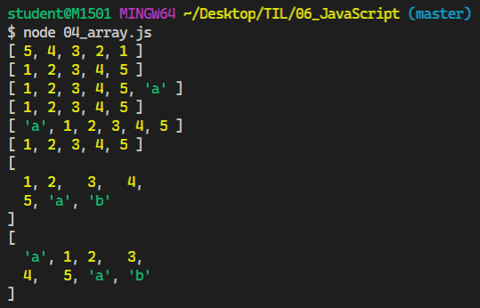

## 8. 객체(Object)

```js
// 05_object.js

const me = {
    name : '영선',   // key가 한 단어일 때
    'phone number' : '01000000000',     // key가 여러 단어일 때
    appleProducts: {
        iphone:'8',
        watch:'series5',
        macbook:'pro2019'
    }
}

/*
me.name         // "영선"
me['name']      // "영선"
// key가 여러단어 일때 []로 접근!
me['phone number']      // "01000000000"
me.appleProducts        // {iphone: "8", watch: "series5", macbook: "pro2019"}
me.appleProducts.iphone // "8"
*/

console.log(me.appleProducts)
console.log(me.appleProducts.iphone)
```

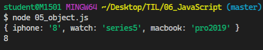

```js
// 06_object2.js

// ES5
var books = ['자바스크립트 입문', '장고 웹 프로그래밍']
var comics = {
  'DC' : ['Aquaman', 'Joker'],
  'Marvel' : ['Avengers', 'Spider Man']
}

var magazines = null

var bookShop = {
  books:books,
  comics:comics,
  magazines:magazines
}

console.log(bookShop)
console.log(typeof bookShop)
console.log(bookShop.books[0])
```

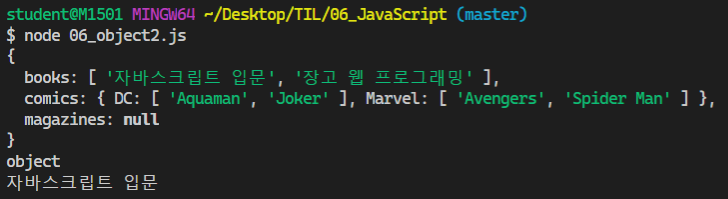

```js
// 06_object2.js

// ES6 이후
// 객체의 Key와 Value가 똑같으면 -> 마치 배열처럼 한번만 작성 가능
let books = ['자바스크립트 입문', '장고 웹 프로그래밍']
let comics = {
  'DC' : ['Aquaman', 'Joker'],
  'Marvel' : ['Avengers', 'Spider Man']
}

let magazines = null
const bookShop = {
  books,
  comics,
  magazines
}

console.log(bookShop)
console.log(typeof bookShop)    //object
console.log(bookShop.books[0])
```

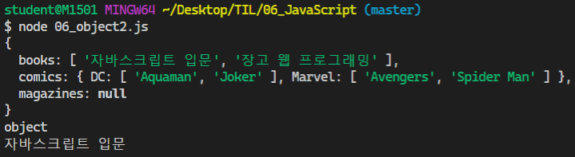

## 9. JSON

> JavaScript Object Notation - **JavaScript 객체 표기법**

- **웹에서 데이터를 주고 받을 때 형식**으로 대표적으로 JSON, XML, YAML 등이 있다. **주로 JSON을 사용**한다.
- Key-Value 형태의 자료구조를 JavaScript Object 와 유사한 모습으로 표현하는 표기법
- 하지만 JSON은 모습만 비슷할 뿐이고, 실제로 Object 처럼 사용하려면다르 언어드로가 마찬가지로 **Parsing(구문 분석)하는 작업이 필요**하다.

```js
// 07_json.js

// Object -> String
const jsonData = JSON.stringify({
    도현 : '합기도',
    혁진 : '감자',
})
console.log(jsonData)           // {"도현":"합기도","혁진":"감자"}
console.log(typeof jsonData)    // string

// String -> Object
const parseData = JSON.parse(jsonData)
console.log(parseData)          // { '도현': '합기도', '혁진': '감자' }
console.log(typeof parseData)   // object


/*
    [Object vs JSON 간단정리]
    - Object : JavaScript의 Key-Vaule 페어의 자료구조
    - JSON : 데이터를 표현하기 위하 단순 문자열(string)
*/
```

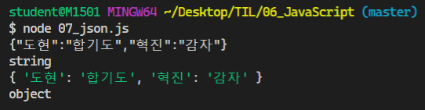

## 10. Array Helper Method

> Helper 란 자주 사요하는 로직을 재활용 할 수 있게 만든 일종의 Library ES6부터 본격적으로 사용되기 시작했다.

- 더욱더어ㅓㅓ 상세한 사용법 => [MDN 문서](https://developer.mozilla.org/ko/docs/Web/JavaScript/Reference/Global_Objects/Array/forEach)  참고

### 8.1 `forEach`

- `arr.forEach(callback(element, index, array))`
- 주어진 callback을 배열에 있는 각 요소에 대해 한번씩 실행

```js
// 08_forEach.js

// ES5 for loop
var iot1 = ['도현','혁진','은애']
for (var i = 0; i < iot1.length; i++) {
    console.log(iot1[i])
}
```

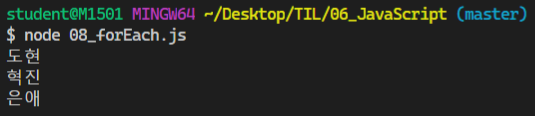

```js
// 08_forEach.js

// ES6+
const IOT1 = ['수연', '승찬', '한석', '경희', '영선']
IOT1.forEach(function(student) {
    console.log(student)
})
```

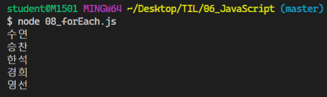

```js
// 08_forEach.js

// 한줄로 리팩토링 가능!
IOT1.forEach( student => console.log(student) )

const result = IOT1.forEach( 
    student => console.log(student) 
)
console.log(result) // undefined
```

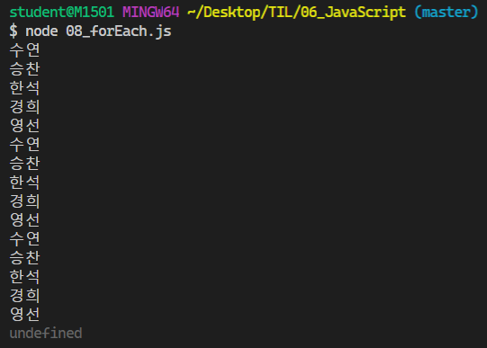

##### **[실습]** - for 를 forEach로 바꾸기

```js
// 08_forEach.js

// [실습] for 를 forEach로 바꾸기!
function handleStudents() {
    const students = [
        { id:1, name:'오은애', status:'응애?'},
        { id:15, name:'서혁진', status:'기염듕이...'},
        { id:28, name:'김영선', status:'너무쉽네..JS'},
    ]
    // for
    for (let i = 0; i < students.length; i++) {
        console.log(students[i])
        console.log(students[i].name)
        console.log(students[i].status)
    }
    // forEach
    students.forEach(function(student) {
        console.log(student)
        console.log(student.name)
        console.log(student.status)
    })
    console.log()
}
handleStudents()
```

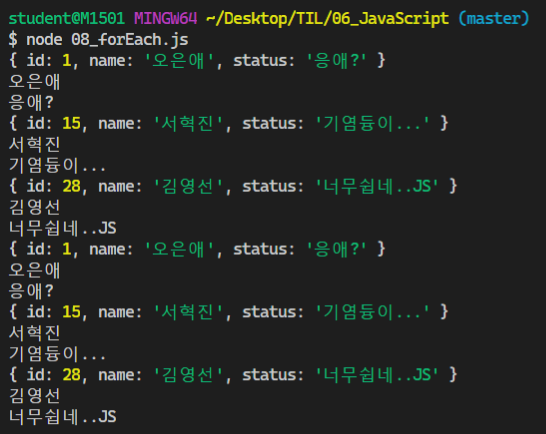

##### **[실습]** -  images 배열 안에 있는 정보를 곱해 넓이를 구하여 areas 배열에 저장하기

```js
// 08_forEach.js

// [실습] images 배열 안에 있는 정보를 곱해 넓이를 구하여 areas 배열에 저장하기
const images = [
    { height : 30, width : 55 },
    { height : 50, width : 178 },
    { height : 81, width : 35 },
]
const areas = []

// 정답코드 (forEach 활용)
images.forEach(function(image) {
    areas.push(image.height * image.width)
})

console.log(areas)
```

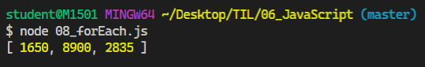

## 2019 - 11 - 19

### 8.2 `map`

- `arr.map(callback(element))`
- 배열 내의 모든 요소에 대하여 주어진 콜백 함수를 호출한 결과를 모아 새로운 배열 return!
- `map`, `filter` 둘 다 사본을 return 하는 거고, 원본은 바뀌지 않는다. 만약 return을 안적으면 undefined가 배열에 담김!

````js
// 09_map.js

// 숫자가 담긴 배열의 요소에 각각 2를 곱하려 새로운 배열 만들기

// ES5
var numbers = [1, 2, 3]
var doubleNumbers = []

for( var i = 0; i <numbers.length; i++) {
    doubleNumbers.push(numbers[i] * 2)
}
console.log(doubleNumbers)
console.log(numbers)        // 원본 유지

// ES6+
const NUMBERS = [1, 2, 3]
// const DOUBLE_NUMBER = []
const DOUBLE_NUMBER = NUMBERS.map(function(number) {
    // return이 없으면 undefined (까먹지말자!!)
    return number * 2
}) 
console.log(DOUBLE_NUMBER)
````

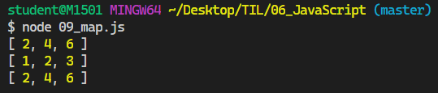

```js
// 화살표 함수 사용하여 한 줄로 줄이기
const DOUBLE_NUMBER = NUMBERS.map( number => number * 2 ) 
console.log(DOUBLE_NUMBER)
console.log(NUMBERS)        // 원본 변화 없음
```

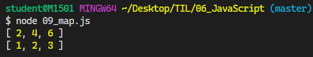

**[문제풀어보기]**

```js
// map 헬퍼를 사용해서 images 배열 안의 객체들의 height들만 저장되어 있는 heights 배열을 만들어 보자.
const images = [
    { height : '34px', width : '59px'},
    { height : '11px', width : '135px'},
    { height : '681px', width : '592px'},
]

const heights = images.map(function(image) {
    return image.height
})

console.log(heights)
console.log(images)
```

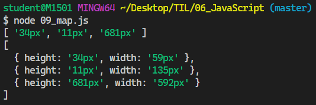

**[문제풀어보기]**

```js
// map 헬퍼를 사용해서 "distance/time => 속도"를 저장하는 새로운 배열 speeds를 만들어 보자.
const trips = [
    { distance : 34 , time : 10 },
    { distance : 90 , time : 20 },
    { distance : 111 , time : 28 },
]
                        // callback 함수
const speeds = trips.map(function(trip) {
    return trip.distance / trip.time
})

console.log(speeds)
```

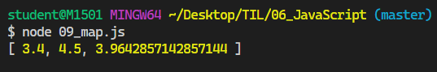

### 8.3 `filter`

- `arr.filter(callback(element))`
- 주어진 콜백 함수의 테스트를 토와하는 모든 요소를 모아서 새로운 배열로 반환한다. (콜백 함수 조건을 적어서 원하는 요소들만 filtering 한다.)

```js
// 10_filter.js

// for loop 활용
var students = [
    { name : '서혁진', type='male' },
    { name : '공선아', type='female' },
    { name : '남찬우', type='male' },
    { name : '이도현', type='female' },
]

var strongStudents = []
// students 라는 배열의 객체들 중 type이 female인 요소들만 뽑기!
// students 원본 자체를 바꾸고 싶은게 아니라, 원하는 조건에 맞는
// 데이터들만 골라서 새로운 배열 만들기.
// ES5
for (var i = 0; i < students.length; i++) {
    if ( students[i].type === 'female' ) {
        strongStudents.push(students[i])
    }
}

console.log(students)               // 원본 유지
console.log(strongStudents)         // 새로운 배열
console.log(students[1].name)       // 객체 내 속성 접근하기
```

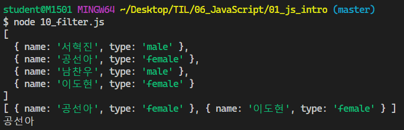

```js
// filter Helper 활용
const STUDENTS = [
    { name : '서혁진', type : 'male' },
    { name : '공선아', type : 'female' },
    { name : '남찬우', type : 'male' },
    { name : '이도현', type : 'female' },
]

// const STRONG_STUDENTS = STUDENT.filter(function(student) {
//     return student.type === 'female'
// })

// 한 줄로 바꾸기
const STRONG_STUDENTS = STUDENTS.filter( student => student.type === 'female')

console.log(STRONG_STUDENTS)        // 새로운 배열
console.log(STUDENTS)               // 원본 유지
```

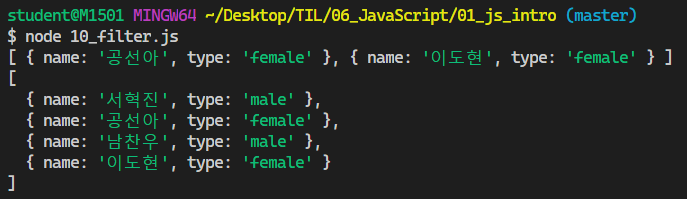

**[문제풀어보기]**

```js
// filter Helpler를 사용해서 numbers 배열 중 50보다 큰 값만 필터링해서 새로운 배열에 저장하기

const numbers = [15, 35, 13, 36, 69, 3, 61, 55, 99, 5]
const newNumbers = numbers.filter(function(number) {
    return number > 50
})

// const newNumbers = numbers.filter( number => number > 50 )

console.log(numbers)
console.log(newNumbers)
```

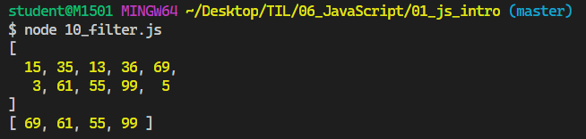

### 8.4 `reduce`

- `arr.reduce(callback(acc, element, index))`
  - 첫 번째 매개변수 : 누적 값 (전 단계의 결과물) 
  - 두 번째 매개변수 :  현재 배열 요소
  - 세 번째 매개변수 :  배열 순서(인덱스 번호)
- 배열의 각 요소에 대해 주어진 콜백 함수를 실행하고 하나의 결과 값을 반환한다. **배열 내의 숫자 총합, 평균 계산 등 배열의 값을 하나로 줄이는 동작**을 한다.
- map은 배열의 각 요소를 변형, **reduce는 배열 자체를 변형**한다.
- map, filter 등 여러 메소드들의 동작을 대부분 대체 가능.

```js
// 11_reduce.js

const tests = [90, 85, 77, 13, 58]

// const sum = tests.reduce(function(total, score) {
//     return total += score
// })

const sum = tests.reduce( (total, score) => total += score )

console.log(sum)
```

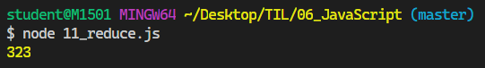

### 8.5 `find`

- `arr.find(callback(acc, element, index))`
- 주어진 판별 함수를 만족하는 첫번째 요소의 값을 반환.
  - 값이 없으면 `undefined`
- 조건에 맞는 인덱스가 아니라 요소 자체를 원할 때 사용.

```js
// 12_find.js

// for loop
var students = [
    { name : '서혁진' , age : 26 },
    { name : '오은애' , age : 26 },
    { name : '공선아' , age : 25 },
    { name : '이도현' , age : 26 },
    { name : '최주현' , age : 27 },
]

// ES5
for ( var i = 0; i < students.length; i++ ) {
    if ( students[i].age === 27 ){
        student = students[i]
        break       // 원하는 조건 도달하면 loop 탈출
    }
}

console.log(student)


// find Helpler
const STUDENTS = [
    { name : '서혁진' , age : 26 },
    { name : '오은애' , age : 26 },
    { name : '공선아' , age : 25 },
    { name : '이도현' , age : 26 },
    { name : '최주현' , age : 27 },
]

// const student = STUDENTS.find(function(student) {
//     return students.age === 27
// })

// 화살표함수
const student = STUDENTS.find( student => students.age === 27 )

console.log(student)
```

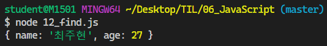