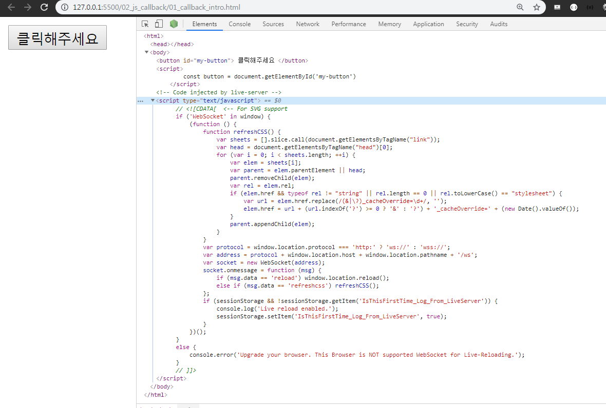
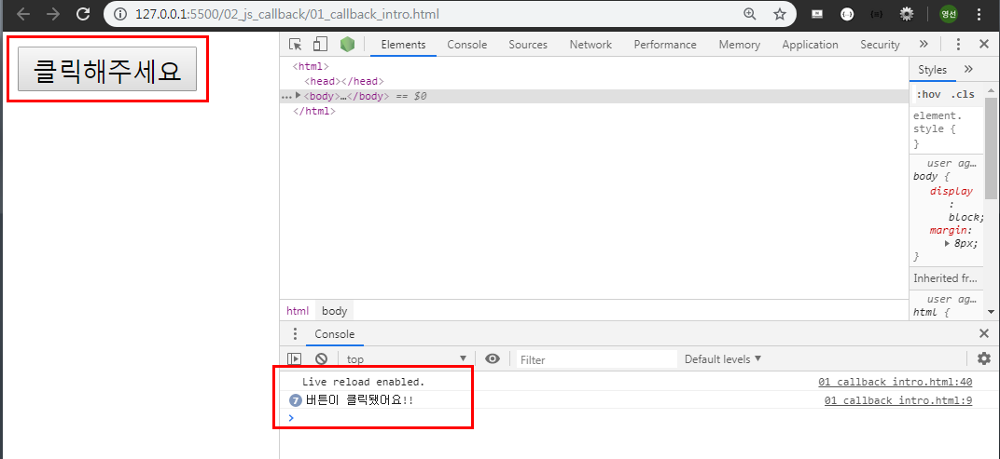
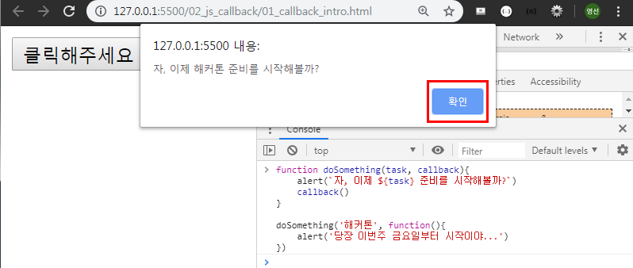
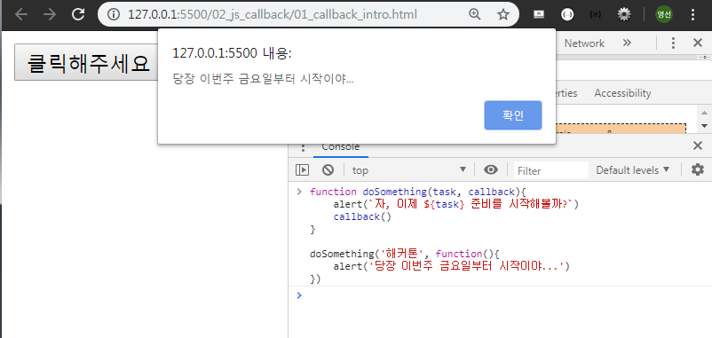
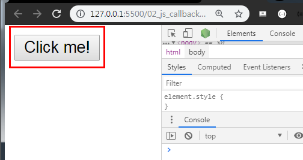
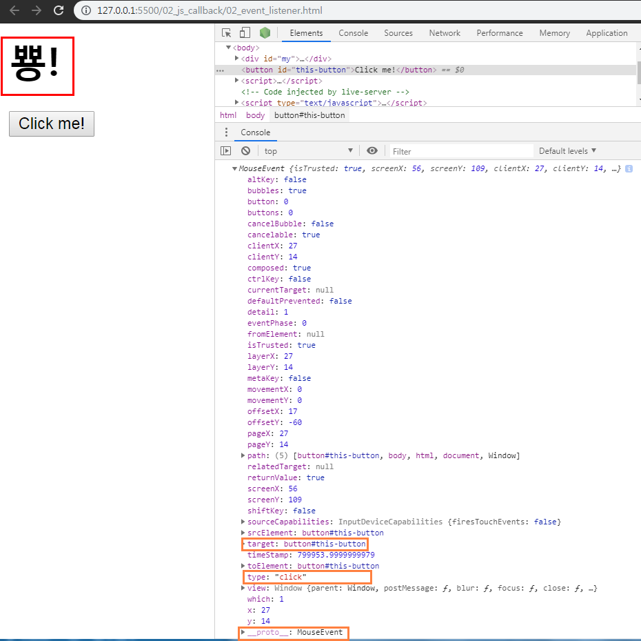

# 크아아앙 공룡 만들기

## 1. Callback Function

### 1.1 정의

- **다른 함수에 인수로 넘겨지는 함수**
- 특정 이벤트가 발생했을 때 시스템에 의해 호출되는 함수
- "좀 이따 너 실행 끝나면 나 다시 불러줘! (call back)"
- 자주 사용되는 대표적인 예 -> 이벤트 핸들러 처리
- `<script>`태그 추가

```html
<html>
  <head></head>
  <body>
    <button id="my-button"> 클릭해주세요 </button>

    <script>
      const button = document.getElementById('my-button')
    </script>

  </body>
</html>
```



- 이벤트 핸들러 사용하기

```html
<!-- 01_callback_intro.html -->

<html>
    <head></head>
    <body>
        <button id="my-button">클릭해주세요</button>

        <script>
            const button = document.getElementById('my-button')
            button.addEventListener('click', function() {
                console.log('버튼이 클릭됐어요!!')
            })
        </script>
    </body>
</html>
```

- '클릭해주세요' 버튼을 누르면 console 창에 '버튼이 클릭됨' 이 출력된다.



### 1.2 예시

#### 1.2.1 함수 정의

```javascript
function doSomething(task){
	alert(`자, 이제 ${task} 준비를 시작해볼까?`)
}

doSomething('해커톤')
```


#### 1.2.2 익명 함수인 콜백 함수 추가

- 먼저 doSomething()이 수행 된후, 익명 함수로 정의한 콜백 함수가 수행된다.

```javascript
function doSomething(task, callback){
	alert(`자, 이제 ${task} 준비를 시작해볼까?`)
	callback()
}

doSomething('해커톤', function(){
	alert('당장 이번주 금요일부터 시작이야...')
})
```





#### 1.2.3 기명 함수인 콜백 함수로 변경해서 추가

- 우리가 원하는 시점에 함수를 호출해서 사용할 수 있게 되었다.

```javascript
function doSomething(task) {
	alert(`자, 이제 ${task} 준비를 시작해볼까?`)
	callback()
}

function alertStart() {
 alert(`당장 이번주 금요일부터 시작이야....:)`)
}

doSomething('해커톤', alertStart)
```

## 2. EventListener

### 2.1 정의

- 특정한 **이벤트가 발생했을 때 실행되는 함수** 또는 절차

  1. 무엇을 ->  EventTarget
  2. 언제 -> Type의 행위를 했을 때
  3. 어떻게 -> (주로) Listener에 구현된 함수를 실행

- `addEventListener` 메소드 구성 요소

  ```html
  EventTarget.addEventListener(type, listener)
  ```

  > - `EventTarget` : 이벤트 리스너를 등록할 대상 (->DOM 노드)
  > - `type` : 이벤트 유형을 뜻하는 문자열(`click`, `mouseover` 등)
  > - `listener` : 이벤트가 발생했을 때 처리를 담당하는 콜백 함수
  >   - 인수로 이벤트 객체인 `e`를 전달받음

### 2.2 예시

1. (무엇을) 특정한 DOM 요소를 -> button을
2. (언제) 어떠한 행동을 했을 때 -> click 했을 때
3. (어떻게) 한다. -> '뿅'한다.

```html
<!-- 02_event_listener.html -->

<html>
    <head></head>
    <body>
        <div id = "my">
        
        </div>
        <button id = "this-button">Click me!</button>
        
        <script>
            // 1. 무엇을 -> 버튼 (EventTarget)
            const button = document.getElementById('this-button')

            // 2. 언제 -> 'click' 하면 (type : 'click')
            button.addEventListener('click', function(event) {
                console.log(event)
                const area = document.querySelector('#my')

            // 3. 어떻게 -> '뿅'하고 나온다.
            area.innerHTML = '<h1>뿅!</h1>'
            })
        </script>
    </body>
</html>
```





## 3. Google dino

### 3.1 BOM & DOM

- **BOM (Brower Object Model)**

  - JavaScript가 브라우저와 소통하기 위한 모델

    - 브라우저 제작사마다 세부사항이 다소 다르게 구현되고 한정적임
    - 웹 브라우저의 창, 프레임을 추상화해서 프로그래밍적으로 제어할 수 있도록 수단을 제공
    - 전역 객체인 `window`의 프로퍼티와 메소드들을 통해서 제어할 수 있음

  - window 객체는 모든 브라우저로부터 지원 받으며, 이는 브라우저 window 자체를 의미

  - **모든 전역 JavaScript 객체, 함수, 변수들을 자동으로 window 객체의 멤버가 된다.**

    - **HTML DOM에 있는 documnet 객체 역시 window 객체의 속성이다.**

      ```javascript
      window.print()		// 인쇄창 열기
      window.open()		// 브라우저 탭 열기
      window.confirm()	// 브라우저 대화상자 열기
      window.document		// document 역시 브라우저에 종속 -> window 전역 객체
      ```

- **DOM (Document Object Model)**

  - JavaScript로 브라우저를 조작하기 위한 언어. **DOM을 통해서 HTML 파일에 작성되는 여러 요소(Element)들을 조작** 할 수 있다.
  - DOM이라는 객체를 통해서 **요소를 선택**할 수도 있고, 선택한 **요소의 속성 값을 수정하거나 삭제**할 수도 있다.
  - **요소에 이벤트를 등록**해서, 특정 이벤트가 발생할 시 특정 함수를 실행하도록 만들 수도 있다.
  - HTML 문서에 작성하지 않은 **새로운 요소를 생성**해서 **원하는 위치에 삽입**할 수도 있다.

### 3.2 사전준비