# 비동기 처리

HTTP -> Ajax(HTTP를 효과적으로 활용) -> WebSocket

## Axios 

[공식문서참고](https://www.npmjs.com/package/axios)

- 라이브러리를 사용하기 위해서는 `node.js`가 설치되어 있어야한다.

- 브라우저와 `Node.js`에서 사용할 수 있는 Promise 기반의 HTTP 클라이언트 라이브러리
  - 비동기 방식으로 HTTP 데이터 요청을 실행한다.
  - 내부적으로는 직접적으로 `XMLHttpRequest`를 다루지 않고 `Ajax` 호출을 보낼 수 있다.

- `Promise` (ES6)
  - 비동기 요청을 보내고 응답을 받았을 때, 그 응답 결과를 어떨게 처리하자고 약속(Promise)하는 것.
  - `.then` : 응답이 정상적으로 왔을 경우 -> 이제 어떻게 처리할 지 결정
  - `.catch` : 응답이 잘 안왔을 경우 -> 에러 처리!


## 0. 설치

- node.js 설치 시, npm 가 함께 설치된다.

```bash
$ npm install axios
```

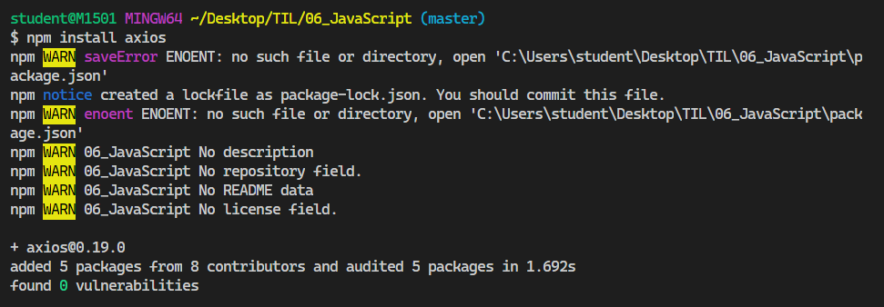

- `node_modules`폴더가 자동으로 생성되고, package-lock.json 파일이 생성되었다.


06_JavaScript 폴더에 03_js_axios 폴더를 만들고 그 안에 01_axios.js 파일을 생성한다. 

- Axios GET 요청해보기

  [JSONPlaceholder](https://jsonplaceholder.typicode.com/)

- `01_axios.js`

```js
// 01_axios.js

const axios = require('axios')

axios.get('https://jsonplaceholder.typicode.com/posts/1')
    .then(response => {
        console.log(response)
    })
    .catch(error => {
        console.log(error)
    })
```

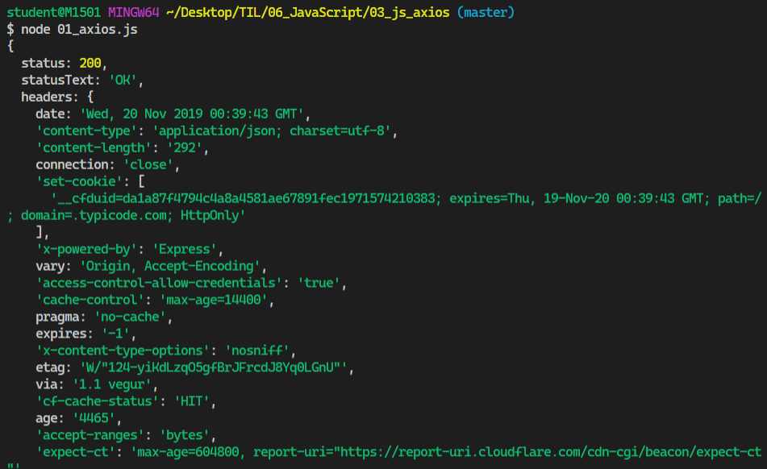


## 1. Dog and Cat

### 1.1 Dog API

강아지 API [사이트](https://dog.ceo/dog-api/)

> `axios`를 이용하여 강아지 API에서  랜덤으로 강아지 사진을 가져온다.

- `02_dogs_and_cats.html`

```html
<!-- 02_dogs_and_cats.html -->

<html>
  <head></head>
  <body>
    <h1>댕댕이들 :)</h1>
    <div class="animals">

    </div>

    <script src="https://unpkg.com/axios/dist/axios.min.js"></script>
    <script>
     
    </script>
  </body>
</html>
```
- `<script>` 코드 안에 아래의 코드를 추가해준다.

```js
axios.get('https://dog.ceo/api/breeds/image/random')
  .then(response => {
    console.log(response)
  })
  .catch(error => { console.log(error) })
```

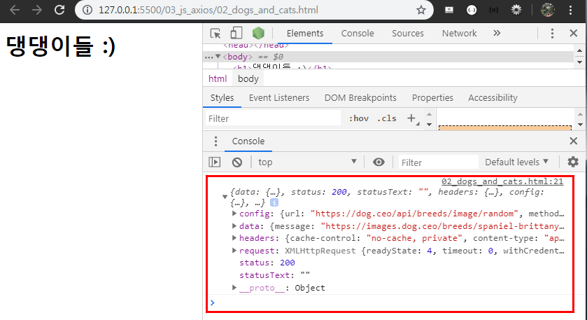

- img url 찾기 `response.data.message`

```js
axios.get('https://dog.ceo/api/breeds/image/random')
  .then(response => {
    console.log(response.data.message)
  })
  .catch(error => { console.log(error) })
```

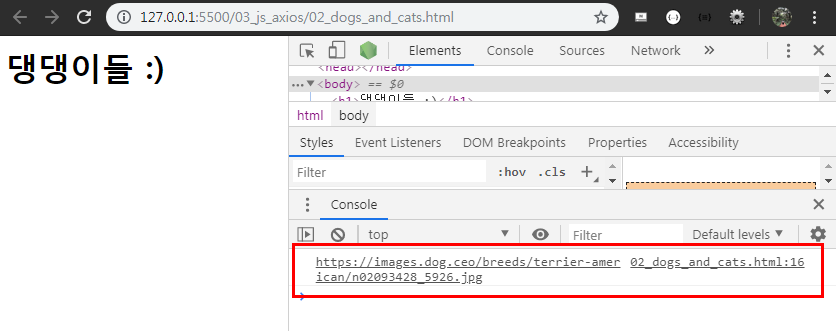

- img URL을 변수에 담기

```js
const imgUrl = response.data.message  
```

- img 태그 만들기

```js
const imgTag = document.createElement('img')
```

- src를 추가하기

```js
imgTag.src = imgUrl
```

- HTML 문서에 요소를 위치시키기

```js
document.querySelector('.animals')
```

- 전체코드

```js
// 02_dogs_and_cats.html

axios.get('https://dog.ceo/api/breeds/image/random')
    .then(response => {
      // 1. img URL을 변수에 담는다.
      const imgUrl = response.data.message  
      // 2. img 태그를 만든다.
      const imgTag = document.createElement('img')
      // 3. src를 추가한다.
      imgTag.src = imgUrl
      // 4. HTML 문서에 요소를 위치시킨다.
      document.querySelector('.animals')
    })
    .catch(error => { console.log(error) })
```

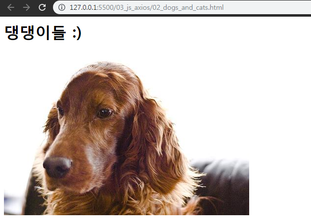

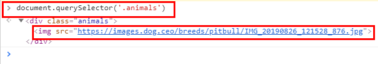

- 함수로 작성하여, 함수를 호출할 때마다 강아지 사진이 랜덤으로 추가되게끔 하기, `appendChild` 사용해서 뒤에서 부터 이미지 추가


```js
const getDogImage = () => {}
```

- `const getDogImage = () => {}`의 코드 안에 위에서 작성한 Script 코드를 이동시켜 준다.

```js
// 02_dogs_and_cats.html

const getDogImage = () => {
    axios.get('https://dog.ceo/api/breeds/image/random')
      .then(response => {
        // 1. img URL을 변수에 담는다.
        const imgUrl = response.data.message  
        // 2. img 태그를 만든다.
        const imgTag = document.createElement('img')
        // 3. src를 추가한다.
        imgTag.src = imgUrl
        // 4. HTML 문서에 요소를 위치시킨다.
        document.querySelector('.animals').appendChild(imgTag)
      })
      .catch(error => { console.log(error) })
  }
```

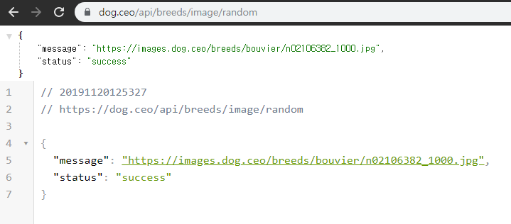

- 버튼을 선택하고, 버튼을 클릭해서 강아지 사진이 나오게 해보자

```html
<!-- 02_dogs_and_cats.html -->

<html>
  <head></head>
  <body>
    <h1>댕댕이들 :)</h1>
    <div class="animals">
         <!-- 버튼을 추가해준다. -->
		 <button id="dog">댕댕이 내놔</button>
    </div>

    ...
</html>
```

- script 에 버튼 추가

```js
// 버튼을 선택하고 클릭하면 만들어둔 콜백 함수 실행!
const dogbutton = document.querySelector('#dog')
dogbutton.addEventListener('click', getDogImage)
```

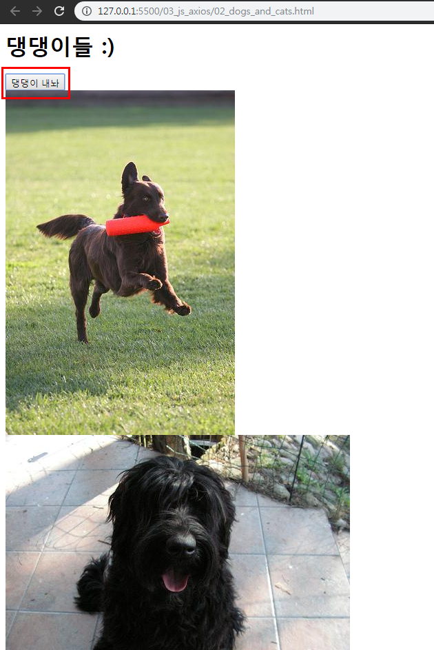

- 이미지 사이즈를 조정해 준다.

```js
const getDogImage = () => {
          ...
              // 이미지 사이즈 조정
              imgTag.style.width = '200px'
              imgTag.style.height = '200px'
              // 4. HTML 문서에 요소를 위치시킨다.
          ...
}
```

- 실행결과

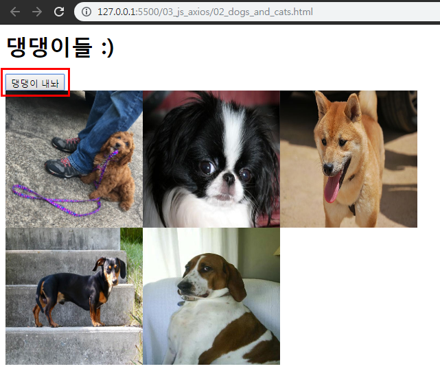

 ### 1.2 [실습]Cat API

고양이 API [사이트](https://docs.thecatapi.com/)

- 버튼을 선택하고, 버튼을 클릭해서 고양이 사진이 나오게 해보자

```html
<!-- 02_dogs_and_cats.html -->

<html>
  <head></head>
  <body>
    <h1>댕냥이들 :)</h1>
    <div class="animals">
         <!-- 버튼을 추가해준다. -->
		 <button id="dog">댕댕이 내놔</button>
         <button id="cat">냥냥이 내놔</button>
    </div>

    ...
</html>
```

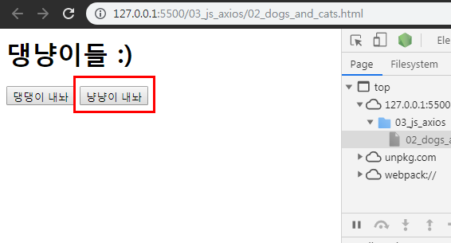

- 함수로 작성하여, 함수를 호출할 때마다 고양이 사진이 랜덤으로 추가되게끔 하기, `prepend` 사용해서 앞에서 부터 이미지 추가
- 강아지와 다른점은 url 읽어오는 방식이 틀리다.

```js
// 02_dogs_and_cats.html

const getCatImage = () => {
  axios.get('https://api.thecatapi.com/v1/images/search')
    .then(response => {
      const imgUrl = response.data[0].url
      const imgTag = document.createElement('img')
      imgTag.src = imgUrl
      imgTag.style.width = '200px'
      imgTag.style.height = '200px'
      document.querySelector('.animals').prepend(imgTag)
    })
    .catch(error => { console.log(error) })
}
```

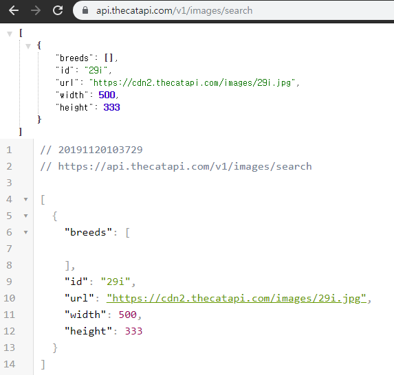

- script 에 버튼 추가

```js
const catbutton = document.querySelector('#cat') 
catbutton.addEventListener('click', getCatImage)
```

- 실행결과

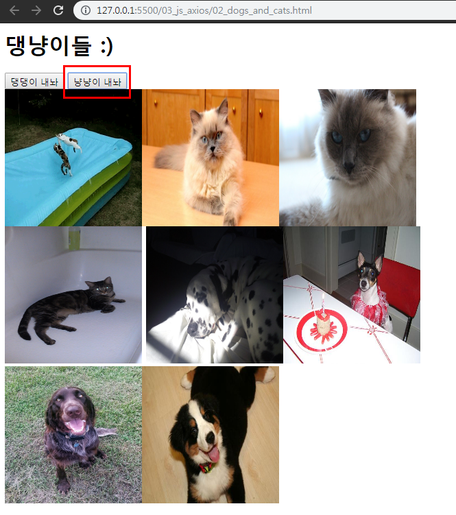


## 2. Like (Get 요청)

- `Ajax`
  - Asynchronous JavaScript and XML
  - 브라우저에서 웹페이지를 요청하거나 링크를 클릭하며 화면갱신(새로고침)이 일어났다. 이는 브라우저와 서버간의 통신이 일어났다는 이야기다.
  - **JavaScript를 활용해서 비동기적으로 서버와 브라우저가 데이터를 교환할 수 있는 통신 방식**이다.
  - 페이지 전체를 다시 로드하는 것이 아니라, 페이지에서 갱신이 필요한 일부분만 로드함으로써 빠른 퍼포먼스와 부드러운 화면 표시가 가능하다.
    - 사용자 경험(UX) 향상 + 서버 자원 이용 절감 -> 두마리 토끼 다 잡기!!
- `XHR(XMLHttpRequest)`
  - **브라우저는 XHR 객체를 이용해서 AJAX 요청을 생성하고 전송**한다.
  - 서버가 브라우저 요청에 응답 내용을 반환하면, 마찬가지로 XHR 객체가 그 결과 처리를 한다.


### 2.1 좋아요 버튼을 부-드럽게

- 이전에 우리가 구현해둔 장고 코드에서는 좋아요 버튼을 누르면 페이지 전환(요청)을 통해 좋아요 기능이 이루어진다.
- 하지만 **`axios`를 사용하면 페이지 전환 없이 좋아요 기능을 구현할 수 있다.**

- `base.html` -  Axios 추가

```html
<!-- base.html -->

<!-- Axios -->
<script src="https://unpkg.com/axios/dist/axios.min.js"></script>
```

#### 2.1.1 a 태그 삭제 , i 태그 수정

- `_article.html` - 기존코드

기존의 코드에서`<a>` 태그를 삭제해준다.

```django
<!-- _article.html -->

<p class="card-text">
<a href="">
    <!-- 사용자가 좋아요 안누른 상태면 -> 빈하트 -->
    
      <i class="fas fa-heart"></i>
    <!-- 사용자가 좋아요 누른 상태면 -> 꽉찬하트 -->
    
      <i class="far fa-heart"></i>
    
</a><br>
  ...
</p>
```

- `_article.html`- 수정코드

`<i>` 태그에 `like-button`이라는 클래스를 추가해준다. 또한 `data-id="{{ article.pk }}"` 를 추가해 준다. 그리고 각각의 하트에 색상을 지정해주고 마우스 커서를 올렸을때 손가락 모양이 나오게 바꿔주자. (+ 하트 색상을 변경할 것이기 때문에 꽉찬하트로 둘다 지정해주자!!!)

`data-id` : JS가 데이터를 처리할 때 해당 요소가 어떤 article의 번호인지 구분하기 위해서 지정!

```django
<!-- _article.html -->

<p class="card-text">

<!-- 사용자가 좋아요 누른 상태면 -> 꽉찬하트 -->
<!--
  data-id : JS가 데이터를 처리할 때 해당 요소가 어떤 article의 
            번호인지 구분하기 위해서 지정!
-->

<i data-id="{{ article.pk }}" class="like-button fas fa-heart" style="color:crimson; cursor:pointer;"></i>
<!-- 사용자가 좋아요 안누른 상태면 -> 빈하트 -->

<i data-id="{{ article.pk }}" class="like-button fas fa-heart" style="color:black; cursor:pointer;"></i>


<br>
...
</p>
```

#### 2.1.2 Template 수정

- `index.html` -  script 코드 작성

```django
<!-- index.html -->

...

<script>
// 1. 모든 좋아요 버튼 가져오기
const likeButtons = document.querySelectorAll('.like-button')
// 2. forEach 함수 활용 -> 각각의 좋아요 버튼을 클릭했을 때 
likeButtons.forEach(button => {
  button.addEventListener('click', function(event) {
    // event.target.classList, event.target.dataset.id
    // 1. data-id 에 article.pk가 들어있음. -> 동적 라우팅 활용!
    const articleId = event.target.dataset.id
    // 2. 해당 게시글의 좋아요 요청 보내기
    axios.get(`/articles/${articleId}/like/`)
      // 3. 응답 결과 확인
      .then(response => {
        console.log(response)
      })
      .catch(error => { console.log(error) })
  })
})
</script>
...
```

- event (e) 의 `Target`
  - `classList` : 이벤트가 발생한 좋아요 버튼에 설정된 `class` 목록들이 들어있다.
  - `dataset` : 이벤트가 발생한 좋아요 버튼의 `data-id` 로 설정해준 article.pk가 들어간다.

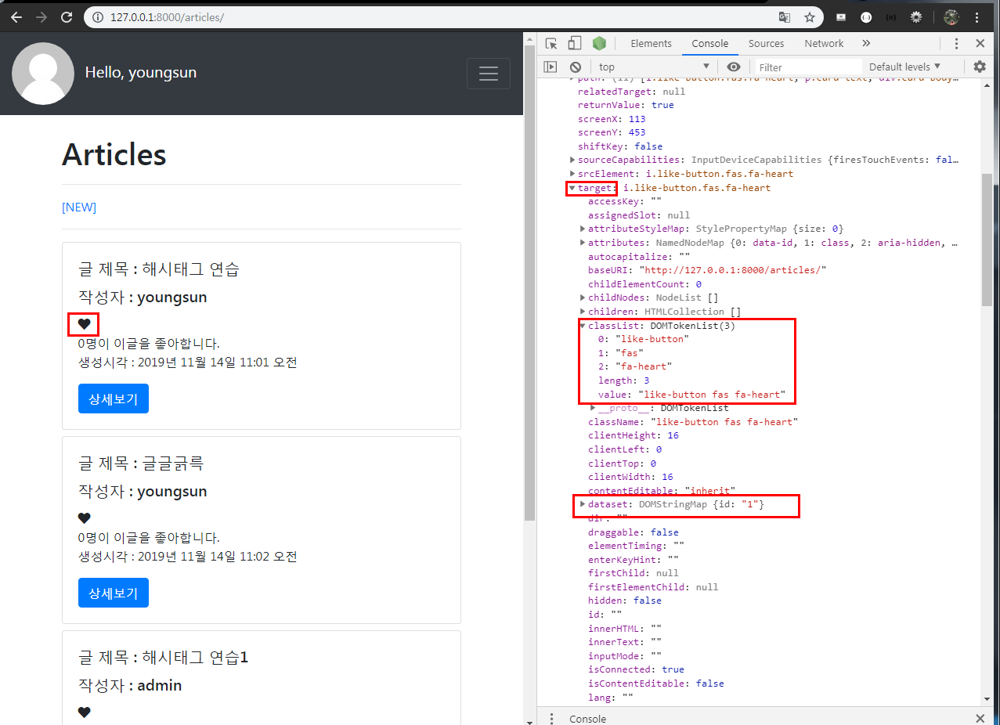


data에 작성한 코드가 다나온다아아아아아아

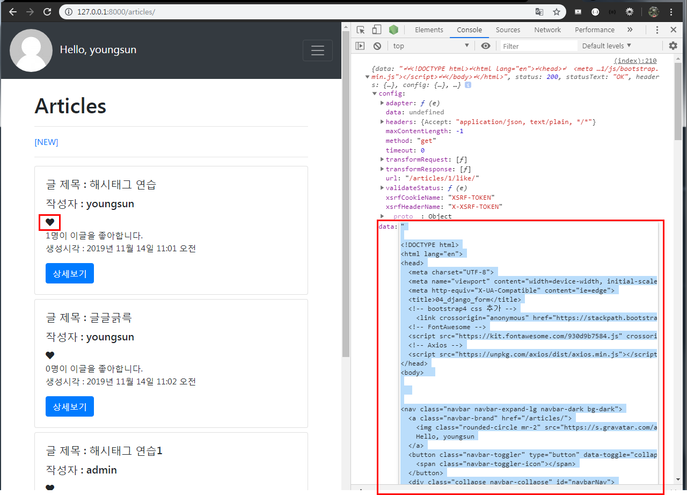


#### 2.1.3 View 수정

- `articles/views.py`  에서 `like` 로직을 수정해줘야한다.

- 좋아요 버튼의 `articleId`를 찾아서 좋아요 요청을 보냈을 때, View 로직에서 보내준 boolean 값에 따라 클래스를 지우거나 추가한다.

- redirect 응답에 대한 결과로 `index.html`을 받는게 아니라, `JSON`형태로 응답 결과를 반환한다.

  - 좋아요 취소 -> `liked = False`
  - 좋아요 하면 -> `liked = True`

- Django에서 제공하는 JsonResponse를 사용해서 JSON 형태로 결과를 반환해보자. 

  JsonResponse [공식문서참고](https://docs.djangoproject.com/en/2.2/ref/request-response/)

```python
# 공식문서 사용법
from django.http import JsonResponse
response = JsonResponse({'foo': 'bar'})
response.content
b'{"foo": "bar"}'
```

- `articles/views.py`  `JsonResponse`를 import 해줘야한다.
-  `like` 로직 수정  - '좋아요' 취소인 경우`liked = False`, '좋아요' 인 경우`liked = True` 추가 , 리턴방법 바꾸기 (import한 JsonResponse 사용)

```python
from django.http import JsonResponse

@login_required
def like(request, article_pk):
    ...
    if user in article.like_users.all():
        article.like_users.remove(user)
        liked = False
    # 목록에없을경우 -> 좋아요 누르기
    else:
        # article.like_users.add(user)
        article.like_users.add(user)
        liked = True
    context = {'liked':liked}
    # return redirect('articles:index')
    return JsonResponse(context)
```

- `event.target.dataset.id` : 이벤트가 발생한 좋아요 버튼의 게시글 pk 값
- `event.target.classList` : 이벤트가 발생한 좋아요 버튼에 설정된 class 값들의 목록

```js
// index.html

// 1. 모든 좋아요 버튼 가져오기
const likeButtons = document.querySelectorAll('.like-button')

// 2. forEach 함수 활용 -> 각각의 버튼 하나하나를 꺼내서 특정 동작을 추가한다.
likeButtons.forEach(button => {
button.addEventListener('click', function(event){
    console.log(e)

    // 1. data-id에 article.pk가 들어있다. -> 동적 라우팅 활용!
    const articleId = event.target.dataset.id

    // 2. 해당 게시글의 '좋아요' 요청 보내기
    // like view 함수로 이동
    axios.get(`/articles/${articleId}/like/`)
    // 3. 응답 결과 확인
        .then( response => {
        if (response.data.liked){
            event.target.style.color = 'crimson'
        } else {
            event.target.style.color = 'black'
        }
    })
        .catch(error => { console.log(error) })
})
})
```

- 실행결과

하트의 색상은 바뀌지만 `0명이 이글을 좋아합니다.`부분의 숫자는 바뀌지 않는다.

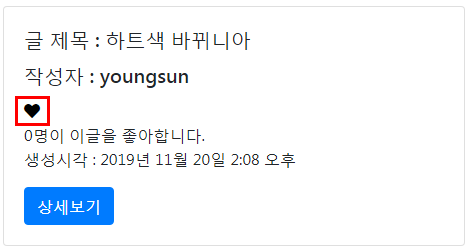

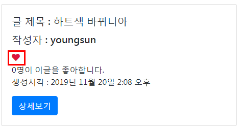


### 2.2 좋아요 수(Count)

#### 2.2.1 View

- `articles/views.py`  - `like` 로직에서 context 안에 `'count': article.like_users.count(),` 를 추가해준다.

```python
# articles/views.py

context = {
    'liked': liked,
    'count': article.like_users.count(),
}
```

#### 2.2.2 Template

- `_article.html` - `{{ article.like_users.all|length }}`를 `<span>`태그로 감싸준다.

```django
<span id="like-count-{{ article.pk }}">
  {{ article.like_users.all|length }}
</span>
명이 이글을 좋아합니다.<br>
```

- `index.html` - script 코드 추가

```js
likeButtons.forEach(button => {
      ...
          .then(response => {
            // 알맞은 id값을 가진 span 태그를 선택해서, 
            // 사용자가 좋아요를 누를때 마다 response.data.count 값으로 갱신시킨다.
            document.querySelector(`#like-count-${articleId}`).innerText = response.data.count  
...              
```

- 실행결과 

하트의 색상도 바뀌고 하트를 누르게 되면 `0명이 이글을 좋아합니다.`부분의 숫자도 `1명이 이글을 좋아합니다.`로 바뀌게 된다.

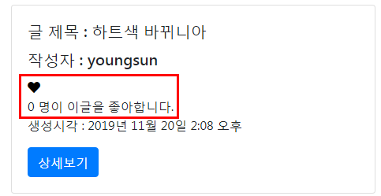

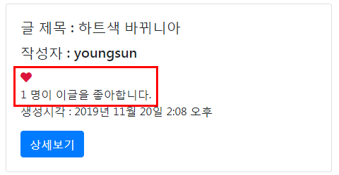


## 3. Like (POST 요청)


- '좋아요' 요청은 데이터베이스에 조작을가하는 로직이기 때문에 GET요청이 아니라 POST요청이 적절하다.

#### 3.1. Template

- `index.html` - `get`을 `post`로 변경

```js
// axios.get(`/articles/${articleId}/like/`)
axios.post(`/articles/${articleId}/like/`)
```

이렇게만 `get`을 `post`로 변경하고 실행을 하게 되면 권한이 없을 때 뜨는`403 (Frobidden)` 에러가 뜨게 된다. script에서는 ``를 사용할 수 없기 때문에 요청을 보낼때 CSRF를 Cookie에 담아서 서버로 보내줄꺼임

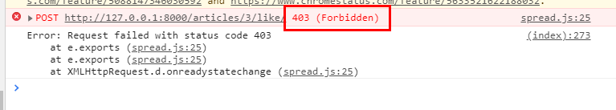

- 지금 요청에서는 Django Form을 통해 를 넘겨줄 수 없으므로 Cookie에 담아서 직접 요청을 진행하자.

  post로 요청을 보내기 전에 미리 설정해 준다. Django-Ajax [공식문서참고](https://docs.djangoproject.com/en/2.2/ref/csrf/)

```js
axios.defaults.xsrfCookieName = 'csrftoken'
axios.defaults.csrfHeaderName = 'X-CSRFToken'
```

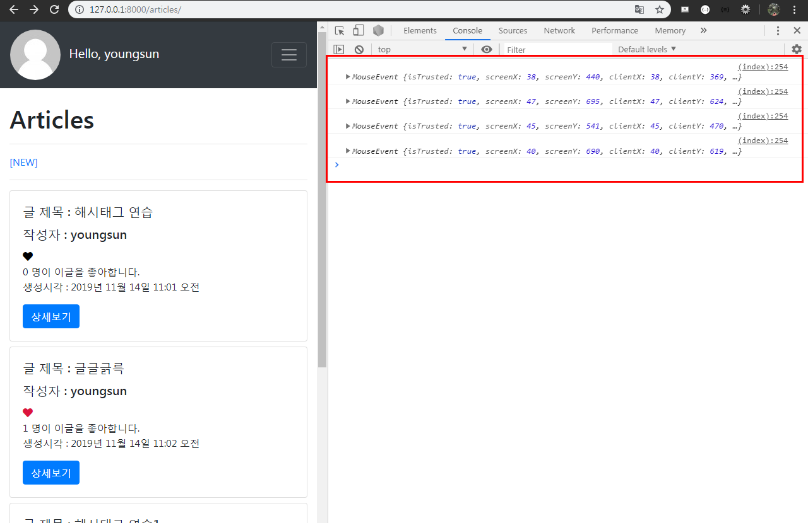

#### 3.2 is_ajax() 분기

ajax 요청이면 좋아요 기능을 수행하고, 아니면 400 에러가 뜬다.

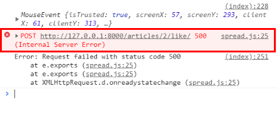

- `articles/views.py` - ajax를 사용할때 아닐때로 분기하기 

`HttpResponseBadRequest`  import 해주기

```python
# articles/views.py

from django.http import HttpResponseBadRequest

@login_required
def like(request, article_pk):
    if request.is_ajax():
        ...
        return JsonResponse(context)
    else:
        return HttpResponseBadRequest
```

- 하지만 지금은 Django가 들어온 요청이 Ajax 요청인지 구분할 방법이 없다. 요청을 보낼 때 XHR 객체를 담아서 함께 보내주자.

```js
// index.html

likeButtons.forEach(button => {
      button.addEventListener('click', function(event) {
        const articleId = event.target.dataset.id
        // 장고가 Ajax 요청을 구분하게 하기 위해서 XHR 객체를 담아서 보내준다.
        axios.defaults.headers.common['X-Requested-With'] = 'XMLHttpRequest'
        ...
```

- 사용자가 로그인 했는지 안했는지에 따라서 하트를 누르게 되면 어떻게 될지 코드를 추가하자.

``를 추가해주자

```js
// index.html

// 사용자가 로그인 했는지 안했는지 확인

axios.post(`/articles/${articleId}/like/`)
  .then(response => {
    // 알맞은 id값을 가진 span 태그를 선택해서, 
    // 사용자가 좋아요를 누를때 마다 response.data.count 값으로 갱신시킨다.
    document.querySelector(`#like-count-${articleId}`).innerText = response.data.count  

    console.log(response.data)
    console.log(response.data.liked)
    if (response.data.liked) {
      event.target.style.color = 'crimson'
    } else {
      event.target.style.color = 'black'
    }
  })
  .catch(error => { console.log(error) })

  alert('로그인을 해야 기능을 사용할 수 있습니다.')

```

- 실행결과

로그인을 하지 않았을 때  하트르 누르게 되면 `로그인을 해야 기능을 사용할 수 있습니다.`가 입력된 `alert`창이 뜨게 된다. 

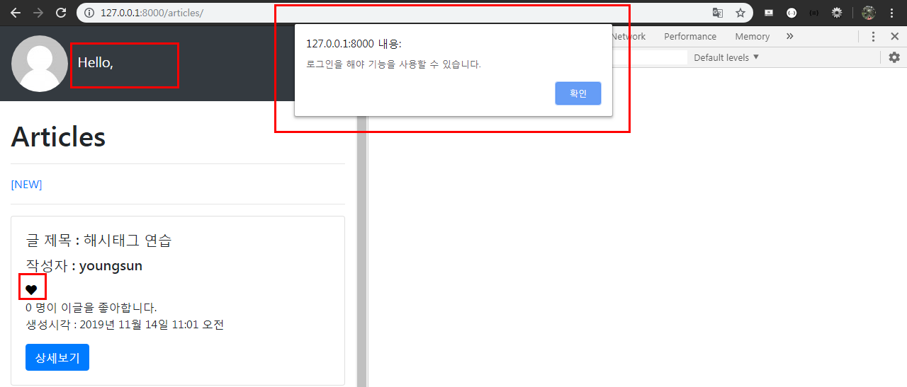

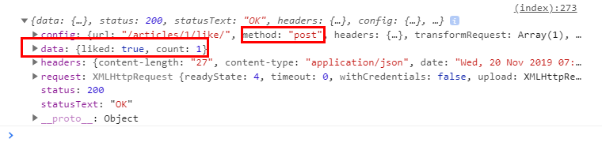

로그인했을 때는 정상으로 하트가 눌려진다.

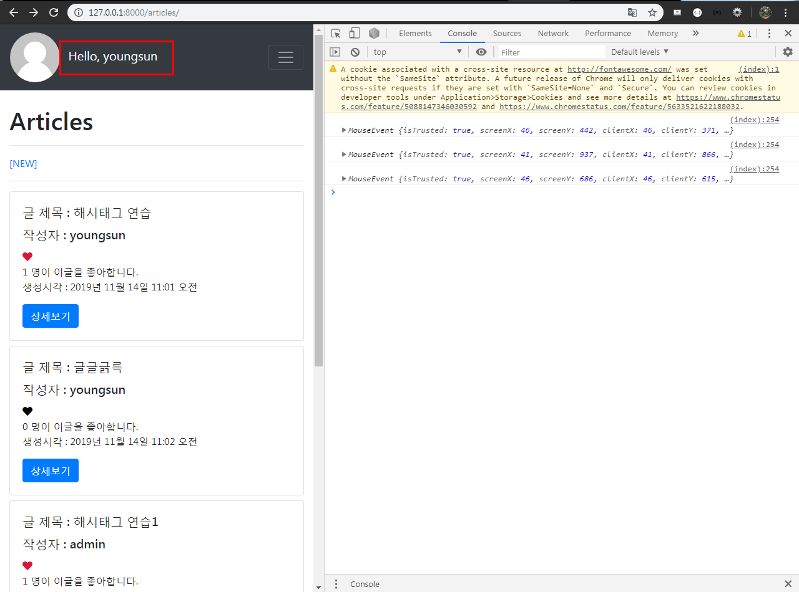

