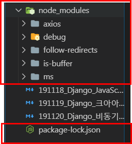

# 비동기 처리

HTTP -> Ajax(HTTP를 효과적으로 활용) -> WebSocket

## Axios 

[공식문서참고](https://www.npmjs.com/package/axios)

- 라이브러리를 사용하기 위해서는 `node.js`가 설치되어 있어야한다.

- 브라우저와 `Node.js`에서 사용할 수 있는 Promise 기반의 HTTP 클라이언트 라이브러리
  - 비동기 방식으로 HTTP 데이터 요청을 실행한다.
  - 내부적으로는 직접적으로 `XMLHttpRequest`를 다루지 않고 `Ajax` 호출을 보낼 수 있다.

- Promise (ES6)
  - 비동기 요청을 보내고 응답을 받았을 때, 그 응답 결과를 어떨게 처리하자고 약속(Promise)하는 것.
  - `.then` : 응답이 정상적으로 왔을 경우 -> 이제 어떻게 처리할 지 결정
  - `.catch` : 응답이 잘 안왔을 경우 -> 에러 처리!


## 0. 설치

- node.js 설치 시, npm 가 함께 설치된다.

```bash
$ npm install axios
```


- `node_modules`폴더가 자동으로 생성되고, package-lock.json 파일이 생성되었다.



06_JavaScript 폴더에 03_js_axios 폴더를 만들고 그 안에 01_axios.js 파일을 생성한다. 

- Axios GET 요청해보기

  [JSONPlaceholder](https://jsonplaceholder.typicode.com/)

01_axios.js

```js
// 01_axios.js

const axios = require('axios')

axios.get('https://jsonplaceholder.typicode.com/posts/1')
    .then(response => {
        console.log(response)
    })
    .catch(error => {
        console.log(error)
    })
```


## 1. Dog and Cat

### 1.1 Dog API

강아지 API [사이트](https://dog.ceo/dog-api/)

> `axios`를 이용하여 강아지 API에서  랜덤으로 강아지 사진을 가져온다.

02_dogs_and_cats.html

```html
<!-- 02_dogs_and_cats.html -->

<html>
  <head></head>
  <body>
    <h1>댕댕이들 :)</h1>
    <div class="animals">

    </div>

    <script src="https://unpkg.com/axios/dist/axios.min.js"></script>
    <script>
     
    </script>
  </body>
</html>
```

```js
axios.get('https://dog.ceo/api/breeds/image/random')
  .then(response => {
    console.log(response)
  })
  .catch(error => { console.log(error) })
```


- img url 찾기 `response.data.message`

```js
axios.get('https://dog.ceo/api/breeds/image/random')
  .then(response => {
    console.log(response.data.message)
  })
  .catch(error => { console.log(error) })
```


- img URL을 변수에 담기

```js
const imgUrl = response.data.message  
```

- img 태그 만들기

```js
const imgTag = document.createElement('img')
```

- src를 추가하기

```js
imgTag.src = imgUrl
```

- HTML 문서에 요소를 위치시키기

```js
document.querySelector('.animals')
```

- 전체코드

```js
axios.get('https://dog.ceo/api/breeds/image/random')
    .then(response => {
      // 1. img URL을 변수에 담는다.
      const imgUrl = response.data.message  
      // 2. img 태그를 만든다.
      const imgTag = document.createElement('img')
      // 3. src를 추가한다.
      imgTag.src = imgUrl
      // 4. HTML 문서에 요소를 위치시킨다.
      document.querySelector('.animals')
    })
    .catch(error => { console.log(error) })
```


- 함수로 작성하여, 함수를 호출할 때마다 강아지 사진이 랜덤으로 추가되게끔 하기, `appendChild` 사용해서 뒤에서 부터 이미지 추가


```js
const getDogImage = () => {}
```

- `const getDogImage = () => {}`의 코드 안에 위에서 작성한 Script 코드를 이동시켜 준다.

```js
const getDogImage = () => {
    axios.get('https://dog.ceo/api/breeds/image/random')
      .then(response => {
        // 1. img URL을 변수에 담는다.
        const imgUrl = response.data.message  
        // 2. img 태그를 만든다.
        const imgTag = document.createElement('img')
        // 3. src를 추가한다.
        imgTag.src = imgUrl
        // 4. HTML 문서에 요소를 위치시킨다.
        document.querySelector('.animals').appendChild(imgTag)
      })
      .catch(error => { console.log(error) })
  }
```


- 버튼을 선택하고, 버튼을 클릭해서 강아지 사진이 나오게 해보자

```html
<!-- 02_dogs_and_cats.html -->

<html>
  <head></head>
  <body>
    <h1>댕댕이들 :)</h1>
    <div class="animals">
         <!-- 버튼을 추가해준다. -->
		 <button id="dog">댕댕이 내놔</button>
    </div>

    ...
</html>
```

- script 에 버튼 추가

```js
// 버튼을 선택하고 클릭하면 만들어둔 콜백 함수 실행!
const dogbutton = document.querySelector('#dog')
dogbutton.addEventListener('click', getDogImage)
```


- 이미지 사이즈를 조정해 준다.

```js
const getDogImage = () => {
          ...
              // 이미지 사이즈 조정
              imgTag.style.width = '200px'
              imgTag.style.height = '200px'
              // 4. HTML 문서에 요소를 위치시킨다.
          ...
}
```

- 실행결과


 ### 1.2 [실습]Cat API

고양이 API [사이트](https://docs.thecatapi.com/)

- 버튼을 선택하고, 버튼을 클릭해서 고양이 사진이 나오게 해보자

```html
<!-- 02_dogs_and_cats.html -->

<html>
  <head></head>
  <body>
    <h1>댕냥이들 :)</h1>
    <div class="animals">
         <!-- 버튼을 추가해준다. -->
		 <button id="dog">댕댕이 내놔</button>
         <button id="cat">냥냥이 내놔</button>
    </div>

    ...
</html>
```


- 함수로 작성하여, 함수를 호출할 때마다 고양이 사진이 랜덤으로 추가되게끔 하기, `prepend` 사용해서 앞에서 부터 이미지 추가
- 강아지와 다른점은 url 읽어오는 방식이 틀리다.

```js
const getCatImage = () => {
  axios.get('https://api.thecatapi.com/v1/images/search')
    .then(response => {
      const imgUrl = response.data[0].url
      const imgTag = document.createElement('img')
      imgTag.src = imgUrl
      imgTag.style.width = '200px'
      imgTag.style.height = '200px'
      document.querySelector('.animals').prepend(imgTag)
    })
    .catch(error => { console.log(error) })
}
```


- script 에 버튼 추가

```js
const catbutton = document.querySelector('#cat') 
catbutton.addEventListener('click', getCatImage)
```

- 실행결과


## 2. Like (Get 요청)

- `Ajax`
  - Asynchronous JavaScript and XML
  - 브라우저에서 웹페이지를 요청하거나 링크를 클릭하며 화면갱신(새로고침)이 일어났다. 이는 브라우저와 서버간의 통신이 일어났다는 이야기다.
  - **JavaScript를 활용해서 비동기적으로 서버와 브라우저가 데이터를 교환할 수 있는 통신 방식**이다.
  - 페이지 전체를 다시 로드하는 것이 아니라, 페이지에서 갱신이 필요한 일부분만 로드함으로써 빠른 퍼포먼스와 부드러운 화면 표시가 가능하다.
    - 사용자 경험(UX) 향상 + 서버 자원 이용 절감 -> 두마리 토끼 다 잡기!!
- `XHR(XMLHttpRequest)`
  - **브라우저는 XHR 객체를 이용해서 AJAX 요청을 생성하고 전송**한다.
  - 서버가 브라우저 요청에 응답 내용을 반환하면, 마찬가지로 XHR 객체가 그 결과 처리를 한다.


## 3. 


## 4. 


## 5. 


