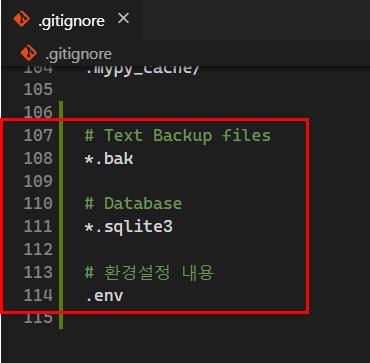

## Heroku 배포

### 1. 사전준비

#### 1.1 Github Repo 생성

- github site에 프로젝트 배포를 위한 저장소 새로 생성 ex) django-deploy
- repo명 :django-deploy
- description : 장고 프로젝트 배포


##### 1.1.1 Repo 생성

- 배포할 프로젝트 하나만 관리하고 있는 폴더로 진행해야 함
  - 절대 TIL 안에 있는 프로젝트로 진행하면 안된다.
- 바탕화면에 `django-deploy`폴더를 만들어 준다.
- `TIL/05_Django/06_django_axios` 에서 다음 파일들 복사해서 `django-deploy`폴더에 넣어준다.


- git init 해주기


##### 1.1.2 gitignore 등록

- `venv`, `django` 포함해서 만들어주기


- gitignore 파일 생성 (http://gitignore.io/api/venv,django)

- `.gitignore` 파일 마지막에 추가해주기

```
# django-deploy/.gitignore

# Text Backup files
*.bak

# Database
*.sqlite3

# 환경설정 내용
.env
```



##### 1.1.3 기존 프로젝트에서 필요한 install 목록 가져오기

- 현재 상태를 얼린다.

```bash
# 05_Django/06_django_axios

$ pip freeze > requirements.txt
```


##### 1.1.4 가상환경 venv 만들기

```bash
# django-deploy

$ python -m venv venv
```


- interpreter로 가상환경 선택해주기


##### 1.1.5 requirements.txt install

- `requirements.txt` 파일 `django-deploy` 폴더에 복사
- `django-deploy`에서 필요한 것들 install

```bash
# django-deploy

$ pip install -r requirements.txt
```

##### 1.1.6 decouple 설치

- `settings.py` 에서 노출되면 안되는 `SECRET_KEY` 를 따로 관리하기 위해서 decouple을 설치한다.

```bash
# django-deploy

$ pip install django-decouple
```


- 프로젝트 폴더 내에 .env 파일생성

```
SECRET_KEY='장고 SECRET_KEY 설정'
DEBUG=True
```

- settings.py 수정

```
from decouple import config
...
# SECURITY WARNING: keep the secret key used in production secret!
SECRET_KEY = config('SECRET_KEY')

# SECURITY WARNING: don't run with debug turned on in production!
DEBUG = config('DEBUG')
```

#### 1.3 django-heroku 설치

```
#what_to_eat 프로젝트 내에
$ pip install django-heroku
```

- settings.py heroku 설정추가

```
#heroku settings
import django_heroku
django_heroku.settings(locals())
```

### 2. 배포설정

### 2.1 Procfile

- 프로젝트 최상위 폴더에 Procfile 파일생성

```
web: gunicorn config.wsgi --log-file -
```

- gunicorn 설치

```
#what_to_eat (master)
$ pip install gunicorn
```

- 프로젝트 최상위 폴더에 runtime.txt 파일생성

```
python-3.7.4
```

- requirements 파일 새로 생성

```
#what_to_eat (master)
$ pip freeze > requirements.txt
```

### 3. 배포

- herocu cli 검색

- herocu 64bit 설치 [](https://github.com/kyunghee2/TIL/blob/박경희/2-1.빅데이터_Iot과정/md_img/image-20191125104828632.png)

  -> 설치하면 herocu cli 기반으로 사용할 수 있음

- VS Code 재실행 후

- 터미널에서 heroku login 입력

[](https://github.com/kyunghee2/TIL/blob/박경희/2-1.빅데이터_Iot과정/md_img/image-20191125105507978.png)

```
# 프로젝트 폴더 내에서 ex)what_to_eat
$ heroku config:set SECRET_KEY='<SECRET_KEY입력>'
$ heroku config:set DEBUG=True
#$ heroku config:set DISABLE_COLLECTSTATIC=1
```

- 위 설정이 안될 경우
- heroku.com 대시보드 > Settings > Reveal Config Vars버튼 클릭 [](https://github.com/kyunghee2/TIL/blob/박경희/2-1.빅데이터_Iot과정/md_img/image-20191125111929210.png)
- SECRET_KEY 설정 [](https://github.com/kyunghee2/TIL/blob/박경희/2-1.빅데이터_Iot과정/md_img/image-20191125111801248.png)

```
$ heroku --version
heroku/7.35.0 win32-x64 node-v12.13.0
#heroku 서버에 배포
#what_to_eat (master)
$ git push heroku master
```

[](https://github.com/kyunghee2/TIL/blob/박경희/2-1.빅데이터_Iot과정/md_img/image-20191125113922139.png)

- db가 sqlite 인경우 migrate

```
$ heroku run python manage.py makemigrations
$ heroku run python manage.py migrate
```

- config/settings.py 설정

```
#heroku full name 설정
ALLOWED_HOSTS = ['sleepy-thicket-13178.herokuapp.com']
#heroku 서버에 배포
$ git push heroku master
```