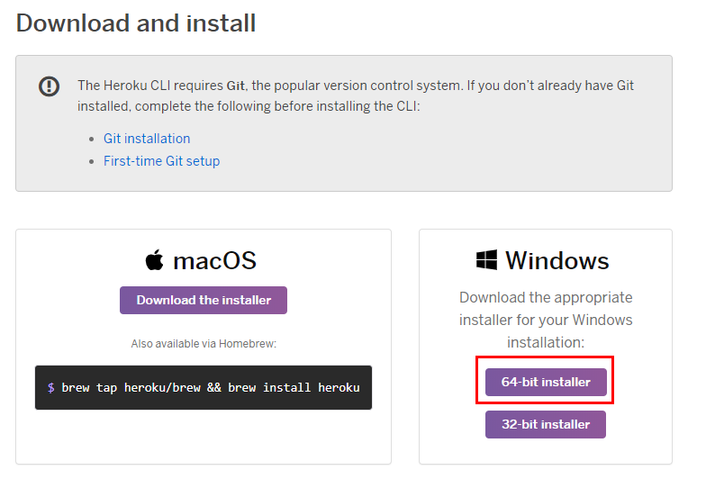
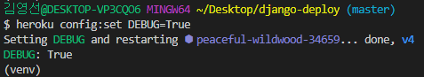

## Heroku 배포

## 1. 사전준비

#### 1.1 Github Repo 생성

- github site에 프로젝트 배포를 위한 저장소 새로 생성 ex) django-deploy
- repo명 :django-deploy
- description : 장고 프로젝트 배포


##### 1.1.1 Repo 생성

- 배포할 프로젝트 하나만 관리하고 있는 폴더로 진행해야 함
  - 절대 TIL 안에 있는 프로젝트로 진행하면 안된다.
- 바탕화면에 `django-deploy`폴더를 만들어 준다.
- `TIL/05_Django/06_django_axios` 에서 다음 파일들 복사해서 `django-deploy`폴더에 넣어준다.


- git init 해주기


##### 1.1.2 gitignore 등록

- `venv`, `django` 포함해서 만들어주기


- gitignore 파일 생성 (http://gitignore.io/api/venv,django)

- `.gitignore` 파일 마지막에 추가해주기

```
# django-deploy/.gitignore

# Text Backup files
*.bak

# Database
*.sqlite3

# 환경설정 내용
.env
```


##### 1.1.3 원격 저장소 업로드 

- 기존 프로젝트에서 필요한 install 목록 가져오기

- 현재 상태를 얼린다.

```bash
# 05_Django/06_django_axios

$ pip freeze > requirements.txt
```


##### 1.1.4 가상환경 venv 만들기

```bash
# django-deploy

$ python -m venv venv
```


- interpreter로 가상환경 선택해주기


##### 1.1.5 requirements.txt install

- `requirements.txt` 파일 `django-deploy` 폴더에 복사
- `django-deploy`에서 필요한 것들 install

```bash
# django-deploy

$ pip install -r requirements.txt
```

##### 1.1.6 decouple 설치

- `settings.py` 에서 노출되면 안되는 `SECRET_KEY` 를 따로 관리하기 위해서 decouple을 설치한다.

```bash
# django-deploy

$ pip install django-decouple
```


## 2. 배포설정

#### 2.1 Procfile : gunicorn 설정 파일

- 프로젝트 최상위 폴더에 Procfile 파일생성

```
# django-deploy/Procfile

web: gunicorn config.wsgi --log-file -
```


#### 2.2 .env

- 프로젝트 폴더 내에 .env 파일생성

```
# django-deploy/.env

SECRET_KEY='config/settings.py에 있는 SECRET_KEY'
DEBUG=True
```

#### 2.3 config/settings.py 코드수정

```python
# config/settings.py

import os
from decouple import config

# Build paths inside the project like this: os.path.join(BASE_DIR, ...)
BASE_DIR = os.path.dirname(os.path.dirname(os.path.abspath(__file__)))


# Quick-start development settings - unsuitable for production
# See https://docs.djangoproject.com/en/2.2/howto/deployment/checklist/

# SECURITY WARNING: keep the secret key used in production secret!
SECRET_KEY = config('SECRET_KEY')

# SECURITY WARNING: don't run with debug turned on in production!
DEBUG = config('DEBUG')
```

#### 2.4 django-heroku 설치

```bash
# django-deploy

$ pip install django-heroku
```

- config/settings.py - heroku 설정추가

```python
# heroku settings

import django_heroku
django_heroku.settings(locals())
```

#### 2.5 gunicorn 설치

```bash
# django-deploy

$ pip install gunicorn
```

####  2.6 runtime.txt 

- 프로젝트 최상위 폴더에 runtime.txt 파일생성 , 파이썬 버전을 작성해줘야 한다.

```
# django-deploy/runtime.txt

python-3.8.0
```

#### 2.7 requirement.txt

```bash
$ pip freeze > requirements.txt
```


## 3. 배포

#### 3.0 heroku 설치

- herocu cli 검색

  https://devcenter.heroku.com/articles/heroku-cli

#### 3.1 herocu 64bit 설치 



#### 3.2 settings.py에서 HOST 열어주기

- heroku에서 알아서 `ALLOWED_HOSTS` 잡아준다.

```python
# django-deploy/settings.py

ALLOWED_HOSTS = ['peaceful-wildwood-34659.herokuapp.com']
```


- 설치하면 herocu cli 기반으로 사용할 수 있음
- VS Code 껐다가 다시키기!!

#### 3.3 Heroku 앱 생성 & push

- heroku 실행

```bash
$ heroku
```

- heroku 로그인

```bash
$ heroku login
# enter 치고 홈페이지 뜨면 로그인 하면됨!!
```


- heroku 앱 생성 : 자동으로 앱 하나를 만들어준다

```bash
$ heroku create
```


HEROKU 홈페이지를 들어가보면 앱이 생성되었다.


- heroku에 push : 앞으로는 heroku git에다 push 한다

```bash
$ git remote -v
```


- 앱을 지우고 다시 만들고 싶다면 remote 저장소를 삭제하고 다시 만든다!

```bash
$ git remote rm heroku
```

#### 3.4 heroku config 세팅

heroku에 `SECRET_KEY`와 `DEBUG` 를 셋팅한다.

```bash
$ heroku config:set SECRET_KEY='SECRET_KEY'
$ heroku config:set DEBUG=True
$ heroku config:set DISABLE_COLLECTSTATIC=1
```





- `SECRET_KEY` 설정에서 에러나면 직접 heroku 웹페이지 들어가서 바꿔준다.

Personal 메뉴에서 APP찾기


`settings`클릭, `Reveal Config Vars` 클릭


`SECRET_KEY`직접 수정


#### 3.5 migration 해주기

##### db가 sqlite 인경우 migrate

- heroku에 migration

```bash
$ heroku run python manage.py makemigrations
```

- 에러나면 heroku 웹 `대쉬보드 > MORE > Run Console` 에서 실행


```bash
$ python manage.py makemigrations
```


#### 3.6 settings.py 에서 `SECRET_KEY` & `DEBUG` 설정 수정

- 이제 heroku에 키랑 debug 설정 해주었으니 감춰도 된다
- heroku에서 알아서 `ALLOWED_HOSTS` 잡아줌

```python
# config/settings.py

SECRET_KEY = config('SECRET_KEY')
DEBUG = config('DEBUG')

ALLOWED_HOSTS = []
```


#### 3.7 git에 push 해보기

- 가상환경에 있는지 확인할 것

```bash
$ git add .
$ git status
$ git commit -m "191202 | Heroku 배포연습"
$ git push heroku master
```


#### 3.8 서버 확인


- 소셜 로그인 수정
- **DEBUG 모드 전환** (배포 성공적으로 마치고 난 후)
  - False로 바꿔서 서비스 이용시 상세한 에러코드가 출력되지 않도록 함

```bash
$ heroku config:set DEBUG=False
```


## 4. 기타

**아래 명령어가 잘 동작하지 않을 경우, Heroku 사이트에서 직접 console을 열어서 명령어 수행**

- **admin 계정 생성**

  ```bash
  # heroku run console
  
  $ heroku run manage.py createsuperuser
  ```

- **Data Seeding** (fixtures 있는 경우에만 수행)

  ```bash
  # heroku run console
  
  $ heroku run python manage.py loaddata 파일이름.json
  ```

- **Social Login**

  기본적으로 이전에 학습했던 Social Login 세팅 절차를 똑같이 수행하면 됨.

  But, 로컬 주소가 아니라 배포한 Heroku 주소를 넣어야한다는 사실만 주의.

  ```
  ex)
  https://secure-reef-12340.herokuapp.com
  http://secure-reef-12340.herokuapp.com
  ```